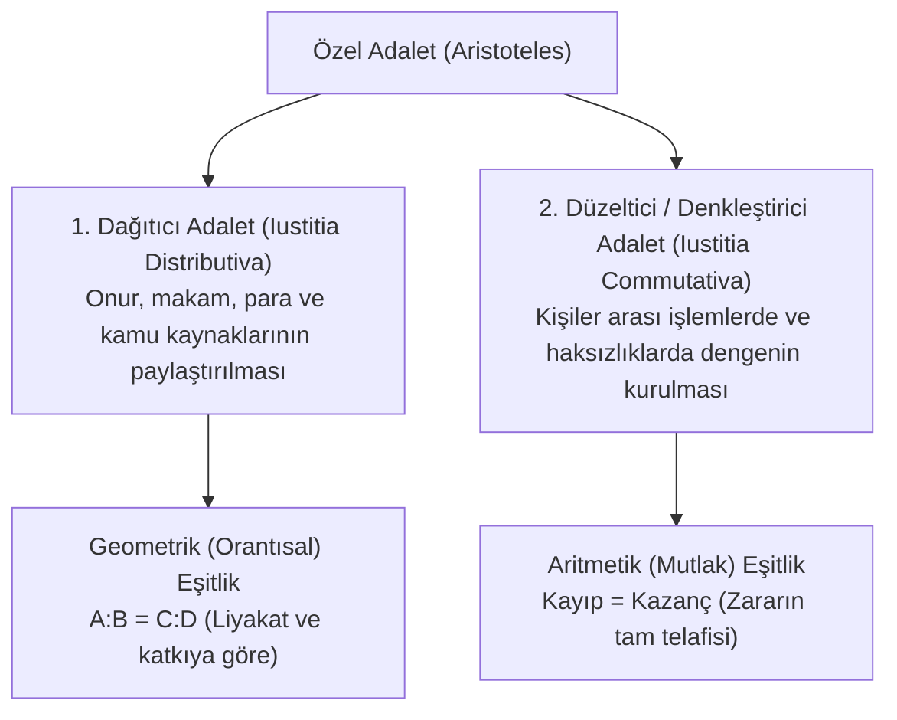

# Dağıtıcı ve Düzeltici Adalet

> *"Adalet; eşitlere eşit, eşit olmayanlara ise eşitsizlikleri oranında muamele etmektir."*  
> — **Aristoteles**, *Nikomakhos'a Etik* (V. Kitap)

---

## 1. Giriş: Aristoteles'in Adalet Sınıflandırması

Batı düşünce tarihinde adaletin en sistemli ve kalıcı kavramsal ayrımı Aristoteles tarafından yapılmıştır. Aristoteles genel adaleti (bütünsel erdem) inceledikten sonra, hukukun ve siyasetin doğrudan konusu olan **özel adalet** türlerini iki ana başlıkta toplar:

---

## 2. Dağıtıcı Adalet (*Iustitia Distributiva*)

Dağıtıcı adalet; bir siyasal topluluktaki onur, para, kamu makamları ve diğer bölünebilir ortak kaynakların yurttaşlar arasında nasıl paylaştırılacağını belirler:

* **Geometrik Orantı İlkesi:**
  * Herkesin eşit pay alması her zaman adil değildir; çünkü insanların topluma katkıları, yetenekleri veya liyakatleri (*axia*) eşit olmayabilir.
  * İki kişinin liyakati farklıysa, alacakları pay da bu liyakat farkıyla orantılı olmalıdır:
    $$\frac{\text{Kişi 1'in Payı}}{\text{Kişi 2'nin Payı}} = \frac{\text{Kişi 1'in Liyakati}}{\text{Kişi 2'nin Liyakati}}$$
* **Liyakat Ölçütü Tartışması:**
  * Aristoteles farklı rejimlerin farklı liyakat ölçütleri benimsediğini belirtir:
    - Demokrasilerde ölçüt: **Özgür doğmuş olmak**.
    - Oligarşilerde ölçüt: **Zenginlik / Mülkiyet**.
    - Aristokrasilerde ölçüt: **Erdem (*Arete*)**.

---

## 3. Düzeltici / Denkleştirici Adalet (*Iustitia Commutativa*)

Düzeltici adalet; kişiler arasındaki özel hukuk ilişkilerinde, sözleşmelerde veya haksız fiillerde bozulan dengenin yeniden tesis edilmesidir:

* **Aritmetik Eşitlik İlkesi:**
  * Burada tarafların soylu, zengin ya da erdemli olup olmadığına bakılmaz; kanun önünde taraflar kesin bir biçimde eşittir.
  * Hâkimin görevi, bir tarafın haksızca kazandığı ve diğer tarafın kaybettiği değeri tespit edip, kaybı kazançla sıfırlayarak başlangıçtaki eşitliği kurmaktır:
    $$\text{Tazminat / İade} = \text{Uğranılan Zarar}$$
* **İki Alt Alanı:**
  1. **İradi İlişkiler (*Sözleşmeler*):** Satım, kira, ödünç gibi işlemlerde edimler arasındaki dengenin (*denklik*) korunması.
  2. **Gayriiradi İlişkiler (*Haksız Fiiller ve Suçlar*):** Hırsızlık, yaralama, mala zarar verme gibi durumlarda zararın giderilmesi veya failin cezalandırılması.

---

## 4. Hakkaniyet (*Epieikeia / Aequitas*)

Aristoteles, pozitif kanunun genel ve soyut niteliğinden kaynaklanan kaçınılmaz adaletsizlikleri gidermek için **Hakkaniyet (*Epieikeia*)** kavramını geliştirmiştir:

* **Yasanın Kusuru:** Kanun koyucu tüm durumları önceden öngöremez; kurallar genel ifadelere dayanır.
* **Hakkaniyetin Rolü:** Somut olayda yasanın harfi harfine (*littera legis*) uygulanması aşırı bir haksızlığa yol açacaksa, yasa koyucunun olay yerinde olsaydı yapacağı tercihi yaparak kuralı somut olaya göre esnetmektir.
* **Lesboslu Taşçı Cetveli Analojisi:**
  > *"Tıpkı Lesbos adasındaki mimarların kullandığı kurşun cetvelin taşın kıvrımlarına göre bükülmesi gibi; hakkaniyet de kuralı olayın kendine özgü koşullarına uyarlar."*

---

## 5. Ceza Adaletinin Türleri

Modern hukuk doktrininde adalet teorileri ceza adaleti bağlamında üç ana eksende incelenir:

1. **Ödetici / Kefaretçi Adalet (*Retributive Justice*):**
   * Cezanın amacı suçlunun hak ettiği kötülüğü görmesidir (*lex talionis / göze göz, dişe diş*). Kant ve Hegel cezanın ahlaki bir zorunluluk olduğunu savunur.
2. **Önleyici / Faydacı Adalet (*Utilitarian / Deterrence Justice*):**
   * Cezanın amacı faili ıslah etmek (*özel önleme*) ve topluma ibret teşkil ederek gelecekteki suçları caydırmaktır (*genel önleme*).
3. **Onarıcı Adalet (*Restorative Justice*):**
   * Cezalandırmaktan ziyade mağdurun zararının giderilmesini, failin sorumluluk üstlenmesini ve toplumsal barışın yeniden tesisini (uzlaşma, arabuluculuk) hedefler.

---

## 📌 Güncel Yansımalar

* Modern anayasa hukukunda **vergilendirmede adalet** (mali güce göre artan oranlı vergi) dağıtıcı adaletin doğrudan bir uygulamasıdır.
* Borçlar hukukundaki **gabun (aşırı yararlanma)** ve **haksız fiil tazminatı** düzeltici adaletin ilkeleriyle yönetilir.
* Türk Medeni Kanunu m. 4'teki **"Hâkimin Takdir Yetkisi"** ve hakkaniyete göre karar verme ilkesi doğrudan Aristotelesçi *epieikeia* mirasıdır.
