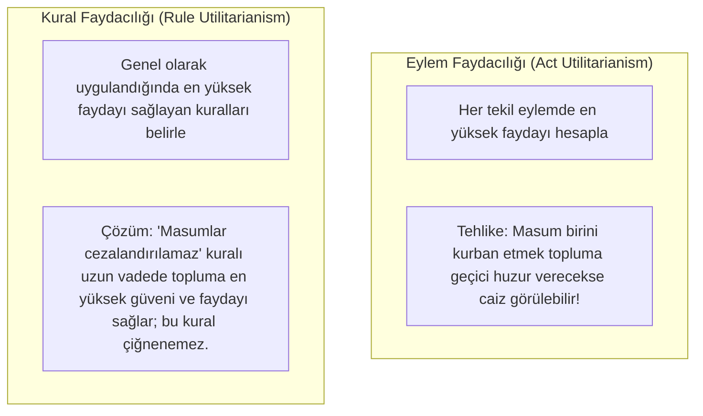

# Faydacılık (Utilitarizm) ve Adalet

> *"Doğa, insanlığı iki egemen efendinin yönetimine bırakmıştır: Acı ve Haz. Ne yapacağımızı belirleyen de ne yapmamız gerektiğine karar veren de yalnızca onlardır."*  
> — **Jeremy Bentham**, *An Introduction to the Principles of Morals and Legislation* (1789)

---

## 1. Giriş: Sonuçsalcı Ahlak ve Hukuk Teorisi

Faydacılık (*Utilitarianism*), eylemlerin, kuralların ve yasal düzenlemelerin ahlaki değerini onların **doğurduğu sonuçlar (*consequentialism*)** üzerinden ölçen felsefi akımdır.

Bu kurama göre adalet bağımsız, aşkın veya metafizik bir ilke değildir; **toplumun toplam refahını ve mutluluğunu maksimize etmeye yarayan en yüksek fayda aracıdır**.

---

## 2. Jeremy Bentham ve Niceliksel Faydacılık

Jeremy Bentham (*1748-1832*), fayda ilkesini matematiksel bir kesinlikle formüle etmeye çalışmıştır:

* **En Büyük Mutluluk İlkesi (*Greatest Happiness Principle*):** Bir yasanın veya eylemin doğruluğu, etkilenen tüm tarafların mutluluğunu artırma veya acısını azaltma eğilimine göre ölçülür.
* **Fayda Hesabı (*Felicific Calculus*):** Haz ve acı şu değişkenlerle ölçülür:
  1. *Şiddet (Intensity)*
  2. *Süre (Duration)*
  3. *Kesinlik / Olasılık (Certainty)*
  4. *Yakınlık (Propinquity)*
  5. *Doğurganlık (Fecundity - Başka hazlar doğurması)*
  6. *Saflık (Purity - Acıyla karışık olmaması)*
  7. *Kapsam (Extent - Kaç kişiyi etkilediği)*

---

## 3. John Stuart Mill ve Niteliksel Faydacılık

Bentham'ın kuramına yöneltilen "domuzlara layık bir felsefe" eleştirisine karşı **John Stuart Mill** (*1806-1873*), *Utilitarianism* (1861) adlı eserinde hazlar arasında niteliksel ayrımlar getirmiştir:

* **Yüksek ve Alçak Hazlar:**
  > *"Doyuma ulaşmış bir domuz olmaktansa doyumsuz bir Sokrates olmak; tatmin edilmiş bir aptal olmaktansa tatmin edilmemiş bir insan olmak evladır."*
  * Zihinsel, sanatsal, ahlaki ve entelektüel hazlar; salt bedensel hazlardan niteliksel olarak üstündür.
* **Adalet ve Fayda İlişkisi:** Mill, adaletin toplumun güvenliğini sağladığı için "faydaların en kutsalı ve en bağlayıcı olanı" olduğunu savunur.

---

## 4. Eylem Faydacılığı vs. Kural Faydacılığı

Faydacılığın hukuk felsefesindeki iç tartışması iki ana model üzerinden yürür:

---

## 5. Faydacılığın Adalet Açısından Karşılaştığı Temel Eleştiriler

Faydacı adalet anlayışı çağdaş hukuk felsefecileri (özellikle Rawls ve Dworkin) tarafından şu noktalarda ağır biçimde eleştirilmiştir:

### 1. Birey Haklarının Araçsallaştırılması
* Toplam mutluluk uğruna bir azınlığın veya tek bir bireyin temel haklarının feda edilmesi riski doğar (örneğin toplumun çoğunluğunun refahı için köleliğin veya masum bir şüphelinin cezalandırılmasının meşrulaştırılması).
* John Rawls'un tespiti: *"Faydacılık, kişiler arasındaki ayrımı ciddiye almaz."*

### 2. Değerlerin Karşılaştırılamazlığı
* İnsan hayatı, özgürlük, onur ve sağlık gibi değerlerin tek bir ortak para veya haz birimine indirgenerek matematiksel olarak toplanıp çıkarılması imkânsızdır ve ahlaken sorunludur.

---

## 📌 Hukuk Politikasındaki Yeri

Eleştirilere rağmen faydacılık; **ceza hukukunda caydırıcılık politikaları**, **kamu sağlığı ve çevre düzenlemeleri**, **maliyet-fayda analizleri** ve **idarenin kamu yararı (*public interest*) kararlarında** modern devlet yönetiminin en sık başvurduğu pragmatik araç olmaya devam etmektedir.
