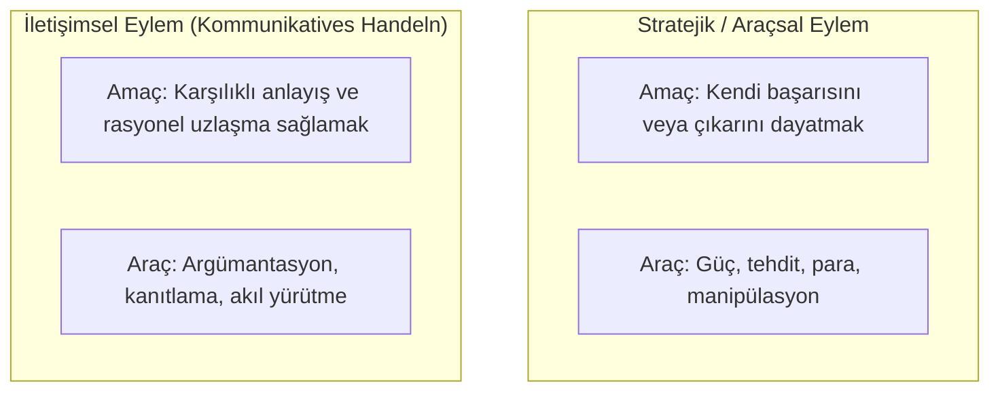

# Jürgen Habermas ve Müzakereci Demokrasi: Hukukun Söylemsel Meşruiyeti

> *"Yalnızca etkilenen tüm bireylerin rasyonel bir söylem sürecinde onaylayabileceği normlar meşru kabul edilebilir."*  
> — **Jürgen Habermas**, *Faktizität und Geltung* (1992)

---

## 1. Giriş: Frankfurt Okulu ve İletişimsel Rasyonalite

Alman filozof ve sosyolog **Jürgen Habermas** (*1929-*), Frankfurt Okulu'nun eleştirel teorisini **İletişimsel Eylem Kuramı (*Theorie des kommunikativen Handelns*)** ve **Müzakereci Demokrasi (*Deliberative Democracy*)** modelleriyle yeniden inşa etmiştir.

Habermas; hukukun meşruiyetini ne saf biçimsel normativizmde (Kelsen) ne de soyut ahlaki monologlarda (Kant/Rawls) arar. Ona göre hukuk, yurttaşların özgür ve eşit kamusal müzakereleriyle üretildiği ölçüde meşrudur.

---

## 2. Stratejik Eylem vs. İletişimsel Eylem

Habermas toplumsal eylemleri iki temel kategoriye ayırır:



---

## 3. Söylem İlkesi (*Diskursprinzip*) ve Demokratik İlke

Habermas'ın ahlak ve hukuk felsefesinin kalbinde **Söylem İlkesi (D)** yer alır:

* **Söylem İlkesi (D):**  
  *"Bir eylem normu, ancak ve ancak pratik bir söyleme katılan tüm olası ilgililerin rasyonel rızasını alabiliyorsa geçerlidir."*

Bu ilke anayasal hukuk alanına uyarlandığında **Demokratik İlke (d)** haline gelir:
* Yalnızca demokratik bir yasa yapım sürecinde yurttaşların özgür tartışmasıyla kabul edilen pozitif kanunlar meşrudur.
* Bu sayede yurttaşlar hem yasanın **muhatabı (*addressee*)** hem de yasanın **yaratıcısı / yazarı (*author*)** haline gelirler.

---

## 4. İdeal Konuşma Durumu (*Ideale Sprechsituation*)

Meşru bir kamusal müzakerenin gerçekleşebilmesi için şu kuralların sağlanması gerekir:

1. **Evrensel Katılım:** Konudan etkilenen herkesin tartışmaya katılma hakkı vardır.
2. **Eşit Söz Hakkı:** Her katılımcı istediği savı ileri sürebilir, eleştirebilir ve sorgulayabilir.
3. **Baskısızlık ve İçtenlik:** Hiçbir katılımcı tehdit, güç veya hile yoluyla susturulamaz.
4. **En İyi Argümanın Zorlamayan Zorlayıcılığı (*Der zwanglose Zwang des besseren Arguments*):** Tartışmanın sonucunu para veya siyasi güç değil, yalnızca mantıksal argümanın kalitesi belirlemelidir.

---

## 5. *Faktizität und Geltung* (Faktisite ve Geçerlilik)

1992 tarihli anıtsal eseri *Faktizität und Geltung* (Olgusallık ve Geçerlilik) kitabında Habermas, modern çoğulcu toplumlarda hukukun birleştirici rolünü inceler:

```text
┌─────────────────────────────────────────────────────────────┐
│                      MODERN TOPLUM                          │
│                                                             │
│   Geleneksel dini ve metafizik ortak uzlaşılar çökmüştür.   │
│   Bireyler farklı dünya görüşlerine ve inançlara sahiptir.  │
└──────────────────────────────┬──────────────────────────────┘
                               │
                               ▼
┌─────────────────────────────────────────────────────────────┐
│                    HUKUKUN İKİLİ DOĞASI                     │
│                                                             │
│  1. Olgusallık (Faktisite): Devlet cebriyle yaptırıma       │
│     bağlanmış pozitif kurallar sistemi (İstikrar sağlar).   │
│                                                             │
│  2. Geçerlilik (Geltung): Kamusal alandaki demokratik       │
│     müzakereyle elde edilen rasyonel meşruiyet.             │
└─────────────────────────────────────────────────────────────┘
```

---

## 📌 Hukuk Devleti Açısından Önemi

* Habermas, liberal "hak odaklı negatif özgürlük" anlayışı ile cumhuriyetçi "katılımcı siyasi özgürlük" anlayışını **müzakereci anayasacılık** çatısı altında uzlaştırmıştır.
* Katılımcı bütçe, kamusal tartışma platformları, sivil toplumun yasama süreçlerine dahil edilmesi gibi çağdaş demokratik reformlar doğrudan Habermasçı kurama dayanır.
