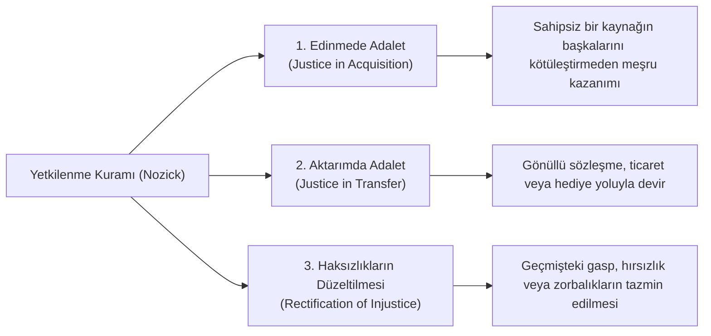

# Robert Nozick ve Liberteryen Adalet: Yetkilenme Kuramı

> *"Bireylerin hakları vardır ve hiçbir kişi ya da grup (devlet dahil) bu hakları ihlal edemez."*  
> — **Robert Nozick**, *Anarchy, State, and Utopia* (1974)

---

## 1. Giriş: Rawls'a Karşı Liberteryen Başkaldırı

Harvard Üniversitesi felsefecisi **Robert Nozick** (*1938-2002*), Rawls'un *A Theory of Justice* eserine en sert ve kapsamlı cevabı 1974 tarihli *Anarchy, State, and Utopia* (Anarşi, Devlet ve Ütopya) kitabıyla vermiştir.

Nozick; devletin yeniden dağıtımcı rolünü, refah uygulamalarını ve zenginlerden alıp yoksullara vermeyi amaçlayan vergilendirmeyi bireyin mülkiyet ve özgürlük haklarına yönelik haksız bir saldırı olarak tanımlar.

---

## 2. Yetkilenme Kuramı (*Entitlement Theory of Justice*)

Nozick'e göre adalet, kaynakların toplumda belirli bir kalıba (*pattern*) göre dağıtılması değildir; **tarihsel edinme ve aktarım süreçlerinin meşruiyetine** bağlıdır.

Yetkilenme kuramı üç ana ilkeden oluşur:



* Eğer bir mülk meşru bir şekilde ilk kez edinilmişse (*Lockeçu Şart: başkalarına yeterli ve aynı kalitede bırakarak*) ve daha sonra yalnızca gönüllü mübadelelerle devredilmişse, ortaya çıkan dağılım ne kadar eşitsiz olursa olsun **kesinlikle adildir**.

---

## 3. Kalıplı (*Patterned*) vs. Tarihsel Adalet: Wilt Chamberlain Örneği

Nozick, Rawls veya sosyalistlerin benimsediği "kalıplı / son-durum odaklı" adalet anlayışlarının sürekli olarak bireylerin özgürlüğüne müdahale etmek zorunda kalacağını ünlü **Wilt Chamberlain** düşünce deneyiyle kanıtlar:

```text
1. Başlangıçta herkesin D1 gibi mükemmel eşit bir gelir dağılımına sahip olduğunu varsayalım.
2. Ünlü basketbolcu Wilt Chamberlain maç başına bilet alan her seyirciden fazladan 25 sent ister ve 1 milyon seyirci bunu isteyerek öder.
3. Sezon sonunda Chamberlain 250.000 dolar kazanır ve yeni bir dağılım (D2) oluşur (eşitsizlik doğar).
4. Bu süreçteki her işlem tamamen GÖNÜLLÜDÜR; kimse kimseyi zorlamamış, kimse dolandırılmamıştır.
```

* **Sonuç:** Özgürce yapılan gönüllü tercihler her zaman başlangıçtaki eşitlikçi kalıbı bozar. Bu kalıbı yeniden tesis etmek istemek, **insanların özgür iradelerine ve hayatlarına sürekli devlet müdahalesi (tiranlık)** gerektirir.
* *"Özgürlük, kalıpları altüst eder (*Liberty upsets patterns*)."*

---

## 4. Minimal Devlet (*Gece Bekçisi Devleti*)

Nozick'e göre ahlaken meşru olan tek devlet biçimi **Minimal Devlet**tir (*Night-watchman State*):

* **Devletin Meşru Görevleri:**
  1. Bireyleri şiddet, hırsızlık ve dolandırıcılıktan korumak (Ordu ve Polis).
  2. Sözleşmelerin uygulanmasını sağlamak (Mahkemeler).
* **Meşru Olmayan Görevler:**
  - Kamu okulları, kamu hastaneleri, emeklilik fonları kurmak.
  - Zenginlerden vergi alarak yoksullara sosyal yardım dağıtmak.
  - İnsanları kendi iyilikleri için korumaya çalışan babacan (*paternalist*) yasalar (emniyet kemeri zorunluluğu, uyuşturucu yasakları vb.).

---

## 5. "Vergilendirme Zorla Çalıştırmaya Eşdeğerdir"

Nozick'in en çarpıcı argümanı mülkiyet ve öz-sahiplik (*self-ownership*) ilişkisidir:

1. Her insan kendi bedeninin ve zihninin mutlak sahibidir (*Öz-sahiplik*).
2. İnsan kendi bedenini çalıştırarak emek üretir; dolayısıyla emeğinin ve emeğinin ürünlerinin de sahibidir.
3. Bir kişinin emeğinin kazancından (örneğin %30 gelir vergisiyle) zorla pay almak, o kişinin haftalık çalışma süresinin bir kısmına (örneğin 10 saatine) bedelsiz el koymak demektir.
4. Bir insanın zamanına ve emeğine rızası dışında el koymak ise **kısmi kölelik ve zorla çalıştırmadır (*forced labor*)**.

---

## 📌 Karşılaştırmalı Özet

| Boyut | John Rawls (Hakkaniyet Olarak Adalet) | Robert Nozick (Yetkilenme Kuramı) |
| :--- | :--- | :--- |
| **Öncelikli Değer** | Hakkaniyet, Eşitlik ve Temel Özgürlükler | Negatif Özgürlük ve Mutlak Mülkiyet |
| **Sosyal Haklar** | Zorunlu anayasal güvence | Zorlama ve mülkiyet ihlali |
| **Yetenekler** | Toplumun ortak varlığı (*Natural Lottery*) | Bireyin mutlak kişisel mülkü |
| **İdeal Devlet** | Demokratik Refah Devleti | Minimal Gece Bekçisi Devleti |
