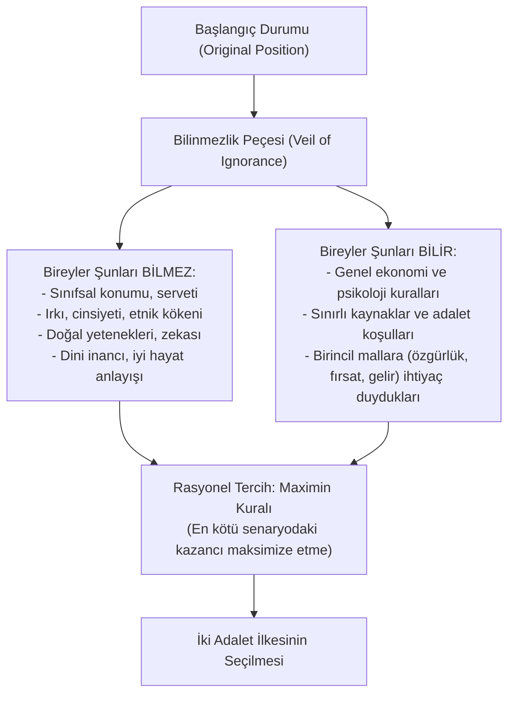

# John Rawls ve Hakkaniyet Olarak Adalet (*Justice as Fairness*)

> *"Her birey, adalete dayanan ve toplumun genel refahının bile çiğneyemeyeceği bir dokunulmazlığa sahiptir."*  
> — **John Rawls**, *A Theory of Justice* (1971)

---

## 1. Giriş: 20. Yüzyılda Sözleşmeci Geleneğin Yeniden Doğuşu

Amerikalı filozof **John Rawls** (*1921-2002*), 1971 yılında yayımladığı anıtsal eseri *A Theory of Justice* (Bir Adalet Teorisi) ile modern siyaset ve hukuk felsefesinde devrim yaratmıştır.

Rawls, dönemin hâkimi olan faydacılığa karşı Kantçı deontolojik ahlakı ve toplumsal sözleşme yöntemini yeniden canlandırarak liberal-demokratik refah devletinin normatif adalet mimarisini kurmuştur.

---

## 2. Yöntemsel Araçlar: Başlangıç Durumu ve Bilinmezlik Peçesi

Rawls, adil bir toplumun temel ilkelerini belirlemek için varsayımsal bir düşünce deneyi tasarlar:



* **Bilinmezlik Peçesi (*Veil of Ignorance*):** İnsanlar toplumdaki yerlerini bilmedikleri için tarafsız (*hakkaniyetli*) düşünmek zorunda kalırlar. Kendilerinin toplumun en yoksul, en dışlanmış veya en yeteneksiz bireyi olma ihtimalini gözeterek kuralları belirlerler.

---

## 3. Rawls'un İki Temel Adalet İlkesi

Bilinmezlik peçesi arkasındaki rasyonel bireyler şu iki ilke üzerinde uzlaşırlar:

### 1. Eşit Temel Özgürlükler İlkesi (*Equal Liberty Principle*)
* Her birey; diğer herkesinkiyle uyumlu, en geniş temel özgürlükler sistemi üzerinde eşit hakka sahiptir.
* Bu özgürlükler: Siyasi özgürlükler (oy kullanma, seçilme), ifade ve toplanma özgürlüğü, vicdan ve düşünce özgürlüğü, kişi dokunulmazlığı ve hukukun üstünlüğü güvenceleridir.
* **Sözlüksel Öncelik (*Lexical Priority*):** Birinci ilke ikinci ilkeden her zaman önce gelir. Ekonomik refah artışı uğruna temel özgürlükler asla sınırlandırılamaz.

### 2. Sosyo-Ekonomik Eşitsizlikler İlkesi
Sosyal ve ekonomik eşitsizlikler ancak şu iki koşulu sağlıyorsa meşrudur:
* **A. Fark İlkesi (*Difference Principle*):** Eşitsizlikler, toplumun **en az avantajlı / en dezavantajlı üyelerinin en büyük yararına** olmalıdır (*Maximin* mantığı).
* **B. Hakkaniyete Uygun Fırsat Eşitliği (*Fair Equality of Opportunity*):** Makamlar, mevkiler ve kamusal görevler herkese eşit fırsat koşulları altında açık olmalıdır.

---

## 4. Doğal Piyango (*Natural Lottery*) ve Liyakat Eleştirisi

Rawls, geleneksel liberal liyakat (*meritocracy*) anlayışına devrimci bir eleştiri getirir:

```text
┌─────────────────────────────────────────────────────────────┐
│  DOĞAL VE TOPLUMSAL PİYANGO:                                │
│                                                             │
│  - Yüksek zekâ, atletik yetenek, özel yetenekler            │
│  - Zengin veya kültürlü bir ailede doğmak                   │
│  - Çalışkan bir karaktere sahip olmak                       │
│                                                             │
│  Bunların HİÇBİRİ bireyin kendi ahlaki başarısı DEĞİLDİR;   │
│  doğanın ve şansın keyfi bir lütfudur.                      │
└──────────────────────────────┬──────────────────────────────┘
                               │
                               ▼
┌─────────────────────────────────────────────────────────────┐
│  FARK İLKESİNİN ÇÖZÜMÜ:                                     │
│  Doğuştan şanslı olanlar, yeteneklerini sadece kendileri    │
│  için değil; şanssız olanların durumunu iyileştirmek kaydı- │
│  yla kullanabilirler (Ortak havuz anlayışı).                │
└─────────────────────────────────────────────────────────────┘
```

---

## 5. Düşünsel Denge (*Reflective Equilibrium*)

Rawls'a göre adalet ilkeleri gökten inmez; bireylerin gündelik adalet sezgileri (örn. "kölelik ve ırkçılık yanlıştır") ile soyut adalet ilkeleri arasında karşılıklı düzeltmeler yapılarak bir **düşünsel dengeye** ulaşılır.

---

## 📌 Hukuk ve Siyaset Felsefesine Etkisi

* Rawls, kapitalist serbest piyasa ile katı sosyalist planlama arasında **"Mülkiyeti Tabana Yayan Demokrasi (*Property-Owning Democracy*)"** veya liberal refah devletinin en güçlü felsefi meşruiyetini kurmuştur.
* Modern anayasa yargısında pozitif ayrımcılık, dezavantajlı grupların korunması ve sosyal haklar doktrini büyük ölçüde Rawlsçu ilkelerden beslenmektedir.
