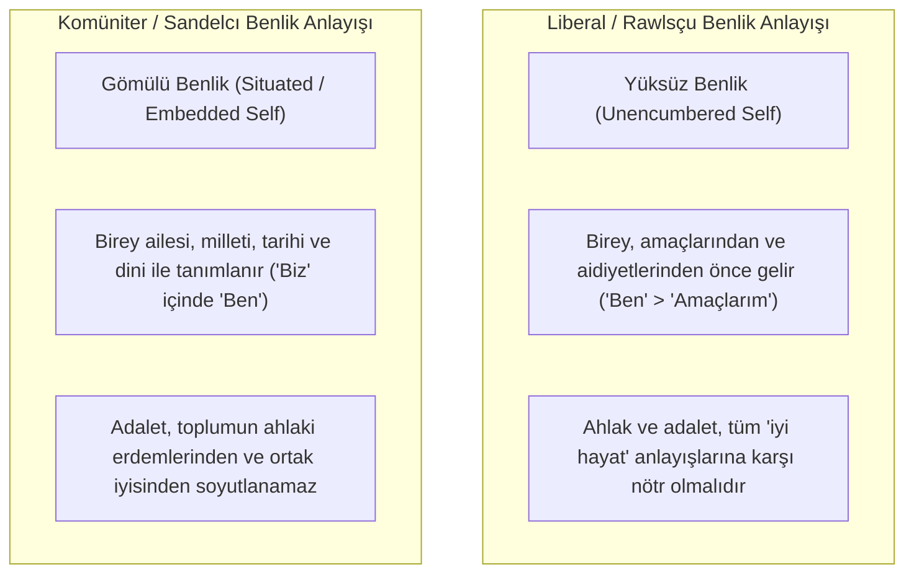

# Michael Sandel ve Komüniter (Cemaatçi) Adalet Eleştirisi

> *"Kendimizi toplumsal bağlarımızdan, tarihimizden ve ahlaki sadakatlerimizden tamamen soyutlanmış 'yüksüz benlikler' olarak düşünemeyiz."*  
> — **Michael Sandel**, *Liberalism and the Limits of Justice* (1982)

---

## 1. Giriş: Liberal Bireyciliğe Komüniter Başkaldırı

1980'lerden itibaren John Rawls ve Robert Nozick gibi düşünürlerin temsil ettiği Anglo-Amerikan liberal adalet kuramlarına karşı **Komüniteryanizm (Cemaatçilik / Toplulukçuluk)** hareketi yükselmiştir.

Başlıca temsilcileri **Michael Sandel**, **Charles Taylor**, **Alasdair MacIntyre** ve **Michael Walzer**'dır.

Komüniterler, liberalizmin bireyi toplumdan, kültürden, dinden ve gelenekten yalıtılmış atomize bir varlık olarak kurgulamasını kökten eleştirirler.

---

## 2. "Yüksüz Benlik" (*The Unencumbered Self*) Eleştirisi

Michael Sandel (*1953-*), *Liberalism and the Limits of Justice* (1982) kitabında Rawls'un "Bilinmezlik Peçesi" arkasındaki insan tasarımını eleştirir:



* Sandel'e göre bir insanın vatandaşlık, aile, tarih ve kültürel bağlarını sıyırıp attığınızda geriye rasyonel bir karar verici değil; ahlaki derinliği olmayan bir gölge kalır.

---

## 3. Sandel'in Üç Ahlaki Yükümlülük Kategorisi

Sandel, bireyin sorumluluklarını üç katmanda açıklar:

1. **Doğal Görevler (*Natural Duties*):** İnsan olmaktan kaynaklanan evrensel yükümlülükler (Örn: Kimseye zarar vermemek, adaleti gözetmek - Rıza gerektirmez).
2. **Gönüllü Yükümlülükler (*Voluntary Obligations*):** Bireyin bizzat sözleşmeyle üstlendiği görevler (Örn: Borcunu ödemek, sözünü tutmak - Rızaya dayanır).
3. **Dayanışma ve Sadakat Yükümlülükleri (*Obligations of Solidarity / Loyalty*):** Bireyin içine doğduğu cemaate, aileye, ülkeye karşı hissettiği ve sözleşmeye dayanmayan ahlaki sorumluluklar (Örn: Geçmiş kuşakların işlediği tarihsel haksızlıklar için özür dileme, yurttaşlık dayanışması).

---

## 4. Michael Walzer ve Adalet Küreleri (*Spheres of Justice*)

Michael Walzer (*1935-*), 1983 tarihli *Spheres of Justice* kitabında tek tip, evrensel bir dağıtıcı adalet ölçütü olamayacağını savunur:

```text
┌─────────────────────────────────────────────────────────────┐
│                 ADALET KÜRELERİ (WALZER)                    │
│                                                             │
│  Toplumda farklı sosyal mallar farklı kürelere aittir:      │
│                                                             │
│  💰 Para ve Piyasa Küresi     ➔ Serbest Mübadele            │
│  🏛️ Siyasi İktidar Küresi     ➔ Eşit Oy ve Müzakere         │
│  🎓 Eğitim Küresi             ➔ Yetenek ve İhtiyaç          │
│  🏥 Sağlık Küresi             ➔ Tıbbi İhtiyaç               │
│  🙏 Dini / Manevi Küre        ➔ İnanç ve Lütuf              │
└──────────────────────────────┬──────────────────────────────┘
                               │
                               ▼
┌─────────────────────────────────────────────────────────────┐
│                 KARMAŞIK EŞİTLİK (COMPLEX EQUALITY)         │
│                                                             │
│  Tiranlık; bir küredeki üstünlüğün (örn. zenginlik/para)    │
│  başka bir küreye (örn. siyaset, yargı veya sağlık) hâkim   │
│  olmasıdır.                                                 │
│                                                             │
│  Adalet, kürelerin sınırlarının korunmasıdır!               │
└─────────────────────────────────────────────────────────────┘
```

---

## 5. Alasdair MacIntyre ve Erdem Etiği

Alasdair MacIntyre (*1929-2024*), *After Virtue* (Erdemden Sonra - 1981) eserinde modern ahlak ve hukuk felsefesinin tutarlı bir temelden yoksun olduğunu, Aristotelesçi erdem geleneğine ve anlatısal kimliğe (*narrative identity*) dönülmesi gerektiğini savunmuştur:
* *"Ben kimim sorusunu yanıtlayabilmek için önce 'Hangi hikâyenin veya toplumun bir parçasıyım?' sorusunu yanıtlamalıyım."*

---

## 📌 Hukuk Felsefesine Katkıları

* Liberal devletin "değerler karşısında tamamen nötr olması gerektiği" dogmasını sorgulatarak, **kamusal ahlak, çevre bilinci, yurttaşlık terbiyesi ve dayanışmanın** hukuk düzenindeki yerini savunmuştur.
* Piyasalaşmanın ve paranın ahlaki sınırları (*What Money Can't Buy*) üzerine çağdaş tartışmaları başlatmıştır.
