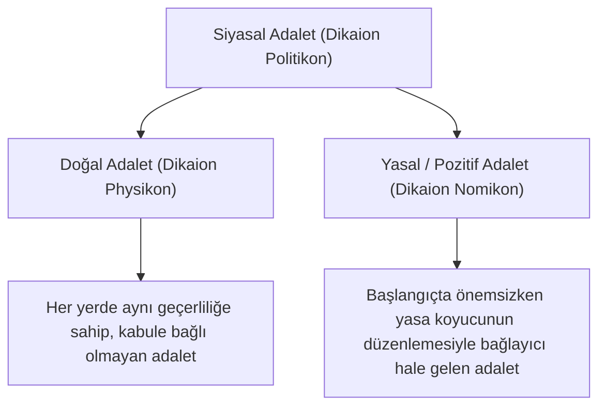

# Antik Dönem ve Stoa Felsefesinde Doğal Hukuk

> *"Gerçek yasa; doğa ile uyumlu, her insana yayılmış, değişmez ve ebedi olan doğru akıldır."*  
> — **Marcus Tullius Cicero**, *De Re Publica* (III, 33)

---

## 1. Giriş: Sofistler ve *Nomos - Physis* Ayrımı

Antik Yunan felsefesinde doğal hukuk düşüncesinin ilk tohumları, **Nomos** (insan yapımı yasalar, gelenekler, uzlaşılar) ile **Physis** (doğa, şeylerin özü ve evrensel düzen) arasındaki karşıtlığın sorgulanmasıyla atılmıştır:

* **Sofistlerin Eleştirisi:**
  * **Kallikles:** Pozitif yasaların (*nomos*) zayıfların güçlüleri dizginlemek için uydurduğu yapay engeller olduğunu, doğada ise (*physis*) güçlünün hükmetmesinin geçerli olduğunu ileri sürmüştür.
  * **Thrasymakhos:** Platon'un *Devlet* diyaloğunda adaleti "güçlünün işine gelen şey" olarak tanımlayarak pozitivist ve güç temelli bir realizm ortaya koymuştur.
  * **Hippias ve Antiphon:** İnsanların doğaları gereği eşit ve kardeş olduğunu, şehir devletlerinin koyduğu yasaların (*nomoi*) bu doğal eşitliği bozan yapay ayrımlar (köle-özgür, Yunan-barbar) yarattığını savunmuşlardır.

---

## 2. Platon ve İdeal Adalet

Platon (*M.Ö. 427-347*), adaleti duyusal dünyanın değişken yasalarından bağımsız, metafizik bir **Adalet İdeası** olarak kurgular:

* **Ruh ve Devlet Analojisi:**
  * Ruhun üç unsuru (akıl, öfke/cesaret, iştah/arzular) ile devletin üç sınıfı (yöneticiler-filozoflar, koruyucular-askerler, üreticiler-zanaatkarlar) arasında mükemmel bir uyum kurulmalıdır.
  * Adalet; her parçanın kendi işini yapması, haddini aşmaması ve aklın kuralına boyun eğmesidir (*suum cuique tribuere* öncülü).
* **Pozitif Yasa ve Filozof Kral:**
  * *Devlet* eserinde en üstün yönetim felsefi bilgiye dayalı yönetimdir; ancak *Yasalar* (*Nomoi*) eserinde Platon, kusursuz yöneticilerin yokluğunda en iyi alternatifin "yasanın egemenliği" (*ikinci en iyi devlet*) olduğunu kabul eder.

---

## 3. Aristoteles ve Doğal Adalet (*Dikaion Physikon*)

Aristoteles (*M.Ö. 384-322*), *Nikomakhos'a Etik* (V. Kitap) ve *Politika* eserlerinde hukuku ve adaleti ampirik ve teleolojik bir temele oturtur:



* **Doğal Adalet (*Dikaion Physikon*):** Ateşin hem Yunanistan'da hem de Pers diyarında aynı şekilde yakması gibi, insanların onayına bağlı olmaksızın her yerde aynı geçerliliğe sahip olan adalettir.
* **Yasal / Pozitif Adalet (*Dikaion Nomikon*):** Örneğin fidye miktarının belirlenmesi veya belirli kurban usulleri gibi, yasa konulmadan önce farksız olan ancak yasa konulduktan sonra bağlayıcı hale gelen kurallardır.
* **Hakkaniyet (*Epieikeia*):** Yasanın soyut ve genel niteliğinden kaynaklanan katılığı, somut olayın özelliklerine göre yumuşatan ve adaleti bireyselleştiren düzeltici mekanizmadır.

---

## 4. Stoa Okulu ve Kozmopolitizm

Stoa Felsefesi (Zenon, Khrysippos, Seneca, Epiktetos, Marcus Aurelius), doğal hukuku evrensel bir akıl ontolojisine bağlamıştır:

1. **Logos (Evrensel Akıl):** Evreni yöneten ilahi ve rasyonel ilkedir. İnsan, aklı sayesinde bu Logos'tan pay alır.
2. **Kozmopolis (Dünya Devleti):** İnsanlar sadece kendi polislerinin (şehir devletlerinin) değil, tüm insanlığı kapsayan evrensel bir topluluğun (*Cosmopolis*) yurttaşlarıdır.
3. **Doğal Eşitlik:** Akıl sahibi olmaları bakımından tüm insanlar (köleler, soylular, yabancılar) doğuştan eşittir.

---

## 5. Roma Hukukunda Cicero ve Hukukçuların Sentezi

Roma hukuk doktrininde Cicero ve klasik dönem hukukçuları (Gaius, Ulpianus, Paulus) doğal hukuk ilkelerini somut hukuk kurumlarına entegre etmişlerdir.

### Cicero'nun Doğru Akıl (*Recta Ratio*) Doktrini
Cicero, *De Legibus* (Yasalar Üzerine) ve *De Re Publica* eserlerinde şu temel ilkeleri ortaya koyar:
* Hukukun kaynağı insanların iradesi değil, doğanın bizzat kendisidir.
* Çoğunluğun oyu veya tiranın fermanı adaletsiz bir şeyi adil yapamaz.
* *"Eğer yasalar yalnızca halk kararları veya prenslerin fermanlarıyla tesis edilseydi; hırsızlık yapmak, zina etmek veya sahte vasiyetname düzenlemek meclisten geçtiği anda meşru sayılırdı."*

### Klasik Roma Hukukunda Üçlü Ayrım

```text
├── Ius Civile     : Yalnızca Roma vatandaşlarına uygulanan katı, biçimsel pozitif hukuk.
├── Ius Gentium    : Tüm halkların ve ulusların uyguladığı ortak prensipler (Uluslar hukuku / Ticaret hukuku).
└── Ius Naturale   : Doğanın tüm canlılara öğrettiği, değiştirilemez evrensel adalet kuralları.
```

* **Ulpianus'un Üç İlkesi (*Tria Iuris Praecepta*):**
  1. *Honeste vivere* (Onurlu yaşamak)
  2. *Alterum non laedere* (Başkasına zarar vermemek)
  3. *Suum cuique tribuere* (Herkese hakkı olanı vermek)

---

## 📌 Temel Çıkarımlar ve Miras

* Antik doğal hukuk, hukukun meşruiyetini keyfi güçten ve tiranlıktan ayırarak **akla ve ontolojik düzene** bağlamıştır.
* Roma hukukçularının geliştirdiği hakkaniyet (*aequitas*) ve iyi niyet (*bona fides*) kavramları modern medeni hukukun temel direkleri haline gelmiştir.
* Stoa kozmopolitizmi, modern evrensel insan hakları rejiminin felsefi zeminini hazırlamıştır.
