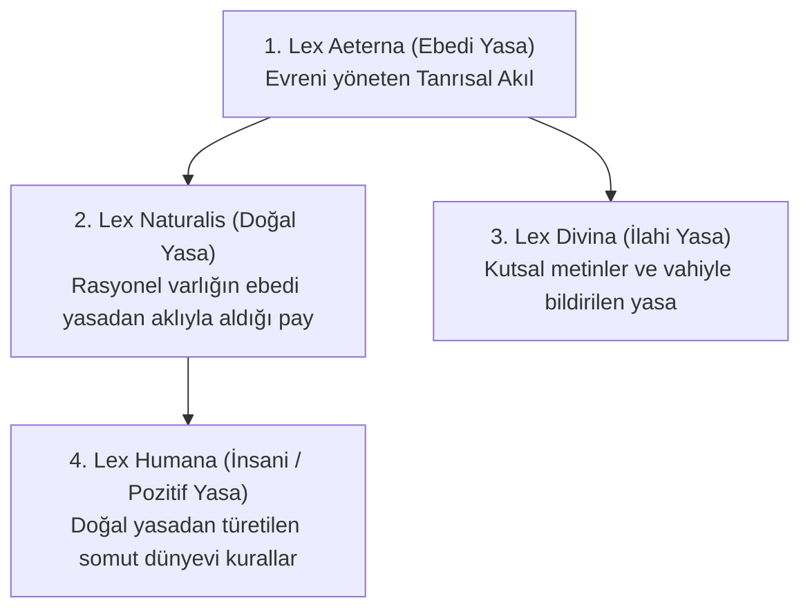

# Orta Çağ ve Skolastik Düşüncede Doğal Hukuk

> *"Adaletsiz bir yasa, yasa niteliğinde değildir (*Lex iniusta non est lex*)."*  
> — **Thomas Aquinas**, *Summa Theologiae* (I-II, q. 95, a. 2)

---

## 1. Giriş: Teoloji ve Hukukun Bütünleşmesi

Orta Çağ Hristiyan felsefesinde doğal hukuk, antik Stoa felsefesinin akıl kavramının Hristiyan teolojisindeki Tanrı iradesi ve Tanrısal akıl kavramıyla sentezlenmesiyle yeniden yorumlanmıştır.

Bu dönemde hukuk, yalnızca dünyevi bir düzenleme aracı değil, insanın nihai kurtuluşuna (*salus aeterna*) ve ilahi düzene hizmet eden normatif bir hiyerarşidir.

---

## 2. Augustinus ve İki Devlet Kuramı (*Civitas Dei*)

Aurelius Augustinus (*M.S. 354-430*), Hristiyan teolojisinin ilk kapsamlı hukuk ve devlet felsefesini geliştirmiştir:

* **Tanrı Devleti (*Civitas Dei*) vs. Yeryüzü Devleti (*Civitas Terrena*):**
  * Yeryüzü devleti, insanın ilk günahının (*peccatum originale*) bir sonucu olarak ortaya çıkmış zorunlu bir kötülüktür.
  * Devletin görevi, günahkâr insanların birbirini yok etmesini engellemek için dünyevi barışı (*pax terrena*) sağlamaktır.
* **Adalet Olmayan Devlet:**
  * Augustinus'un ünlü sorusu: *"Adalet olmazsa krallıklar büyük çaplı haydut çetelerinden başka nedir ki? (*Remota itaque iustitia quid sunt regna nisi magna latrocinia?*)"*
  * Yeryüzü kanunları ancak Tanrısal ebedi yasaya (*Lex Aeterna*) uygun olduğu ölçüde adildir.

---

## 3. Thomas Aquinas ve Dört Aşamalı Hukuk Sistemi

Thomas Aquinas (*1225-1274*), Aristotelesçi rasyonalizm ile Katolik teolojisini *Summa Theologiae* adlı başyapıtında birleştirerek klasik doğal hukukun en yetkin mimarisini kurmuştur.

Aquinas hukuku şöyle tanımlar:  
> *"Hukuk; ortak iyiyi amaçlayan, topluluğun bakımını üstlenen kişi tarafından ilan edilmiş bir **aklın buyruğudur** (*ordinatio rationis*)."*

### Hukuk Hiyerarşisinin Katmanları

1. **Lex Aeterna (Ebedi Yasa):**
   * Tanrı'nın evreni yaratırken ve yönetirken sahip olduğu yüce akıldır. İnsan aklı bunu doğrudan ve bütünüyle kavrayamaz.
2. **Lex Naturalis (Doğal Yasa):**
   * İnsanın akıl sahibi bir varlık olarak Ebedi Yasa'ya katılımıdır.
   * **Temel İlkesi:** *"İyilik yapılmalı ve aranmalı, kötülükten kaçınılmalıdır (*Bonum est faciendum et prosequendum, et malum vitandum*)."*
   * **İnsanın Doğal Eğilimleri:**
     - Varlığını koruma ve sürdürme eğilimi.
     - Türünü devam ettirme (evlilik, çocuk yetiştirme) eğilimi.
     - Hakikati arama (Tanrı'yı tanıma) ve toplum halinde barış içinde yaşama eğilimi.
3. **Lex Divina (İlahî Yasa):**
   * Kutsal Kitap ve vahiy aracılığıyla doğrudan Tanrı tarafından bildirilen yasalardır (On Emir vb.). İnsanın ebedi mutluluğa ulaşması için aklın yetmediği yerde yol gösterir.
4. **Lex Humana (İnsani / Pozitif Yasa):**
   * Doğal yasanın genel ilkelerinden yola çıkılarak somut toplumsal durumlar için konulan pozitif kanunlardır.

---

## 4. Pozitif Hukukun Doğal Yasadan Türetilme Yolları

Aquinas'a göre insani kanunlar doğal yasadan iki yöntemle türer:

1. **Sonuç Çıkarma Yoluyla (*Per modum conclusionis*):**
   * Doğal yasanın genel ilkesinden mantıksal bir sonuç çıkarılır.
   * *Örnek:* "Kimseye zarar verilmemelidir" ilkesinden "Öldürmek yasaktır" kuralının türetilmesi (bilimsel çıkarım gibidir).
2. **Belirleme Yoluyla (*Per modum determinationis*):**
   * Doğal yasanın genel buyruğunun somut ayrıntılarının yasa koyucu tarafından belirlenmesidir.
   * *Örnek:* "Hırsızlık cezalandırılmalıdır" genel kuralına karşılık verilecek cezanın tür ve miktarının yasa ile tayin edilmesi (bir mimarın evin planını detaylandırması gibidir).

---

## 5. Adaletsiz Yasa ve İtaat Yükümlülüğü (*Lex Iniusta Non Est Lex*)

Aquinas, pozitif yasa ile doğal yasa çatıştığında ne olacağı sorusuna şu yanıtı verir:

* Doğal yasaya aykırı olan bir kural hakiki bir yasa değil, **yasanın bozulmuş halidir** (*corruptio legis*).
* Bu tür yasalar vicdanen bağlayıcı değildir.
* **İstisna (Düzen ve Kargaşayı Önleme):** Toplumsal kargaşa, anarşi ve skandalı önlemek adına, insanın meşru olmayan bazı yasalara katlanması gerekebilir. Ancak yasa doğrudan Tanrı buyruğuna aykırıysa (örneğin putperestliğe zorlama), ona hiçbir koşulda itaat edilemez (*"İnsanlardan çok Tanrı'ya itaat etmek gerekir"*).

---

## 📌 Tarihsel Değerlendirme

* Skolastik doğal hukuk, hukuku kaba kuvvetten ayırarak **ahlak ve ortak iyi (*bonum commune*)** ile doğrudan ilişkilendirmiştir.
* Yöneticinin keyfi iradesine karşı normatif bir denetim mekanizması öngörerek anayasacılığın erken tohumlarını ekmiştir.
