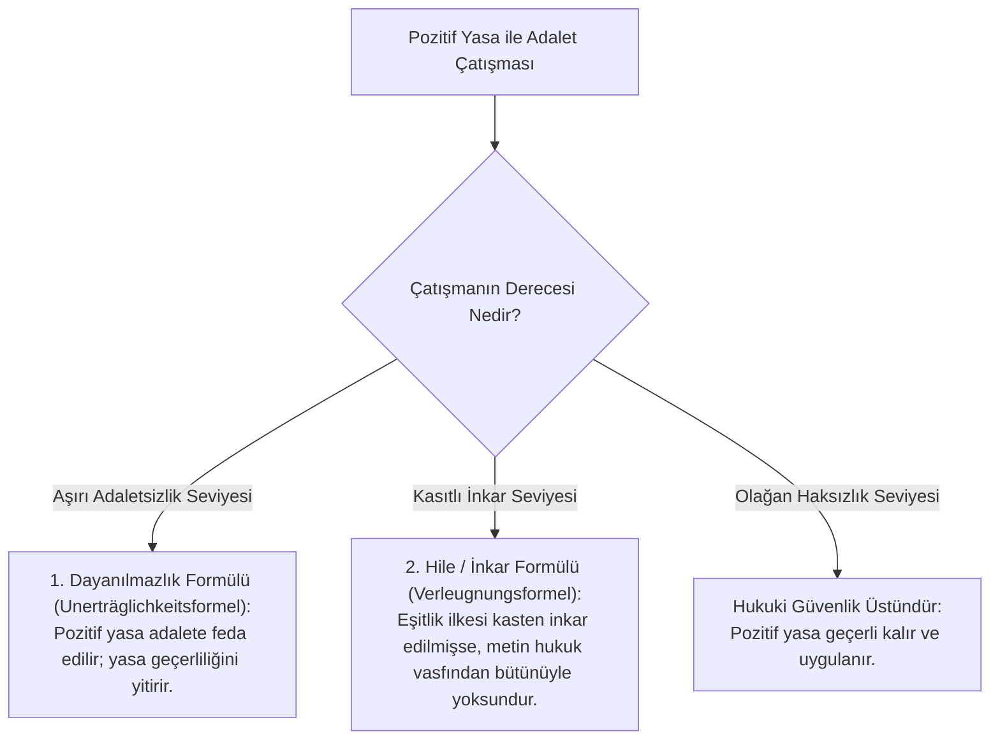

# Radbruch Formülü ve Modern Doğal Hukuk

> *"Pozitif yasa ile adalet arasındaki çatışma öyle dayanılmaz bir dereceye ulaşmalıdır ki yasa, 'adaletsiz hukuk' olarak adalete boyun eğmek zorunda kalsın."*  
> — **Gustav Radbruch**, *Gesetzliches Unrecht und übergesetzliches Recht* (1946)

---

## 1. Giriş: Pozitivizmin Krizi ve İkinci Dünya Savaşı Sonrası Hesaplaşma

19. yüzyıl boyunca ve 20. yüzyılın başlarında hâkim olan katı hukuki pozitivizm (*"Kanun kanundur - Gesetz ist Gesetz"*), Nazi Almanyası döneminde adaletsiz, ırkçı ve insanlık dışı emir ve yasaların yargıçlar ve bürokrasi tarafından sorgusuzca uygulanmasına zemin hazırlamıştır.

İkinci Dünya Savaşı sonrasında Nürnberg Yargılamaları ve Alman mahkemeleri şu yakıcı soruyla yüzleşti:  
**Dönemin yürürlükteki pozitif kanunlarına ve emirlerine uygun olarak işlenen insanlık suçları hukuken meşru sayılabilir mi?**

Bu kriz, doğal hukukun ve ahlak-hukuk ilişkisinin yeniden doğuşuna (*Rönesansına*) yol açmıştır.

---

## 2. Gustav Radbruch ve Ünlü Formülü

Savaştan önce bir hukuki pozitivist olan Alman hukuk filozofu ve Adalet Bakanı **Gustav Radbruch** (*1878-1949*), 1946 yılında yayımladığı *Yasal Haksızlık ve Yasa Üstü Hukuk* (*Gesetzliches Unrecht und übergesetzliches Recht*) makalesinde hukuk felsefesinin en etkili ilkelerinden birini ortaya koydu.

Radbruch Formülü iki temel basamaktan oluşur:

### 1. Dayanılmazlık Formülü (*Unerträglichkeitsformel*)
* Kural olarak pozitif hukuk, hukuki güvenlik ve belirlilik ilkeleri gereğince, haksız veya amaca aykırı olsa bile geçerlidir.
* Ancak pozitif yasa ile adalet arasındaki çatışma **"katlanılamaz / dayanılmaz bir dereceye"** ulaşırsa, yasa adalete boyun eğmelidir ve geçersiz sayılır.

### 2. İnkar Formülü (*Verleugnungsformel*)
* Bir yasa yapılırken adalet idesinin çekirdeğini oluşturan **eşitlik ilkesi kasten inkâr edilmişse**, o yasa yalnızca adaletsiz bir hukuk olmakla kalmaz; **hukuk vasfını tamamen yitirir** (*yasal haksızlık - gesetzliches Unrecht*).

---

## 3. Formülün Uygulama Alanları: Emsal Kararlar

### A. Alman Federal Anayasa Mahkemesi Kararları (1968)
* 1941 tarihli Reich Vatandaşlığı Kanunu 11. Ek Kararnamesi, yurt dışına kaçan Yahudilerin vatandaşlığını ve tüm mal varlıklarını tek taraflı olarak devlete devrediyordu.
* Federal Anayasa Mahkemesi (*BVerfGE 23, 98*), Radbruch formülünü uygulayarak bu düzenlemenin baştan itibaren yok hükmünde (*null and void*) olduğuna karar vermiştir:
  > *"Hukuk ile adaletsizlik aynı şey olamaz; insan haklarının çekirdeğini inkâr eden normlar hiçbir zaman hukuk niteliği kazanamaz."*

### B. Berlin Duvarı Nöbetçileri Davası (*Mauerschützenprozesse* - 1992-1996)
* Doğu Almanya (DDR) sınır muhafızları, Batı Berlin'e kaçmaya çalışan silahsız sivillere ateş açarak öldürmüşlerdi.
* Sanıklar, o dönem yürürlükte olan Doğu Almanya Sınır Kanunu'na ve komutanlarının emirlerine uyduklarını savundular.
* Alman Federal Mahkemesi (*BGH*) ve Anayasa Mahkemesi, Radbruch formülünü işleterek: Silahsız ve kaçan insanları öldürme emrinin evrensel insan haklarını ve asgari adalet bilincini ağır biçimde çiğnediğini, bu nedenle pozitif kuralın meşru bir hukuki dayanak oluşturamayacağını hükme bağlamıştır.

---

## 4. Lon L. Fuller ve Hukukun İçsel Ahlakı

Amerikalı hukuk kuramcısı **Lon L. Fuller** (*1902-1978*), *The Morality of Law* (1964) adlı eserinde doğal hukuku teolojik veya aşkın metafizik yerine **yöntemsel / usuli (*procedural*)** bir temele dayandırmıştır.

Fuller'e göre bir kural dizgesinin "hukuk sistemi" sayılabilmesi için taşıması gereken **8 İçsel Ahlak İlkesi**:

1. **Genellik (*Generality*):** Kurallar kişiye özel değil, genel ve soyut olmalıdır.
2. **Aleniyet / İlan (*Promulgation*):** Kurallar muhataplarına önceden duyurulmalı ve erişilebilir olmalıdır.
3. **Geriye Yürümezlik (*Non-retroactivity*):** Yasalar kural olarak geçmişe etkili olmamalıdır.
4. **Anlaşılırlık / Belirlilik (*Clarity*):** Normlar açık ve anlaşılır bir dille kaleme alınmalıdır.
5. **Çelişki İçermeme (*Non-contradiction*):** Kurallar birbirleriyle çatışmamalıdır.
6. **İmkânsızı İstememe (*Possibility of compliance*):** Muhataplarından güçlerinin ötesinde şeyler talep etmemelidir.
7. **İstikrar / Süreklilik (*Constancy through time*):** Kurallar her gün keyfi olarak değiştirilmemelidir.
8. **Resmî Eylem ile Kural Arasında Uyum (*Congruence between declared rule and official action*):** İdare ve mahkemeler koydukları kuralları fiilen dürüstçe uygulamalıdır.

> Bir sistem bu 8 ilkede tamamen başarısız olursa, ortaya çıkan şey kötü bir hukuk sistemi değil, **hukuk sistemi olmayan bir tiranlık veya keyfilik rejimidir**.

---

## 📌 Sonuç

Radbruch formülü ve modern doğal hukuk doktrini, hukukun biçimsel şekil şartlarından ibaret olmadığını; **insan onuru, temel haklar ve asgari adalet ilkelerinin** her pozitif hukuk normunun geçerlilik barajı olduğunu kanıtlamıştır.
