# Rasyonel Doğal Hukuk ve Toplumsal Sözleşme

> *"Tanrı'nın olmadığını veya insan işleriyle ilgilenmediğini varsaysak bile —ki bu büyük bir günahtır— doğal hukuk yine de geçerliliğini korurdu."*  
> — **Hugo Grotius**, *De Jure Belli ac Pacis* (1625, Prolegomena 11)

---

## 1. Giriş: Hukukun Sekülerleşmesi ve Rasyonalizm

17. ve 18. yüzyıllarda Aydınlanma düşüncesi ve Bilimsel Devrim ile birlikte doğal hukuk, teolojik ve metafizik bağlarından arındırılarak saf **insan aklı** ve **bireysel haklar** üzerine inşa edilmiştir.

Bu dönemin belirleyici yöntemsel araçları şunlardır:
1. **Doğa Durumu (*Status Naturalis*):** Siyasi otoritenin, devletin ve pozitif yasaların varlığından önceki varsayımsal durum.
2. **Toplumsal Sözleşme (*Pactum Unionis / Pactum Subiectionis*):** Bireylerin doğa durumunun belirsizliklerinden kurtulmak amacıyla rıza ile devleti kurmaları.
3. **Doğal Haklar:** İnsanın sırf insan olması sebebiyle sahip olduğu, devredilemez ve vazgeçilemez haklar.

---

## 2. Hugo Grotius ve Uluslararası Hukukun Temelleri

Hugo Grotius (*1583-1645*), modern doğal hukukun ve uluslararası hukukun kurucusu kabul edilir:

* **Sekülerleşme İlkesi (*Etiamsi daremus non esse Deum*):** Doğal hukuk, matematiksel aksiyomlar gibi insan aklının doğasından türer (2+2=4 gibi, Tanrı bile bunu değiştiremez).
* **Toplumsallık Güdüsü (*Appetitus Societatis*):** İnsan yalnız yaşayan yırtıcı bir hayvan değil, barışçıl ve düzenli bir toplumda yaşama arzusu duyan rasyonel bir varlıktır.
* **Ahde Vefa (*Pacta Sunt Servanda*):** Verilen sözlerin tutulması, mülkiyete saygı gösterilmesi ve verilen zararın tazmin edilmesi doğal hukukun zorunlu ilkeleridir.

---

## 3. Toplumsal Sözleşme Kuramlarının Karşılaştırmalı Analizi

```mermaid
flowchart TD
    subgraph Hobbes["Thomas Hobbes (Leviathan - 1651)"]
        H1["Doğa Durumu: Herkesin herkese karşı savaşı (Homo homini lupus)"]
        H2["Güdü: Şiddet dolu ölüm korkusu ve güvenlik arayışı"]
        H3["Sözleşme: Hakların mutlak egemene (Leviathan) devri"]
        H4["Sonuç: Mutlak Monarşi / Güvenlik odaklı düzen"]
        H1 --> H2 --> H3 --> H4
    end

    subgraph Locke["John Locke (İkinci İnceleme - 1689)"]
        L1["Doğa Durumu: Göreli barış ve doğal haklar (Yaşam, Özgürlük, Mülkiyet)"]
        L2["Sorun: Tarafsız yargıcın ve icra gücünün yokluğu"]
        L3["Sözleşme: Hakların korunması için sınırlı ve koşullu yetki devri"]
        L4["Sonuç: Anayasal Hukuk Devleti ve Direnme Hakkı"]
        L1 --> L2 --> L3 --> L4
    end

    subgraph Rousseau["Jean-Jacques Rousseau (Toplum Sözleşmesi - 1762)"]
        R1["Doğa Durumu: Masum ve özgür 'Asil Vahşi'"]
        R2["Sorun: Özel mülkiyetin doğuşu, eşitsizlik ve zincirler"]
        R3["Sözleşme: Bireysel iradelerin 'Genel İrade'ye (Volonté Générale) katılımı"]
        R4["Sonuç: Doğrudan Demokrasi ve Halk Egemenliği"]
        R1 --> R2 --> R3 --> R4
    end
```

---

## 4. Düşünürlerin Hukuk ve Hak Kuramları

### Thomas Hobbes: Hukuk Otoriteden Doğar
* *"Hakikati değil, otoriteyi yasa yapan şeydir (*Auctoritas, non veritas facit legem*)."*
* Doğa durumunda hiçbir şey adil veya adaletsiz değildir; çünkü yasa olmayan yerde adalet de yoktur.
* Egemenin koyduğu yasalar adaletin yegâne ölçütüdür; egemenin tek görevi kamu güvenliğini sağlamaktır.

### John Locke: Hakların Koruyucusu Olarak Sınırlı Devlet
* İnsanlar doğa durumunda **Yaşam (*Life*)**, **Özgürlük (*Liberty*)** ve **Mülkiyet (*Property*)** haklarına sahiptir.
* Mülkiyet hakkı, insanın emeğini doğadaki bir nesneye katmasıyla (*labor theory of property*) doğar.
* Devletin yasama ve yürütme organları, bu hakları ihlal ettiği anda sözleşmeyi çiğnemiş olur ve halkın **Direnme Hakkı (*Right of Revolution*)** doğar.

### Jean-Jacques Rousseau: Genel İrade ve Yasa
* *"İnsan özgür doğar, oysa her yerde zincire vurulmuştur."*
* Hukuk, halkın tümünün tümü hakkında verdiği genel karardır (*Genel İrade*).
* Genel iradeye boyun eğmek, insanın aslında kendi koyduğu yasaya uyması demektir; bu da hakiki özgürlüktür (*otonomi*).

---

## 5. Aydınlanma Doğal Hukukunun Anayasal Belgelere Yansıması

Rasyonel doğal hukuk öğretisi, modern anayasacılığın ve insan hakları bildirgelerinin doğrudan mimarı olmuştur:

* **1776 Amerikan Bağımsızlık Bildirgesi:**  
  > *"Bütün insanların eşit yaratıldıklarını; Yaratıcıları tarafından kendilerine devredilemez bazı hakların bağışlandığını; bunların arasında Yaşam, Özgürlük ve Mutluluğu Arama haklarının bulunduğunu apaçık bir gerçek olarak kabul ediyoruz."*
* **1789 Fransız İnsan ve Yurttaş Hakları Bildirisi:**  
  > *"Madde 2: Her siyasal topluluğun amacı; insanın doğal ve zamanaşımına uğramaz haklarını korumaktır. Bu haklar; özgürlük, mülkiyet, güvenlik ve baskıya karşı direnmedir."*

---

## 📌 Temel Çıkarımlar

* Doğal hukuk bu dönemde teolojiden rasyonel felsefeye evrilmiş; bireyin temel haklarını devlet gücünün önüne yerleştirmiştir.
* Egemenliğin meşruiyet temeli ilahi lütuftan (**Toplumsal Rıza ve Sözleşmeye**) kaydırılmıştır.
