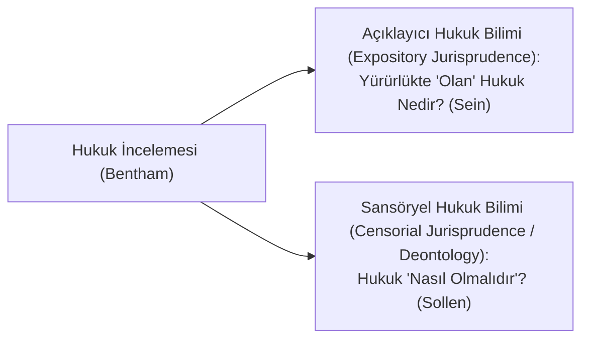

# Erken Pozitivizm ve Buyruk Teorisi: Bentham ve Austin

> *"Hukuk; siyasi bir toplumda egemen tarafından tebaasına yöneltilmiş, arkasında bir yaptırım tehdidi bulunan genel buyruktur."*  
> — **John Austin**, *The Province of Jurisprudence Determined* (1832)

---

## 1. Giriş: Analitik Hukuk Felsefesinin Doğuşu

18. yüzyıl sonu ve 19. yüzyıl başlarında İngiltere'de gelişen analitik pozitivizm, doğal hukuk doktrininin belirsiz "akıl" ve "doğa" kavramlarına karşı hukukun somut, ampirik ve bilimsel yöntemlerle incelenmesi gerektiğini savunmuştur.

Bu geleneğin iki ana kurucusu **Jeremy Bentham** ve onun öğrencisi **John Austin**'dir.

---

## 2. Jeremy Bentham ve Hukukun Rasyonelleştirilmesi

Jeremy Bentham (*1748-1832*), hem faydacılığın kurucusu hem de analitik hukuk felsefesinin öncüsüdür:



* **Doğal Hukuk Eleştirisi:** Bentham, Fransız İnsan Hakları Bildirisi'ni ve doğal haklar kavramını *"anlamsız hezeyanlar ve ayaklar üzerinde yükselen safsatalar (*nonsense upon stilts*)"* olarak nitelendirmiştir.
* **Kodifikasyon Yanlılığı (*Pannomion*):** Örf ve adetlere, hâkim yapımı içtihat hukukuna (*Common Law*) güvenmemiş; toplumun en büyük mutluluğu ilkesine (*utilitarianism*) göre tasarlanmış açık, yazılı kanunlaştırmaları savunmuştur.

---

## 3. John Austin ve Buyruk Teorisi (*Command Theory of Law*)

John Austin (*1790-1859*), hukuk biliminin sınırlarını kesin çizgilerle belirlemeye çalışmıştır:

### Hukukun Üç Temel Unsuru

```text
       ┌──────────────┐
       │   EGEMEN     │ (Siyasi üstün, alışkanlıkla itaat edilen)
       └──────┬───────┘
              │ Buyruk (İrade beyanı)
              ▼
       ┌──────────────┐
       │   YÜKÜMLÜLÜK │ (Tebaaya yönelen vazife)
       └──────┬───────┘
              │ İhlal halinde
              ▼
       ┌──────────────┐
       │   YAPTIRIM   │ (Kötülük / Zarar tehdidi)
       └──────────────┘
```

1. **Buyruk (*Command*):** Bir kişinin diğerine bir şey yapmasını veya yapmamasını bildirmesi ve buna uyulmaması halinde bir kötülük (ceza/yaptırım) ile tehdit etmesidir.
2. **Yaptırım (*Sanction*):** Buyruğa aykırı hareket edildiğinde kamu gücü tarafından uygulanacak olan ceza veya cebir tehdididir. Yaptırım yoksa hukuk da yoktur.
3. **Egemen (*Sovereign*):** Toplumun büyük bir çoğunluğu tarafından alışkanlıkla itaat edilen (*habit of obedience*), ancak kendisi başka hiçbir siyasi üstüne itaat etmeyen meşru veya fiili otoritedir.

---

## 4. Austin'e Göre Hukuk Olan ve Olmayan Alanlar

Austin kuralları sınıflandırarak yalnızca dar anlamda "uygun şekilde adlandırılan hukuku" (*laws properly so-called*) pozitivizmin inceleme nesnesi yapar:

* **Pozitif Hukuk (*Positive Law*):** Siyasi egemen tarafından tebaaya konulan kurallar (Asıl inceleme alanı).
* **Pozitif Ahlak (*Positive Morality*):** Toplumsal töreler, görgü kuralları, moda, onur yasaları ve uluslararası hukuk (Austin'e göre uluslararası hukuk bir egemen ve yaptırım mekanizmasından yoksun olduğu için bir hukuk değil, yalnızca uluslararası pozitif ahlaktır).
* **Tanrısal Hukuk (*Divine Law*):** Dini inançlara dayalı kurallar.

---

## 5. Buyruk Teorisinin Eleştirisi ve Sınırları

Erken pozitivizmin buyruk teorisi 20. yüzyılda (özellikle H.L.A. Hart tarafından) ağır eleştirilere uğramıştır:

1. **Silahlı Haydut Analojisi:** Austin'in "yaptırım tehdidiyle emretme" modeli bir devlet hukuku ile banka soyguncusunun *"Parayı ver yoksa vururum"* tehdidi arasındaki normatif farkı açıklayamaz.
2. **Yetki Veren Kurallar:** Austin yalnızca cezalandırıcı ve yasaklayıcı kuralları (ceza hukuku) modellemiştir. Oysa vasiyetname düzenleme, evlenme veya şirket kurma yetkisi veren medeni hukuk kuralları yaptırım değil **yetki** bahşeder.
3. **Egemenin Sürekliliği:** Alışkanlıkla itaat modeli, bir egemen öldüğünde veya seçimle hükümet değiştiğinde yeni yasama organına neden derhal itaat edildiğini (hukuki sürekliliği) izah edemez.
4. **Anayasal Sınırlılık:** Modern anayasal demokrasilerde egemen bile anayasa kurallarıyla ve yargı denetimiyle bağlıdır; sınırsız bir egemen yoktur.

---

## 📌 Tarihsel Değerlendirme

Tüm eksikliklerine rağmen Austin ve Bentham'ın erken pozitivizmi; hukuku metafizik spekülasyonlardan kurtarmış, hukuk bilimine kavramsal disiplin kazandırmış ve modern analitik hukuk metodolojisinin temellerini atmıştır.
