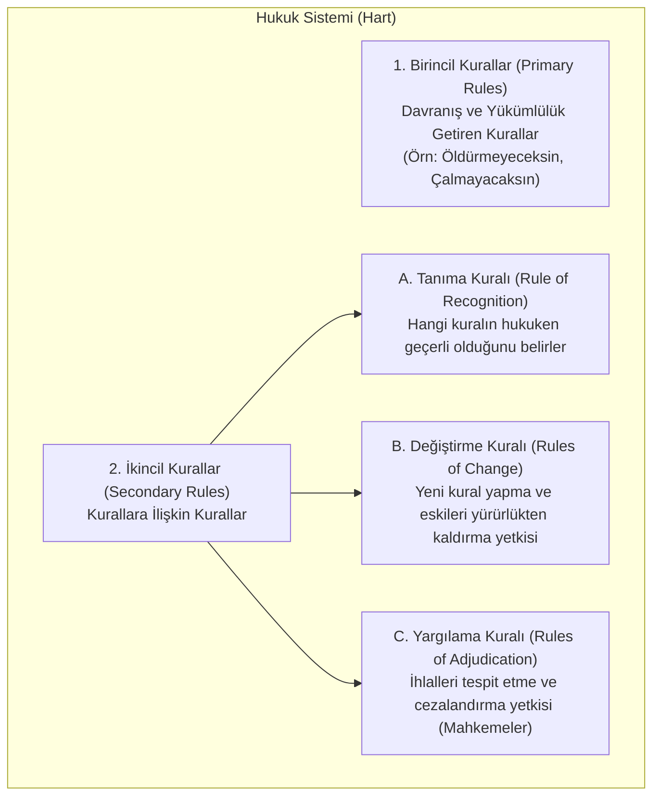

# H.L.A. Hart ve Hukuk Kavramı (*The Concept of Law*)

> *"Hukuk sistemi, birincil yükümlülük kuralları ile ikincil yetki kurallarının bileşiminden doğan kurumsal bir bütündür."*  
> — **H.L.A. Hart**, *The Concept of Law* (1961)

---

## 1. Giriş: İngiliz Analitik Hukuk Felsefesinin Zirvesi

Oxford Üniversitesi Hukuk Felsefesi Profesörü **Herbert Lionel Adolphus Hart** (*1907-1992*), 1961'de yayımladığı *The Concept of Law* (Hukuk Kavramı) eseriyle modern hukuki pozitivizmin en etkili kuramını inşa etmiştir.

Hart, Austin'in mekanik "buyruk-ceza" modelini çürütmüş ve hukukun bir "kurallar sistemi" olduğunu ortaya koymuştur.

---

## 2. Zorunlu Kılınmak (*Being Obliged*) vs. Yükümlülük Altında Olmak (*Having an Obligation*)

Hart, Austin'in yaptırım odaklı yaklaşımının şu iki durum arasındaki farkı açıklayamadığını gösterir:

* **Zorunlu Kılınmak (*Being Obliged*):** Bir soyguncu size silah doğrultup cüzdanınızı istediğinde, korkudan dolayı parayı vermeye zorunlu kalırsınız (*psikolojik cebir*). Ancak cüzdanınızı vermeye yönelik bir "hukuki yükümlülüğünüz" yoktur.
* **Yükümlülük Altında Olmak (*Having an Obligation*):** Bir vergi kanunu veya trafik kuralı karşısında birey, o an polis görmese veya ceza alma ihtimali olmasa dahi kuralın geçerliliği nedeniyle normatif bir yükümlülük altındadır.

---

## 3. Birincil ve İkincil Kuralların Birliği

Hart'a göre ilkel toplumlarda sadece geleneksel davranış kuralları vardır; ancak gelişmiş bir hukuk düzeni, iki tür kuralın bütünleşmesiyle ortaya çıkar:



### İlkel Toplumun Üç Kusuru ve İkincil Kuralların Çözümü:
1. **Belirsizlik (*Uncertainty*):** Kuralların ne olduğu açık değildir ➔ **Tanıma Kuralı** çözer.
2. **Durağanlık (*Static nature*):** Kurallar zamanla değişen koşullara uyarlanamaz ➔ **Değiştirme Kuralları** çözer.
3. **Etkisizlik (*Inefficiency*):** Uyuşmazlıkları bağlayıcı çözen merci yoktur ➔ **Yargılama Kuralları** çözer.

---

## 4. Tanıma Kuralı (*Rule of Recognition*)

Hart'ın kuramında Kelsen'in varsayımsal *Grundnorm*'unun yerini **Tanıma Kuralı** alır:

* Tanıma kuralı metafizik bir varsayım değil, **yargıçların ve kamu görevlilerinin fiili uygulamasıyla ortaya çıkan bir sosyal olgudur (*social practice / conventional rule*)**.
* İngiliz hukukunda örnek: *"Kraliyetin Mecliste (Queen-in-Parliament) kabul ettiği metinler yasadır."*
* Türkiye hukukunda örnek: *"TBMM tarafından Anayasa'ya uygun olarak kabul edilip Resmî Gazete'de yayımlanan metinler kanundur."*

---

## 5. İçsel ve Dışsal Bakış Açısı (*Internal vs. External Point of View*)

* **Dışsal Bakış Açısı (*External Point of View*):** Bir toplumu dışarıdan gözlemleyen antropolog veya sosyoloğun bakışıdır (örn. *"Işık kırmızı yandığında bu insanlar durma eğilimindedir"*).
* **İçsel Bakış Açısı (*Internal Point of View*):** Kuralı bir eleştiri ve davranış standardı olarak benimseyen, *"Işık kırmızı yandığı için durmalıyız, geçmek kural ihlalidir"* diyen yurttaşın ve özellikle yargıcın bakış açısıdır.

---

## 6. Dilin Açık Dokusu (*Open Texture*) ve Hâkimin Takdir Yetkisi

Hart, hukukun dilinin her somut olayı önceden kapsayamayacak kadar esnek ve belirsiz alanlar barındırdığını savunur:

```text
┌──────────────────────────────────────────────┐
│  AÇIK DOKU (OPEN TEXTURE)                   │
│                                              │
│   ┌──────────────────────────────┐           │
│   │ ÇEKİRDEK ANLAM (Core of      │           │
│   │ Certainty): Açık ve tartış-  │           │
│   │ masız vakalar.               │           │
│   │ (Örn: Parka otomobille       │           │
│   │  girmek yasaktır)            │           │
│   └──────────────┬───────────────┘           │
│                  │                           │
│   ┌──────────────▼───────────────┐           │
│   │ ALACAKARANLIK KUŞAĞI         │           │
│   │ (Penumbra of Doubt):         │           │
│   │ Belirsiz sınır vakalar.      │           │
│   │ (Örn: Parka elektrikli kaykay│           │
│   │  veya ambulans girebilir mi?)│           │
│   └──────────────────────────────┘           │
│                                              │
└──────────────────────────────────────────────┘
```

* **Alacakaranlık Kuşağı (*Penumbra*):** Kuralın sınırlarında kalan zor davalarda (*hard cases*) yargıç yalnızca mekanik bir kanun uygulayıcısı değil, **sınırlı bir takdir yetkisi (*judicial discretion*)** kullanarak yeni bir kural ihdas eden bir kural koyucu gibi davranır.

---

## 7. Asgari İçerikli Doğal Hukuk (*Minimum Content of Natural Law*)

Hart katı bir pozitivist olmasına rağmen, insan doğasının bazı yalın gerçekleri nedeniyle her hukuk düzeninin asgari bazı ahlaki ve insani kuralları içermesi gerektiğini kabul eder:
1. **İnsanın Kırılganlığı:** Can güvenliğini koruyan kuralların zorunluluğu (*Öldürme yasağı*).
2. **Yaklaşık Eşitlik:** Hiç kimsenin diğerlerini tamamen boyunduruk altına alacak kadar üstün olmaması.
3. **Sınırlı Özgecilik (Fedakarlık):** İnsanların ne melek ne de bencil canavarlar olması.
4. **Sınırlı Kaynaklar:** Mülkiyet ve bölüşüm kurallarının gerekliliği.
5. **Sınırlı Anlayış ve İrade Gücü:** Yaptırım mekanizmasının zorunluluğu.

---

## 📌 Sonuç

Hart'ın analitik modeli; hukuku ne kaba kuvvete ne de soyut metafiziğe teslim etmeden, kuralların mantıksal ve kurumsal işleyişini açıklayan çağdaş hukuk teorisinin köşe taşıdır.
