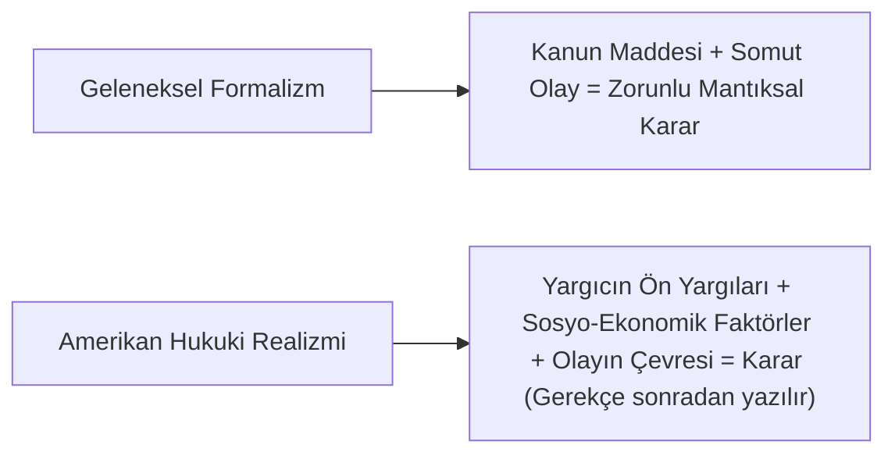

# Hukuki Realizm ve Eleştirel Hukuk Çalışmaları (CLS)

> *"Hukukun yaşamı mantık olmamıştır; deneyim olmuştur."*  
> — **Oliver Wendell Holmes Jr.**, *The Common Law* (1881)

---

## 1. Giriş: Biçimciliğe (Formalizm) Başkaldırı

19. yüzyılın sonlarında hâkim olan "hukuki formalizm" ya da kavramlar hukuku (*Begriffsjurisprudenz*); hukukun kapalı, mantıksal olarak eksiksiz ve yargıcın yalnızca mantıksal bir hekzafon gibi kanunu uyguladığı mekanik bir sistem olduğunu iddia ediyordu.

**Hukuki Realizm** ve ardılı olan **Eleştirel Hukuk Çalışmaları (*Critical Legal Studies - CLS*)**, hukukun kağıt üzerindeki metinlerden değil, mahkemelerin, yargıçların ve toplumsal güç odaklarının fiili eylemlerinden ibaret olduğunu savunan radikal akımlardır.

---

## 2. Amerikan Hukuki Realizmi

Amerikan realizmi, hukuku somut mahkeme salonlarında ve yargısal psikolojide arayan pragmatist bir harekettir:

### Önemli Temsilciler ve Fikirleri

1. **Oliver Wendell Holmes Jr. (1841-1935):**
   * **Kötü Adam Teorisi (*The Bad Man Theory*):** Hukukun ne olduğunu anlamak istiyorsanız ahlakçıya değil, "kötü adama" bakın. Kötü adam soyut adalet ilkeleriyle ilgilenmez; sadece eylemi yaptığında mahkemenin ona fiilen ne ceza vereceğini bilmek ister.
   * **Hukuk = Mahkemelerin Fiilen Ne Yapacağına Dair Bir Tahmin (*Prediction Theory*).**
2. **Karl Llewellyn (1893-1962):**
   * **Kağıt Üzerindeki Kurallar (*Paper Rules*) vs. Gerçek Kurallar (*Real Rules*):** Kanun kitaplarında yazanlar ile mahkemelerin fiilen uyguladığı kurallar arasında büyük bir uçurum vardır.
3. **Jerome Frank (1889-1957):**
   * **Kural Şüpheciliği (*Rule Skepticism*) ve Vaka Şüpheciliği (*Fact Skepticism*):** Yargıçların kararlarını belirleyen şey kanun kuralları değil; tanıkların güvenilirliği, duruşmadaki psikolojik atmosfer ve hatta "yargıcın kahvaltıda ne yediğidir".

---

## 3. İskandinav Hukuki Realizmi

İskandinav okulu (Axel Hägerström, Vilhelm Lundstedt, Karl Olivecrona, Alf Ross), hukukun metafizik ve büyüsel kavramlardan arındırılması gerektiğini savunan felsefi ve psikolojik bir realizmdir:

* **Metafizik Kavramların Tasfiyesi:** "Hak", "görev", "mülkiyet", "egemenlik" gibi kavramlar fiziksel dünyada karşılığı olmayan, ilkel büyü ve tabuların modern dile aktarılmış halidir.
* **Alf Ross ve Geçerli Hukuk:** Bir hukuk kuralının geçerli olması, yargıçların o kuralı uygularken kendilerini normatif bir psikolojik bağ altında hissetmelerine (*yargısal psikoloji*) bağlıdır.

---

## 4. Eleştirel Hukuk Çalışmaları (*Critical Legal Studies - CLS*)

1970'lerde Harvard Hukuk Fakültesi merkezli olarak doğan CLS hareketi (Duncan Kennedy, Roberto Unger, Morton Horwitz), hukuki realizmin tespitlerini Marksist, yapısalcı ve post-modern eleştirilerle birleştirmiştir:

### Temel Doktrinler:

1. **"Hukuk Siyasettir" (*Law is Politics*):**
   * Hukuk tarafsız, nesnel ve ideolojiler üstü bir hakem değildir.
   * Mevcut hukuk sistemi, egemen sınıfların, mülkiyet sahiplerinin ve kurulu düzenin çıkarlarını koruyan ideolojik bir aygıttır.
2. **Belirlenmezlik İlkesi (*Indeterminacy Thesis*):**
   * Hukuk kuralları her somut olayda hem davacıyı hem davalıyı haklı çıkaracak zıt ilkeleri bünyesinde barındırır (örn. Sözleşme serbestisi vs. Dürüstlük kuralı).
   * Kararı belirleyen hukukun mantığı değil, hâkimin sınıfsal ve siyasi tercihidir.
3. **Meşrulaştırma Fonksiyonu (*Legitimation*):**
   * Hukuk, eşitsizlikleri ve hiyerarşileri "doğal ve kaçınılmaz" göstererek toplumu pasifize eder.

---

## 5. Türev Eleştirel Akımlar

* **Feminist Hukuk Teorisi (*Feminist Jurisprudence*):** Hukukun evrensel ve tarafsız değil, tarihsel olarak ataerkil ve erkek egemen değerlere göre kurgulandığını savunur (Catharine MacKinnon, Carol Gilligan).
* **Eleştirel Irk Teorisi (*Critical Race Theory - CRT*):** Hukuk normlarının ve ceza adaleti sisteminin kurumsal ırkçılığı nasıl yeniden ürettiğini inceler (Derrick Bell, Kimberlé Crenshaw).
* **Hukuk ve Ekonomi Okulu (*Law and Economics*):** Realizme farklı bir açıdan yaklaşarak, hukuk kurallarının verimlilik ve refah maksimizasyonu (*Kaldor-Hicks verimliliği*) perspektifinden analiz edilmesi gerektiğini savunur (Richard Posner).

---

## 📌 Sonuç

Realizm ve Eleştirel Hukuk akımları, hukukçulara metinlerin ardındaki **iktidar, ekonomi, psikoloji ve sınıfsal dinamikleri** görme yetisi kazandırarak hukuki dogmatizmi sarsmıştır.
