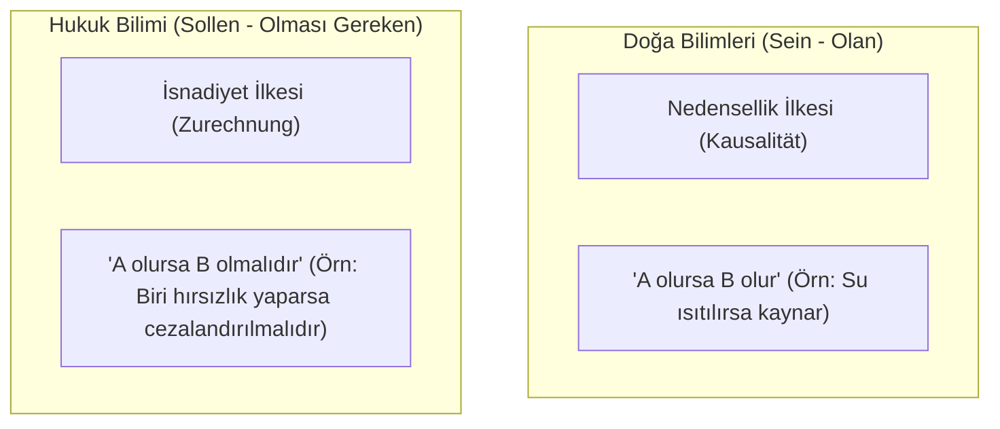

# Hans Kelsen ve Saf Hukuk Kuramı (*Reine Rechtslehre*)

> *"Hukuk bir doğa olgusu değil, normatif bir zorlama düzenidir; geçerliliğini doğadan ya da ahlaktan değil, kurucu temel normdan (*Grundnorm*) alır."*  
> — **Hans Kelsen**, *Reine Rechtslehre* (1934 / 1960)

---

## 1. Giriş: "Saf" Hukuk Biliminin Amacı

Avusturyalı hukuk kuramcısı **Hans Kelsen** (*1881-1973*), 20. yüzyılın en etkili hukuk felsefecilerinden biridir.

Kelsen'in kuramına **"Saf" (*Reine*)** adını vermesinin nedeni, hukuk bilimini iki büyük kirlenmeden arındırma arzusudur:
1. **Sosyolojik ve Psikolojik İndirgemecilik:** Hukuku fiili güç ilişkilerine veya insanların psikolojik güdülerine indirgemek (*Olan - Sein* alanına kayma).
2. **Ahlaki ve Siyasi İdeoloji:** Hukuku adalet, din veya tabii ahlak dogmalarıyla karıştırmak (*İdeal - Değer* yargılarına kayma).

Kelsen'e göre hukuk bilimi, normları **saf bir bilişsel nesne** olarak ele almalıdır.

---

## 2. *Sein* (Olan) ve *Sollen* (Olması Gereken) Düalizmi

Kelsen, Kantçı felsefeden yola çıkarak doğa bilimleri ile hukuk bilimini ontolojik ve yöntemsel olarak ayırır:



* **İsnat (*Zurechnung*):** Hukuk normu, belirli bir koşul (hukuka aykırı fiil) ile bir sonucu (yaptırım) birbirine bağlar. Hırsızlık yapıldığında ceza verilmesi fiziksel bir doğa yasası değil, normatif bir yükümlülüktür.

---

## 3. Normlar Basamağı (*Stufenbaulehre*) ve Norm Hiyerarşisi

Kelsen'in öğrencisi Adolf Merkl ile birlikte geliştirdiği **Stufenbaulehre** (Kademeli Normlar Düzeni), hukukun dinamik bir yetki basamakları piramidi olduğunu savunur:

```text
                  ▲
                 / \
                /   \
               /  G  \        Grundnorm (Varsayımsal Temel Norm)
              /-------\
             /    A    \       Anayasa (İlk Tarihsel Anayasa)
            /-----------\
           /      K      \      Kanunlar / Yasama İşlemleri
          /---------------\
         /        Y        \     Yönetmelikler / Tüzükler / Düzenleyici İşlemler
        /-------------------\
       /          B          \    Bireysel Normlar (Mahkeme Kararları, İdari İşlemler, Sözleşmeler)
      /-----------------------\
```

### Dinamik Yetki Aktarımı
* Bir normun geçerliliği, kendisinden bir üstte bulunan ve onun konulma usulünü belirleyen üst norma dayanır.
* Bir mahkeme kararı geçerlidir çünkü hâkim kanundan yetki almıştır.
* Kanun geçerlidir çünkü anayasanın öngördüğü usulle meclis tarafından kabul edilmiştir.
* Anayasa geçerlidir çünkü ilk kurucu iktidarın koyduğu anayasal normlara dayanmaktadır.

---

## 4. Temel Norm (*Grundnorm*) Kavramı

Hiyerarşinin en tepesindeki ilk tarihsel anayasanın geçerliliği nereden gelir?
Kelsen bu noktada **Grundnorm** (Temel Norm) kavramını geliştirir:

* Temel Norm, pozitif olarak yazılmış bir kural değildir; **hukuki aklın zorunlu bir epistemolojik varsayımıdır (*hypothetical postulate*)**.
* Temel Norm şudur: *"İlk tarihsel anayasa koyucunun buyruklarına itaat edilmelidir."*
* Hukukçular bu varsayımı kabul etmedikçe, bir anayasa veya yasa maddesini kaba bir zorbalıktan ayıran "normatif bağlayıcılığı" mantıksal olarak açıklayamazlar.

---

## 5. Geçerlilik (*Geltung*) ve Etkililik (*Wirksamkeit*)

Kelsen geçerlilik ile etkililik arasında net bir ayrım yapar:

* **Geçerlilik (*Geltung*):** Bir normun hiyerarşiye uygun olarak yaratılmış olması ve bağlayıcılık kazanmasıdır.
* **Etkililik (*Wirksamkeit*):** İnsanların fiilen bu norma uyması ve ihlal halinde yaptırımın fiilen uygulanmasıdır.
* **İlişki:**
  - Tek bir normun geçici olarak uygulanmaması onun geçerliliğini yok etmez.
  - Ancak bir bütün olarak hukuk düzeni toplumda asgari düzeyde etkili olmaktan çıkarsa (örneğin başarılı bir devrim/ihtilal durumunda), Grundnorm değişir ve eski düzen geçerliliğini toptan kaybeder.

---

## 6. Kelsen'in Anayasa Yargısına Mirası

Hans Kelsen sadece bir teorisyen değil, aynı zamanda **1920 Avusturya Anayasası'nın mimarı** ve dünyanın ilk bağımsız **Anayasa Mahkemesi modelinin kurucusudur**:

* Normlar hiyerarşisinde kanunların anayasaya uygunluğunu denetleyecek özel, bağımsız bir mahkeme modeli (Kelsen tipi Anayasa Yargısı) tüm Kıta Avrupası ve Türkiye'de benimsenmiştir.

---

## 📌 Temel Çıkarımlar

* Kelsen, hukuku siyasi ideolojilerden ve ahlakçılıktan bağımsız, kendi içinde tutarlı bir **biçimsel normatif mimari** olarak modellemiştir.
* Normlar hiyerarşisi ve anayasal denetim doktrini, modern kamu hukukunun omurgasını teşkil eder.
