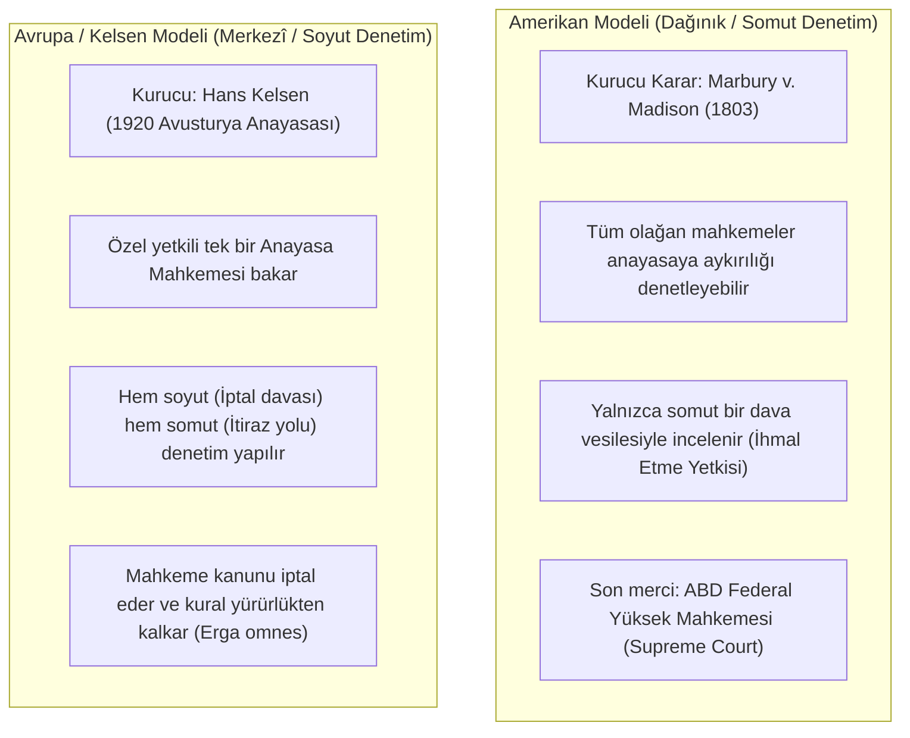

# Anayasanın Üstünlüğü ve Yargısal Denetim

> *"Anayasaya aykırı olan bir kanun hükümsüzdür; mahkemeler de dahil olmak üzere bütün devlet organları Anayasa ile bağlıdır."*  
> — **Başyargıç John Marshall**, *Marbury v. Madison* (1803)

---

## 1. Giriş: Anayasanın Üstünlüğü İlkesi

Anayasanın üstünlüğü (*Supremacy of the Constitution*), anayasanın devletin en üstün hukuk normu olduğunu, yasama, yürütme ve yargı organlarının tüm işlem ve eylemlerinde anayasaya uygun davranmak zorunda olduğunu ifade eden temel hukuk devleti ilkesidir.

Bu ilkenin hayata geçebilmesi iki zorunlu koşula bağlıdır:
1. **Katı (Sert) Anayasa:** Anayasanın olağan kanunlardan daha nitelikli çoğunluklarla ve özel usullerle değiştirilebilmesi.
2. **Yargısal Denetim Mekanizması:** Anayasaya aykırı kanunları geçersiz kılabilecek bağımsız bir yargı merciinin varlığı.

---

## 2. İki Temel Anayasal Denetim Modeli

Dünyada anayasaya uygunluk denetimi iki ana model üzerinden gelişmiştir:



---

## 3. Tarihsel Dönüm Noktası: *Marbury v. Madison* (1803)

ABD Yüksek Mahkemesi Başyargıcı John Marshall, anayasa metninde açıkça yazılı olmamasına rağmen şu mantıksal zincirle yargısal denetimi (*Judicial Review*) tesis etmiştir:

1. Anayasa ya sıradan kanunlarla değiştirilebilen üstün olmayan bir metindir ya da üstün ve temel bir kanundur.
2. Eğer anayasa üstün bir kanunsa, anayasaya aykırı olan bir parlamento kanunu geçersizdir.
3. Mahkemelerin görevi hukukun ne olduğunu söylemektir (*"It is emphatically the province and duty of the judicial department to say what the law is"*).
4. İki kural çatıştığında mahkeme üstün norm olan Anayasa'yı uygulamak ve çatışan kanunu ihmal etmek zorundadır.

---

## 4. Kelsen Modeli ve Denetim Usulleri

Kıta Avrupası ve Türkiye anayasa yargısında benimsenen Kelsen modeli üç ana denetim yolundan oluşur:

### A. Soyut Norm Denetimi (İptal Davası)
* Somut bir uyuşmazlık veya dava olmaksızın, kanunun Resmî Gazete'de yayımlanmasından itibaren belirli yetkili aktörlerin (Cumhurbaşkanı, meclisteki en çok üyeye sahip siyasi parti grupları veya belirli sayıda milletvekili) doğrudan Anayasa Mahkemesi'ne başvurmasıdır.

### B. Somut Norm Denetimi (İtiraz / Def'i Yolu)
* Görülmekte olan bir davada mahkemenin uygulayacağı kanun hükmünün anayasaya aykırı olduğu kanaatine varması veya tarafların bu yöndeki iddiasını ciddi bulması halinde dosyayı Anayasa Mahkemesi'ne göndermesidir.

### C. Bireysel Başvuru (*Anayasa Şikâyeti / Verfassungsbeschwerde*)
* Temel hak ve özgürlükleri kamu gücü tarafından ihlal edilen bireylerin, olağan kanun yollarını tükettikten sonra Anayasa Mahkemesi'ne başvurabilmesidir.
* Bireysel başvuru, anayasa mahkemesini saf bir "norm denetçisi" olmaktan çıkarıp "temel hak ve özgürlüklerin nihai koruyucusu" haline getirmiştir.

---

## 5. Anayasa Yargısında Denetim Ölçütleri

Anayasa Mahkemeleri kanunları şu boyutlarıyla denetler:

```text
┌─────────────────────────────────────────────────────────────┐
│                 ANAYASAYA UYGUNLUK DENETİMİ                 │
│                                                             │
│  1. ŞEKİL (BİÇİM) YÖNÜNDEN DENETİM:                         │
│     - Kanun teklifinin yetkili mercilerce yapılması         │
│     - Karar ve toplantı yeter sayılarına uyulması           │
│     - Zorunlu komisyon ve oylama usullerinin tüketilmesi    │
│                                                             │
│  2. ESAS YÖNÜNDEN DENETİM:                                  │
│     - Temel hak ve özgürlüklerin özüne dokunulmaması        │
│     - Ölçülülük ve belirlilik ilkelerine riayet             │
│     - Eşitlik ve hukuk devleti ilkelerine uygunluk          │
│     - Uluslararası insan hakları sözleşmeleriyle uyum       │
└─────────────────────────────────────────────────────────────┘
```

---

## 📌 Sonuç

Anayasa yargısı, parlamentoların çoğunluk tiranlığına dönüşmesini engelleyen, azınlık haklarını koruyan ve hukukun üstünlüğünü pozitif olarak güvence altına alan en gelişmiş kurumsal kalkandır.
