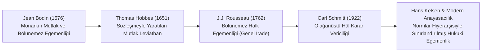

# Egemenlik Kavramının Tarihsel ve Kuramsal Evrimi

> *"Egemenlik; bir devletin yurttaşları ve tebaası üzerindeki en üstün, mutlak ve yasalarla sınırlandırılmamış iktidarıdır."*  
> — **Jean Bodin**, *Les Six Livres de la République* (1576)

---

## 1. Giriş: Modern Devletin Doğuşu ve Egemenlik

Orta Çağ'ın parçalanmış, çok merkezli feodal yapısından (İmparator, Papa, Feodal Beyler, Özerk Kentler) merkezi ulus-devletlere geçiş sürecinde **Egemenlik (*Sovereignty / Souveraineté*)** kavramı, devlet iktidarının tek elde toplanmasının ve üstünlüğünün kuramsal temeli olmuştur.

Ancak zaman içinde bu mutlak kavram, anayasacılık ve insan hakları rejimiyle evcilleştirilmiş ve sınırlandırılmıştır.

---

## 2. Düşünürlerin Egemenlik Kuramları

### 1. Jean Bodin (1576): Egemenliğin Klasik Tanımı
* Bodin, Fransa'daki din savaşlarını ve kaos ortamını sona erdirmek için monarkın üstün otoritesini savunmuştur.
* **Egemenliğin Nitelikleri:**
  1. *Mutlaktır (Absolue):* Kendi koyduğu pozitif yasalarla dahi bağlı değildir.
  2. *Süreklidir (Perpétuelle):* Zamanla sınırlı bir yetki devri değildir.
  3. *Bölünemezdir (Indivisible):* Birden fazla organ arasında paylaştırılamaz.
* *Sınır:* Bodin, monarkın Tanrısal yasalar ve doğa yasaları ile bağlı olduğunu kabul etmiştir.

### 2. Thomas Hobbes (1651): Rasyonel Mutlakçılık
* Hobbes egemenliği ilahi hakka değil, insanların doğa durumundaki ölüm korkusu ve güvenlik ihtiyacına dayandırır.
* Bireyler tüm haklarını devlete devreder; egemenin eylemleri adaletsiz sayılamaz.

### 3. Jean-Jacques Rousseau (1762): Halk Egemenliği
* Egemenliği kraldan alıp **Halkın Bütününe (Ulus / Millet)** vermiştir.
* Egemenlik Genel İrade'nin (*volonté générale*) tezahürüdür; devredilemez, temsil edilemez ve bölünemez.

### 4. Carl Schmitt (1922): Kararcılık (*Decisionism*)
* Weimar Cumhuriyeti döneminde Schmitt, pozitivist normativizmi eleştirerek egemenliğin kriz anlarında ortaya çıktığını savunmuştur:
* *"Egemen, olağanüstü hâle (*Ausnahmezustand*) karar verendir."*
* Hukuk düzeni normal zamanlarda normlarla işler; ancak olağanüstü kriz anında düzeni yeniden kuracak olan egemenin çıplak kararıdır.

---

## 5. Modern Anayasal Düzen: Egemenliğin Sınırlandırılması

20. yüzyıl sonrasında egemenlik kavramı köklü bir paradigma değişimine uğramıştır:

1. **İç Egemenliğin Sınırlandırılması:**
   * Egemenlik artık sınırsız ve keyfi bir güç değildir. Anayasa'nın bağlayıcılığı, kuvvetler ayrılığı, yargı denetimi ve temel insan hakları ile kayıtlıdır.
   * *Örnek (T.C. Anayasası m. 6):* *"Egemenlik, kayıtsız şartsız Milletindir. Türk Milleti, egemenliğini, Anayasanın koyduğu esaslara göre, yetkili organları eliyle kullanır."*
2. **Dış Egemenliğin Dönüşümü:**
   * Uluslararası Hukuk, BM Şartı, Avrupa İnsan Hakları Sözleşmesi (AİHS) ve uluslararası ceza mahkemeleri gibi kurumlar, devletlerin kendi sınırları içinde dahi mutlak keyfi hareket edemeyeceğini kabul ettirmiştir.
   * **İnsani Müdahale ve Koruma Sorumluluğu (*R2P - Responsibility to Protect*):** Bir devlet kendi halkına karşı soykırım ve insanlığa karşı suç işliyorsa, egemenlik kalkanı ardına sığınamaz.

---

## 📌 Sonuç

Egemenlik, "hükümdarın mutlak kudreti" olmaktan çıkıp, **"demokratik usullerle ve hukuk devleti sınırları içinde kullanılan anayasal yetki"** haline gelmiştir.
