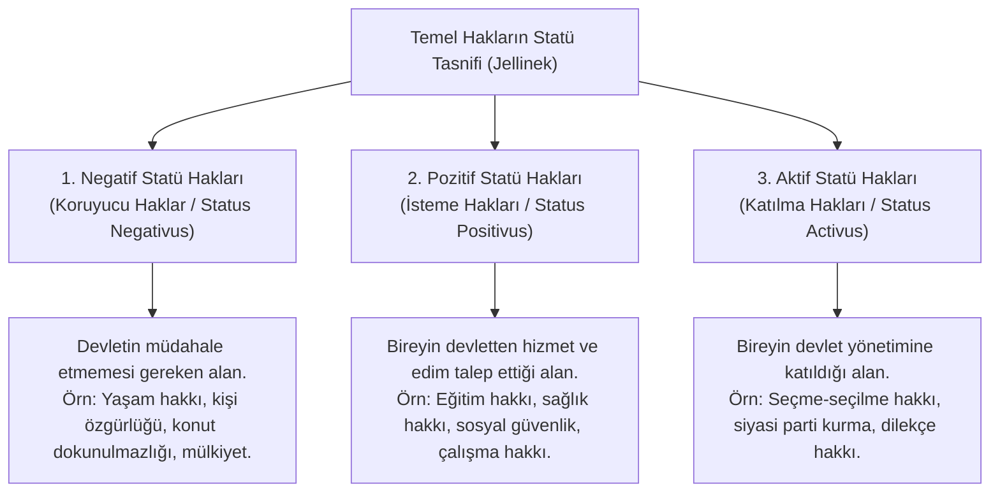

# Temel Haklar ve İnsan Onuru Doktrini

> *"İnsan onuru dokunulmazdır. Ona saygı göstermek ve onu korumak bütün devlet erkinin yükümlülüğüdür."*  
> — **Almanya Federal Cumhuriyeti Temel Yasası (*Grundgesetz*)**, Madde 1(1)

---

## 1. Giriş: Modern Anayasa Hukukunun Aksiyomu Olarak İnsan Onuru

İkinci Dünya Savaşı'nın yol açtığı yıkım ve insanlık suçlarının ardından, 1948 BM İnsan Hakları Evrensel Beyannamesi ve 1949 Alman Temel Yasası ile birlikte **İnsan Onuru (*Human Dignity / Menschenwürde*)**, tüm anayasal ve uluslararası hukuk düzeninin kurucu temeli ve en üst normatif değeri olarak kabul edilmiştir.

---

## 2. Kantçı Kökler ve Nesneleştirme Yasağı (*Objektformel*)

İnsan onuru doktrini doğrudan Immanuel Kant'ın ahlak felsefesine dayanır:

* **Amaç Olarak İnsan:**  
  Kant'ın *Koşulsuz Buyruğu* (*Kategorik İmperatif*):  
  > *"Öyle davran ki, insanlığı hem kendi şahsında hem de bir başkasının şahsında hiçbir zaman sırf bir araç olarak değil, daima bir amaç olarak göresin."*
* **Fiyat vs. Onur:**  
  Fiyatı olan şeyin yerini başka bir şey alabilir; ancak onuru olan şey her türlü paha ve ikamenin üzerindedir.

### Günther Dürig ve Nesneleştirme Formülü (*Objektformel*)
Alman anayasa hukuku doktrininde Günther Dürig tarafından geliştirilen bu formüle göre:
* Eğer bir birey devlet eylemiyle **sırf bir araç, bir nesne, bir rakam veya bir piyon** durumuna indirgeniyorsa, insan onuru ihlal edilmiştir.
* *Örnek (Alman Uçak Güvenliği Davası - 2006):* Teröristler tarafından kaçırılan ve bir gökdelene çarptırılmak istenen bir yolcu uçağının, yerdeki binlerce insanı kurtarmak amacıyla füzeyle vurulmasına izin veren yasa; uçaktaki masum rehineleri sırf bir savunma nesnesi kıldığı gerekçesiyle **insan onuruna aykırı bulunarak iptal edilmiştir**.

---

## 3. Georg Jellinek'in Kamu Hakları Tasnifi (Statü Teorisi)

Avusturyalı kamu hukukçusu **Georg Jellinek** (*1851-1911*), temel hakları birey ile devlet arasındaki ilişkiye göre üçlü bir statüye ayırmıştır:



---

## 4. Temel Hakların Sınırlandırılması Rejimi

Temel hak ve özgürlükler kural olarak sınırsız değildir; ancak sınırlandırmanın keyfi olmasını engelleyen anayasal güvence ölçütleri vardır:

```text
┌─────────────────────────────────────────────────────────────┐
│             HAK SINIRLAMASININ 5 AŞAMALI TESTİ              │
│                                                             │
│  1. KANUNİLİK: Sınırlama ancak açık bir kanunla yapılabilir.│
│  2. MEŞRU AMAÇ: Anayasada sayılan özel sebeplere dayanmalıdır│
│  3. DEMOKRATİK TOPLUM DÜZENİNİN GEREKLERİ: Çoğulculuk,     │
│     hoşgörü ve açık toplum ilkelerine uygun olmalıdır.      │
│  4. HAKKIN ÖZÜNE DOKUNMAMA: Hakkı kullanılamaz kılan veya   │
│     tamamen anlamsızlaştıran sınırlama yapılamaz.           │
│  5. ÖLÇÜLÜLÜK İLKESİ: Elverişli, gerekli ve orantılı olmalı.│
└─────────────────────────────────────────────────────────────┘
```

---

## 5. Çekirdek Haklar Doktrini (Mutlak Haklar)

Savaş, seferberlik veya olağanüstü hâllerde dahi hiçbir surette sınırlandırılamayan, askıya alınamayan mutlak hak alanıdır:

1. **Yaşam Hakkı** (Meşru savunma halleri hariç).
2. **İşkence, Eziyet ve İnsanlık Dışı Muamele Yasağı** (Mutlaktır, hiçbir istisnası yoktur).
3. **Maddi ve Manevi Varlığın Bütünlüğü Doktrini.**
4. **Din, Vicdan, Düşünce ve Kanaatlerin Açıklanmaya Zorlanamaması** (Kişinin iç dünyasına dokunulamaz).
5. **Suç ve Cezaların Geçmişe Yürümezliği.**
6. **Masumiyet Karinesi** (Suçluluğu mahkeme hükmüyle sabit oluncaya kadar herkes masumdur).

---

## 📌 Sonuç

İnsan onuru ve temel haklar rejimi; bireyi devletin bir tebaası veya aracı olmaktan çıkarıp, devletin varlık sebebi ve nihai amacı kılan modern anayasacılığın ahlaki omurgasıdır.
