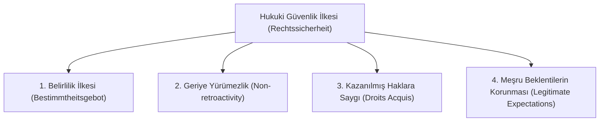

# Hukuki Güvenlik, Belirlilik ve Kazanılmış Haklar

> *"Hukuk devleti, yurttaşlarının hukuki güvenlik içinde yaşadığı, devletin eylem ve işlemlerinin öngörülebilir olduğu devlettir."*  
> — **Anayasa Mahkemesi Kararı**

---

## 1. Giriş: Hukuki Güvenlik İlkesi (*Rechtssicherheit*)

Hukuki güvenlik ilkesi, bireylerin tüm eylem ve işlemlerinde devlete güven duyabilmesini, geleceğe yönelik planlarını mevcut yasal düzene göre güvenle yapabilmesini ve bu güvenin idarece keyfi olarak sarsılmamasını güvence altına alır.

---

## 2. Hukuki Güvenliğin Dört Temel Unsuru

### 1. Belirlilik İlkesi (*Bestimmtheitsgebot*)
* Hukuk kuralları; muhataplarının hangi eylemin ne tür hukuki sonuç doğuracağını, hak ve yükümlülüklerinin sınırlarını tereddütsüz anlayabileceği açıklıkta olmalıdır.
* İdareye tanınan yetkilerin sınırları kanunda açıkça çizilmelidir.

### 2. Geriye Yürümezlik İlkesi
* Yeni yürürlüğe giren bir kanun veya idari düzenleme, kural olarak geçmişte tamamlanmış hukuki işlem ve eylemlere uygulanamaz.
* *İstisna:* Ceza hukukunda failin lehine olan kanun hükümleri geçmişe yürür.

---

## 3. Kazanılmış Hak Doktrini (*Droits Acquis*)

Kazanılmış hak; yürürlükteki mevzuata uygun olarak tüm kurucu şartları gerçekleşmiş, bireyin malvarlığına veya şahsi statüsüne kesin olarak dahil olmuş haktır:

* **Koşulları:**
  1. Hakkın iktisap edildiği tarihteki hukuka tam uygunluk.
  2. Bireyin hile, sahtecilik veya yalan beyanının bulunmaması.
  3. Hakkın tüm hukuki sonuçlarıyla tamamlanmış olması (*tamamlanmamış işlemler sadece 'beklenen hak' oluşturur*).
* **Sonuç:** Sonradan değişen kanunlar veya idari işlemler, hukuka uygun olarak kazanılmış bu hakları geriye dönük olarak ortadan kaldıramaz.

---

## 4. Meşru / Haklı Beklentilerin Korunması (*Legitimate Expectations*)

Modern idare hukukunda geliştirilen bu doktrin, kazanılmış hak kadar katı olmayan ancak korunmaya değer hukuki durumları kapsar:

* **Tanım:** İdarenin uzun süredir devam eden istikrarlı bir uygulaması veya açık bir taahhüdü sebebiyle, makul bir yurttaşta oluşan haklı inançtır.
* **Uygulama:** İdare kuralını değiştirirken ani ve şok edici kararlar alamaz; ilgililere intibak etmeleri için **makul bir geçiş süreci (*transition period*)** tanımalıdır.

---

## 📌 Sonuç

Hukuki güvenlik ve belirlilik; devlet iktidarının keyfiliğini dizginleyen, piyasa istikrarını ve yurttaşın devlete olan sadakat ve itimadını ayakta tutan en temel sütundur.
