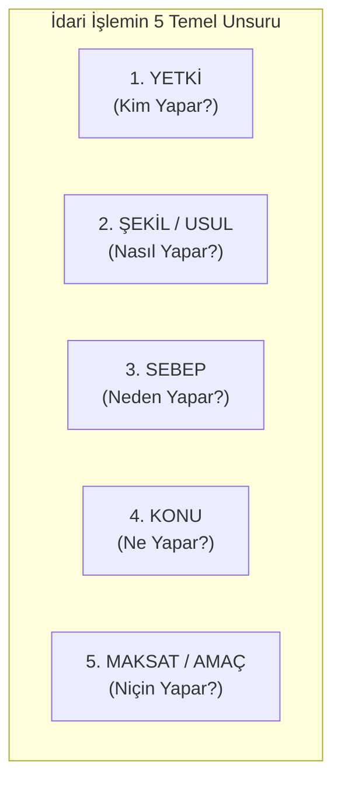

# İdari İşlemlerin İptal Sebepleri ve Sakatlık Türleri

> *"İdari işlemler; yetki, şekil, sebep, konu ve maksat yönlerinden biri ile hukuka aykırı oldukları takdirde iptal edilirler."*  
> — **İdari Yargılama Usulü Kanunu (İYUK m. 2/1-a)**

---

## 1. Giriş: İdari İşlemin Kurucu Unsurları

İdarenin tek yanlı irade beyanıyla ilgililerin hukuki durumunu değiştiren (icrai) işlemlerinin geçerli olabilmesi için 5 kurucu unsurun hukuka uygun olması gerekir:



---

## 2. Unsurların İncelenmesi ve Sakatlık Türleri

### 1. Yetki Unsuru ve Sakatlıkları
Yetki, kanunun belirli bir idari işlemi yapma salahiyetini hangi idari organ veya görevliye verdiğidir.
* **Fonksiyon Gaspı:** İdarenin yasama veya yargı organının yerine geçerek işlem yapması (Örn: İdare mahkemesi kararı olmadan idarenin birini doğrudan hapse atması ➔ **Yokluk** sebebidir).
* **Yetki Gaspı:** İdare adına işlem yapma ehliyeti bulunmayan bir kişinin (resmi sıfatı olmayan) işlem tesis etmesi (➔ **Yokluk**).
* **Yetki Tecavüzü:** İdare içinde bir makamın, başka bir idari makamın görev alanına giren işlemi yapması (Örn: Kaymakamın vali yetkisi kullanması ➔ **İptal** sebebidir).

### 2. Şekil ve Usul Unsuru ve Sakatlıkları
İşlemin yapılışında izlenmesi kanunen zorunlu olan adımlardır.
* **Asli Şekil Sakatlığı:** İlgilinin savunma hakkının kısıtlanması, zorunlu kurul kararının alınmaması veya gerekçe yazılmaması (➔ **İptal** sebebi).
* **Tali Şekil Sakatlığı:** İşlemin sonucunu etkilemeyen önemsiz usul eksiklikleri (İptal gerektirmez).

### 3. Sebep Unsuru ve Sakatlıkları
İdareyi o işlemi yapmaya sevk eden hukuki veya maddi gerekçedir.
* Sebebin gerçek dışı olması (Maddi hata).
* Sebebin hukuken geçerli bir sebebe dayanmaması (Hukuki niteleme hatası).

### 4. Konu Unsuru ve Sakatlıkları
İşlemin doğurduğu doğrudan hukuki sonuçtur.
* Konunun imkânsız veya meşru olmaması.
* Kanunun emrettiği neticeden farklı bir sonucun doğurulması.

### 5. Maksat (Amaç) Unsuru ve Yetki Saptırması (*Détournement de Pouvoir*)
Her idari işlemin tek bir meşru nihai amacı vardır: **Kamu Yararı**.
* **Yetki Saptırması:** İdarenin kanuni yetkisini kamu yararı yerine; kişisel husumet, siyasi kayırma veya mali menfaat sağlamak amacıyla kullanmasıdır.

---

## 3. Sakatlıkların Hukuki Sonuçları

```text
┌─────────────────────────────────────────────────────────────┐
│                 SAKATLIKLARIN DERECELERİ                    │
│                                                             │
│  1. YOKLUK (Inexistence):                                   │
│     İşlem hukuk aleminde hiç doğmamıştır. Süreye tabi      │
│     olmadan her zaman tespiti istenebilir; kimseyi bağlamaz│
│                                                             │
│  2. BUTLAN / İPTAL EDİLEBİLİRLİK (Annulabilité):             │
│     İşlem yetkili idarece yapılmıştır ancak 5 unsurdan      │
│     birinde hukuka aykırılık vardır. Dava açma süresi       │
│     içinde mahkemece İPTAL edilene kadar yürürlüktedir.     │
│                                                             │
│  3. İPTAL KARARININ ETKİSİ (Ex Tunc):                       │
│     İptal kararları işlemi yapıldığı tarihten itibaren      │
│     geriye dönük olarak ortadan kaldırır.                   │
└─────────────────────────────────────────────────────────────┘
```

---

## 📌 Sonuç

İdari işlemlerin 5 unsur üzerinden yargısal denetimi, bürokrasinin vatandaşa karşı keyfi güç kullanmasını engelleyen en somut yargısal kaledir.
