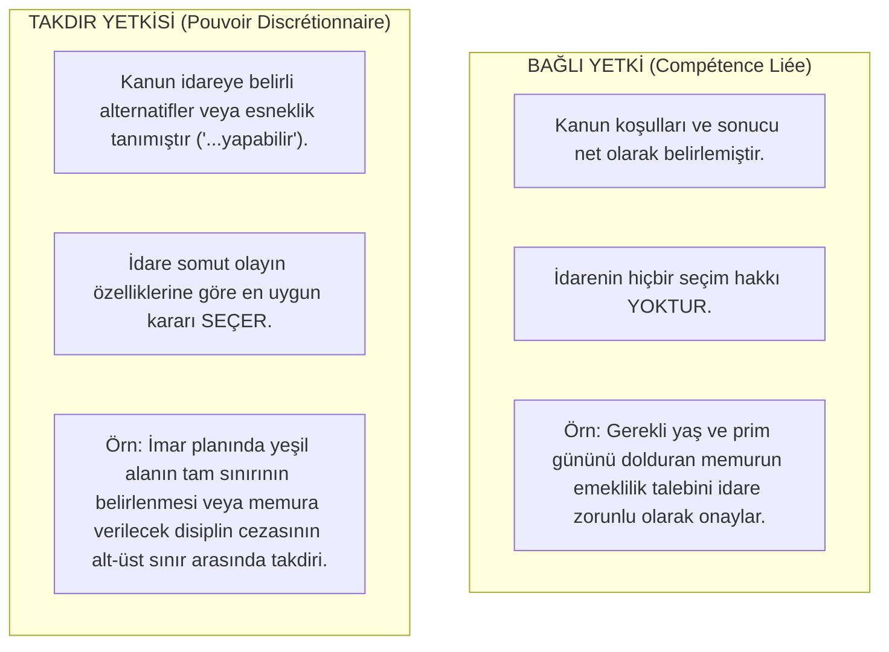

# Kanuni İdare, Bağlı Yetki ve Takdir Yetkisi

> *"İdare, kanunla verilmeyen hiçbir yetkiyi kullanamaz; takdir yetkisi ise sınırsız bir keyfilik değil, kamu yararıyla kayıtlı bir tercih serbestisidir."*

---

## 1. Giriş: İdarenin Kanuniliği İlkesi

İdarenin kanuniliği (*Principe de légalité*), yürütme ve idare organlarının işlemlerinin iki temel şartı sağlamasını gerektirir:

1. **Kanuna Dayanma (Kanuni Dayanak):** İdare, kanunun açıkça izin vermediği bir alanda kendiliğinden işlem tesis edemez (İlkellik / Özerklik ilkesinin yokluğu).
2. **Kanuna Aykırı Olmama:** İdarenin yaptığı hiçbir kural, karar veya fiil mevcut kanunlara zıt olamaz.

---

## 2. Bağlı Yetki vs. Takdir Yetkisi

Hukuk düzeni idareye işlem yapma görevi verirken iki farklı yetki türü tanır:



---

## 3. Takdir Yetkisinin Hukuki Sınırları

Takdir yetkisi asla mutlak bir keyfilik (*arbitrary power*) anlamına gelmez. İdarenin takdir yetkisi şu sınırlar içinde kullanılmak zorundadır:

```text
┌─────────────────────────────────────────────────────────────┐
│                 TAKDIR YETKİSİNİN SINIRLARI                 │
│                                                             │
│  1. KAMU YARARI AMACI:                                      │
│     İşlem mutlaka genel kamu menfaatine ve hizmetin         │
│     gereklerine uygun olmalıdır.                            │
│                                                             │
│  2. EŞİTLİK VE AYRIMCILIK YASAĞI:                           │
│     Benzer durumlardaki kişilere farklı, farklı durumlara   │
│     keyfi aynı muamele yapılamaz.                           │
│                                                             │
│  3. ÖLÇÜLÜLÜK İLKESİ:                                       │
│     Ulaşılmak istenen amaç ile başvurulan araç arasında     │
│     makul bir denge bulunmalıdır.                           │
│                                                             │
│  4. GEREKÇE GÖSTERME ZORUNLULUĞU:                           │
│     İdare takdirini neden o yönde kullandığını somut        │
│     olgu ve verilere dayandırarak açıklamak zorundadır.     │
└─────────────────────────────────────────────────────────────┘
```

---

## 4. İdari Yargı Denetimi ve Yerindelik Denetimi Yasağı

İdari mahkemeler (Danıştay, İdare Mahkemeleri), idarenin işlemlerini denetlerken **Hukukilik Denetimi** yaparlar, **Yerindelik Denetimi (*Contrôle d'opportunité*)** yapamazlar:

* **Hukukilik Denetimi (Caiz Olan):** İşlemin kanuna, kamu yararına, şekle ve yetki kurallarına uygun olup olmadığının incelenmesi.
* **Yerindelik Denetimi Yasağı (Yasak Olan):** Hâkimin idarenin yerine geçerek *"Bu hastane buraya değil şuraya yapılsaydı daha iyi olurdu"* diyerek kendi şahsi tercihini idarenin takdiri yerine ikame etmesi yasaktır.

---

## 📌 Sonuç

Bağlı yetki idarenin mekanik işleyişini, takdir yetkisi ise idarenin değişen toplumsal ihtiyaçlara dinamik cevap verebilmesini sağlar; bağımsız idari yargı denetimi ise bu esnekliğin zorbalığa dönüşmesini engeller.
