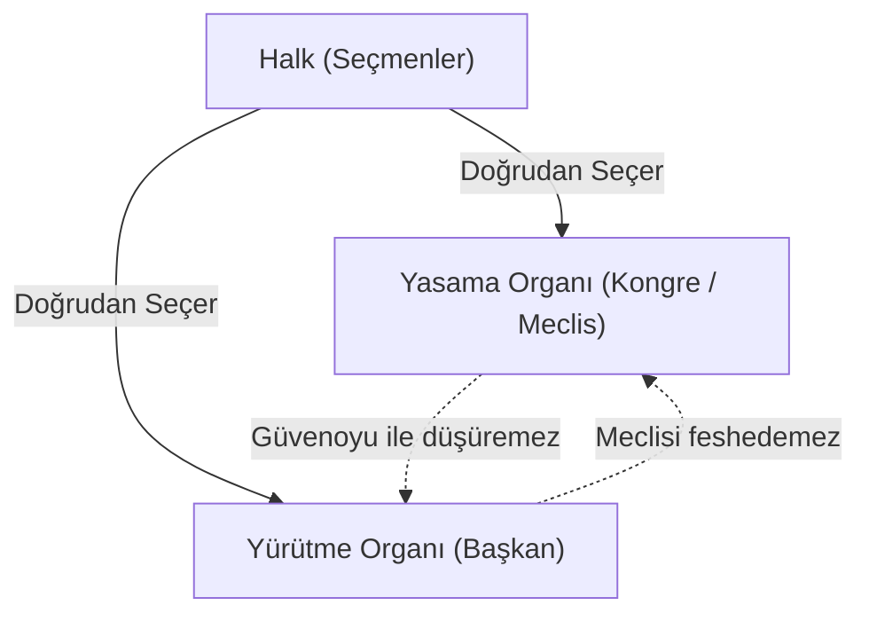
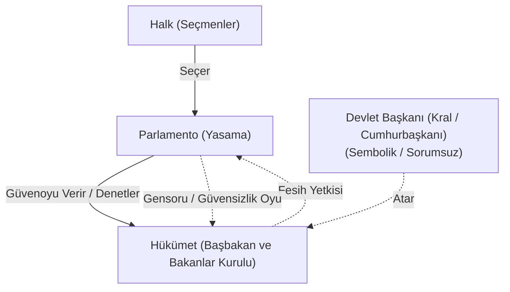

# Hükümet Sistemleri ve Erkler Arası İlişkiler

> *"Hükümet sistemlerinin tasnifi; yasama ve yürütme organları arasındaki ayrılığın sertliğine ve karşılıklı etkileşim araçlarına dayanır."*

---

## 1. Giriş: Karşılaştırmalı Anayasa Hukukunda Sistemler

Demokratik anayasal düzenlerde yasama ve yürütme erklerinin birbirleriyle kurduğu ilişkinin niteliği, hükümet sistemlerinin temel ayrım çizgisini oluşturur.

---

## 2. Başkanlık Sistemi (*Presidentialism*)

Yasama ve yürütme organlarının birbirinden **katı / sert (*strict*)** bir biçimde ayrıldığı sistemdir (En yetkin örneği: ABD).

### Temel Özellikleri:
1. **Tek Başlı Yürütme (*Monist*):** Devlet başkanı ile hükümet başkanı aynı kişidir (Başkan). Başbakanlık makamı yoktur.
2. **Doğrudan Meşruiyet:** Başkan doğrudan halk tarafından sabit bir görev süresi için seçilir.
3. **Karşılıklı Bağımsızlık:**
   - Yasama yürütmeyi siyasi gerekçelerle (güvensizlik oyuyla) düşüremez (Sadece suç halinde *Impeachment* uygulanır).
   - Yürütme de meclisi feshedip erken seçime götüremez.
4. **Bakanların Konumu:** Bakanlar Başkana bağlı sekreterlerdir; meclis üyesi olamazlar ve meclise karşı siyasi sorumlulukları yoktur.

---

## 3. Parlamenter Sistem (*Parliamentarism*)

Yasama ve yürütme organlarının **esnek / yumuşak ve işbirlikçi** bir biçimde ayrıldığı, yürütmenin meclisin içinden çıktığı sistemdir (Örn: Birleşik Krallık, Almanya, İtalya, İspanya).

### Temel Özellikleri:
1. **İki Başlı Yürütme (*Düalist*):**
   - **Devlet Başkanı (Cumhurbaşkanı veya Monark):** Sembolik yetkilere sahiptir, siyaseten sorumsuzdur (*"Kral hata yapmaz"*).
   - **Hükümet Başkanı (Başbakan ve Kabine):** Yürütmenin fiili ve siyasi sorumluluğunu taşır.
2. **Dolaylı Meşruiyet:** Hükümet meclisin içinden çıkar ve meclisin güvenine dayanır.
3. **Karşılıklı Etkileşim ve Denge Silahları:**
   - Meclis hükümeti **Gensoru / Güvensizlik Oyu (*Vote of no confidence*)** ile düşürebilir.
   - Hükümet (veya devlet başkanı) meclisi **feshederek erken seçime** götürebilir.
4. **Yapıcı Güvensizlik Oyu (*Konstruktives Misstrauensvotum* - Almanya):** Hükümeti düşürmek isteyen meclis çoğunluğu, aynı oylamada yeni bir başbakan seçmedikçe mevcut hükümeti düşüremez (Hükümet istikrarını korur).

---

## 4. Yarı-Başkanlık Sistemi (*Semi-Presidentialism*)

Başkanlık sistemi ile parlamenter sistemin unsurlarını harmanlayan karma bir modeldir (Fransa V. Cumhuriyet modeli).

### Temel Özellikleri:
1. **Güçlü ve Halk Tarafından Seçilen Cumhurbaşkanı:** Dış politika ve güvenlikte geniş yetkilere sahiptir.
2. **Meclise Karşı Sorumlu Başbakan ve Kabine:** İç politika ve günlük idareyi yürütür; meclisin güvenoyuna tabidir.
3. **Kohabitasyon (*Cohabitation / Birlikte Yaşama*):** Cumhurbaşkanı ile meclis çoğunluğunun (ve dolayısıyla Başbakanın) farklı siyasi partilerden olması durumunda yürütme içinde çift başlı bir denge oluşur.

---

## 5. Kuvvetler Birliği Sistemleri

Kuvvetler ayrılığının reddedildiği rejimlerdir:

* **Yürütmede Birleşme:** Mutlak Monarşiler, Otokrasiler ve Totaliter Diktatörlükler (Tüm güç yürütme liderinde toplanır; yasama ve yargı kukla haline gelir).
* **Yasamada Birleşme (Meclis Hükümeti Sistemi):** Yürütmenin ve yargının bağımsız organlar olmayıp meclisin doğrudan memuru/komisyonu sayıldığı sistemdir (1793 Fransız Konvansiyonu, 1921 Türkiye Anayasası dönemi ve İsviçre Kanton Yönetimleri).

---

## 📌 Değerlendirme

Hukuk devletinin varlığı için tek bir ideal hükümet sistemi reçetesi yoktur; ancak hangi sistem uygulanırsa uygulansın **bağımsız yargı denetimi ve etkin parlamenter denetim mekanizmalarının** varlığı demokrasinin asgari şartıdır.
