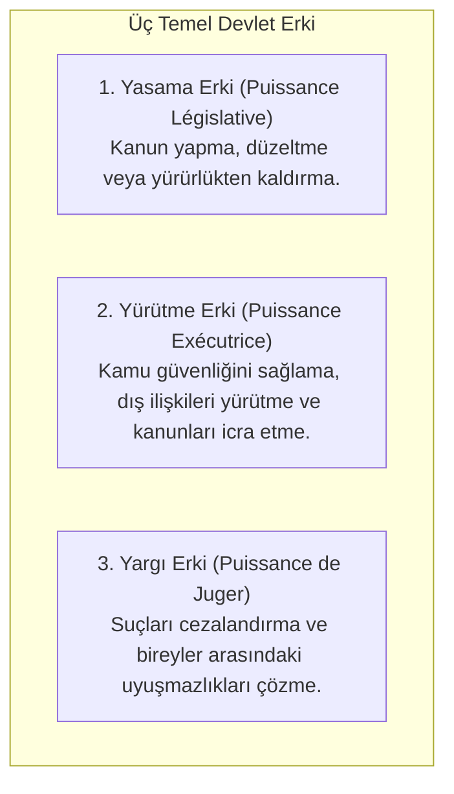
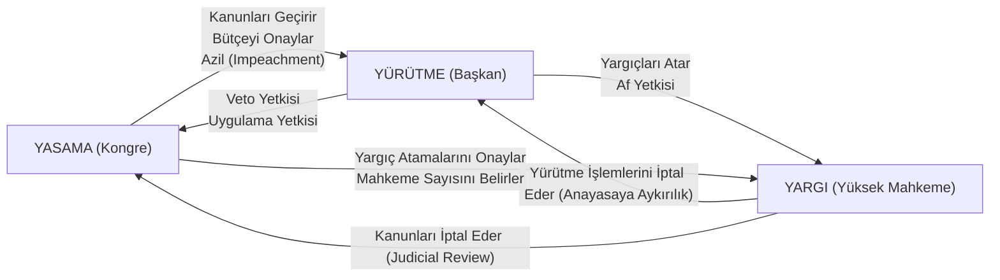

# Montesquieu ve Fren-Denge Sistemi (*Checks and Balances*)

> *"Siyasi özgürlük, ancak iktidarın kötüye kullanılmadığı yerde bulunur. Tecrübe göstermiştir ki gücü elinde bulunduran her insan onu kötüye kullanma eğilimindedir... Gücün kötüye kullanılmasını engellemek için, şeylerin düzeni öyle kurulmalıdır ki güç gücü durdurabilsin."*  
> — **Montesquieu**, *De l'esprit des lois* (1748)

---

## 1. Giriş: Tiranlığa Karşı Mekanik Bir Çözüm

Aydınlanma düşünürü **Charles de Secondat, Baron de Montesquieu** (*1689-1755*), 1748 tarihli *De l'esprit des lois* (Kanunların Ruhu Üzerine) eserinde siyasi özgürlüğün korunmasını devletin yapısal mimarisine bağlamıştır.

Montesquieu'ye göre özgürlük, *"kanunların izin verdiği her şeyi yapabilme hakkıdır"*; ancak yöneticilerin bu hakkı keyfileştirmesini önlemenin tek yolu iktidarı parçalamak ve birbirine karşı dengelemektir.

---

## 2. Montesquieu'nün Üçlü Erk Tasarımı

Montesquieu devletteki üç ana işlevi birbirinden ayırır:

### Tehlikeli Birliktelikler:
* **Yasama + Yürütme Tek Elde Toplanırsa:** Tiranlar zalimce kanunlar çıkarıp bunları zalimce uygulayabilirler; özgürlük yok olur.
* **Yargı + Yasama Birleşirse:** Yurttaşın canı ve özgürlüğü üzerindeki güç keyfileşir; çünkü yargıç aynı zamanda kanun koyucudur.
* **Yargı + Yürütme Birleşirse:** Yargıç bir zorbaya dönüşebilir; elinde hem karar hem icra gücü bulunur.
* **Üçü Birden Tek Elde Toplanırsa:** Mutlak despotizm doğar.

---

## 3. Amerikan Anayasacılığı ve *Checks & Balances* (Fren ve Denge)

Montesquieu'nün kuramı, 1787 ABD Anayasası'nın mimarları (James Madison, Alexander Hamilton, John Jay - *Federalist Papers*) tarafından somut ve operasyonel bir **Fren ve Denge (*Checks and Balances*)** mekanizmasına dönüştürülmüştür.

James Madison'ın ünlü formülasyonu (*Federalist No. 51*):  
> *"İktidarın hırsları, diğer hırslarla dengelenmelidir (*Ambition must be made to counteract ambition*)."*

---

## 4. Yatay ve Dikey Kuvvetler Ayrılığı

Çağdaş anayasa kuramında kuvvetler ayrılığı iki boyutta ele alınır:

1. **Yatay Kuvvetler Ayrılığı (*Horizontal Separation*):**  
   Merkezi devlet organları arasındaki ayrılıktır (Yasama, Yürütme, Yargı arasındaki denge).
2. **Dikey Kuvvetler Ayrılığı (*Vertical Separation / Federalizm & Adem-i Merkeziyet*):**  
   İktidarın merkezi yönetim ile yerel/bölgesel yönetimler (eyaletler, kantonlar, belediyeler) arasında paylaştırılmasıdır. İktidarın tek bir coğrafi merkezde toplanmasını engeller.

---

## 📌 Sonuç

Montesquieu ve kurduğu fren-denge doktrini, insan doğasının iktidara olan zaafını doğru teşhis etmiş ve özgürlüğün ancak **kurumsal engeller ve karşılıklı denetim mekanizmalarıyla** korunabileceğini anayasa tarihine kazımıştır.
