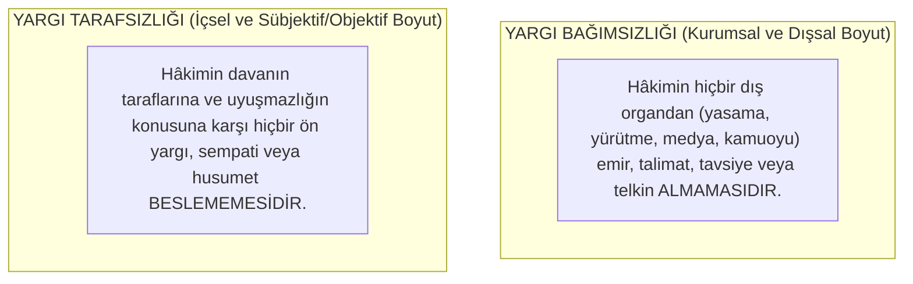

# Yargı Bağımsızlığı ve Tarafsızlığı

> *"Hâkimler görevlerinde bağımsızdırlar; Anayasaya, kanuna ve hukuka uygun olarak vicdani kanaatlerine göre hüküm verirler."*

---

## 1. Giriş: Hukuk Devletinin ve Adil Yargılanmanın Temel Şartı

Yargı bağımsızlığı ve tarafsızlığı, bireylerin hak arama özgürlüğünün ve adil yargılanma hakkının (*AİHS m. 6*) en temel önkoşuludur.

Bağımsız ve tarafsız bir yargının bulunmadığı yerde yasama ve yürütmenin tasarrufları denetlenemez; anayasal haklar ise kağıt üzerinde kalan temennilerden ibaret olur.

---

## 2. İki Temel Kavram: Bağımsızlık vs. Tarafsızlık



### AİHM'in İkili Tarafsızlık Testi:
1. **Öznel / Sübjektif Tarafsızlık:** Hâkimin somut davada kişisel bir önyargısının veya çıkarının bulunup bulunmadığıdır (Aksi ispatlanana kadar hâkimin tarafsız olduğu karine olarak kabul edilir).
2. **Nesnel / Objektif Tarafsızlık:** Hâkimin veya mahkemenin kurumsal yapısının, dışarıdan bakan makul bir gözlemcide tarafsızlığına dair haklı bir şüphe uyandırıp uyandırmadığıdır (*"Adalet sadece yerine getirilmemeli, aynı zamanda yerine getirildiği görülmelidir - Justice must not only be done, it must be seen to be done"*).

---

## 3. Hâkimlik Teminatları (*Judicial Guarantees*)

Yargıcın baskı görmeden özgürce karar verebilmesi için anayasalar şu teminatları öngörür:

```text
┌─────────────────────────────────────────────────────────────┐
│                    HÂKİMLİK TEMİNATLARI                     │
│                                                             │
│  1. AZLOLUNAMAZLIK TEMİNATI:                                │
│     Hâkimler kendileri istemedikçe veya ağır suç işlemedikçe│
│     kanunda gösterilen yaştan önce emekliye sevk edilemez.  │
│                                                             │
│  2. ÖZLÜK VE MAAŞ TEMİNATI:                                │
│     Bir mahkemenin kaldırılması veya kadro gerekçesiyle     │
│     hâkimin aylık ve özlük haklarından mahrum bırakılamaz. │
│                                                             │
│  3. COĞRAFİ TEMİNAT:                                        │
│     Hâkimin verdiği bir karar nedeniyle isteği dışında      │
│     başka bir yere sürgün/tayin edilmesi yasaktır.          │
│                                                             │
│  4. İDARİ VE SİYASİ EMİR ALMAMA:                            │
│     Hiçbir organ, makam veya merci yargı yetkisinin         │
│     kullanılmasında hâkimlere emir ve talimat veremez.      │
└─────────────────────────────────────────────────────────────┘
```

---

## 4. Tabii Hâkim (Kanuni Hâkim) İlkesi

* **Tanım:** Hiç kimse, suçun veya uyuşmazlığın meydana gelmesinden sonra bu olay için özel olarak kurulmuş bir mahkeme önüne çıkarılamaz.
* **Olağanüstü Mahkeme Yasağı:** Uyuşmazlığa bakacak olan mahkeme, hâkim ve usul kuralları olay gerçekleşmeden önce kanunla genel ve soyut olarak belirlenmiş olmalıdır.

---

## 5. Yüksek Yargı Kurulları ve Özerklik Sorunu

Hâkim ve savcıların mesleğe kabulü, atanması, disiplin ve terfi işlemleri yürütmenin (Adalet Bakanlığı'nın) eline bırakılırsa yargı bağımsızlığı yok olur. Bu nedenle çağdaş demokrasilerde özerk Yüksek Yargı Kurulları kurulmuştur:

* **Venedik Komisyonu Standartları:**
  - Kurul üyelerinin çoğunluğu yargıçların kendi aralarından seçtiği temsilcilerden oluşmalıdır.
  - Siyasi iktidarın doğrudan atadığı üyeler azınlıkta kalmalıdır.
  - Kurul kararları yargısal denetime açık olmalıdır.

---

## 📌 Sonuç

Yargı bağımsızlığı, hâkimlere tanınmış kişisel bir ayrıcalık değil; **yurttaşların adil bir şekilde yargılanma hakkının teminatıdır**.
