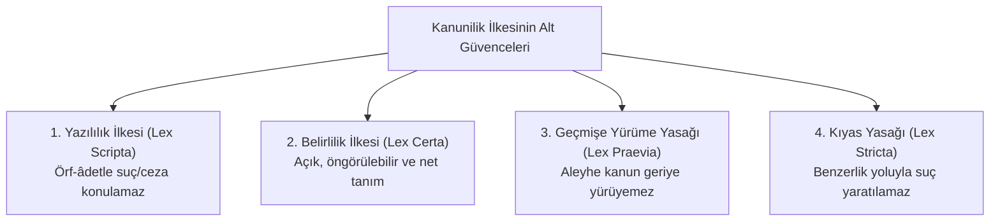
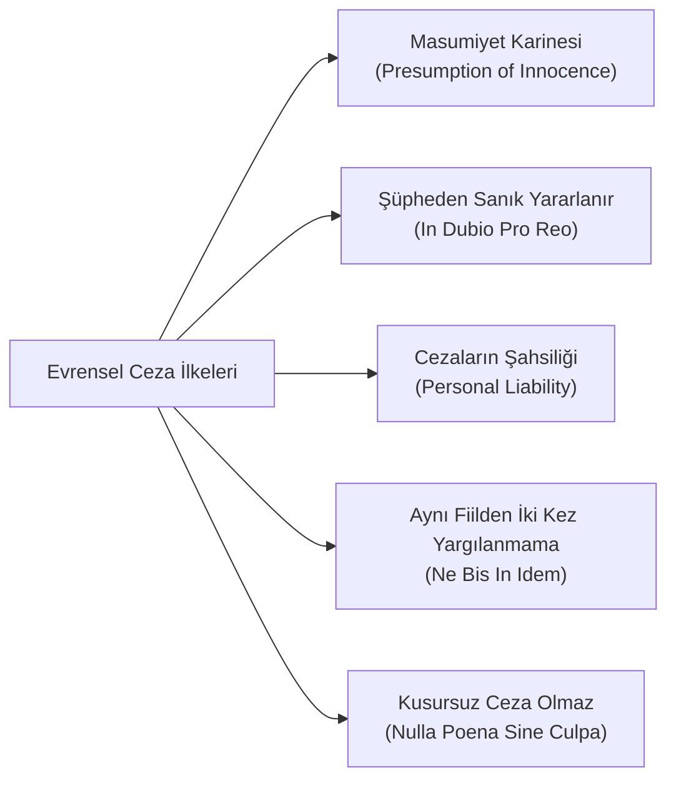

# Ceza Hukukunun Evrensel İlkeleri ve Temel Güvenceler

> *"Hiç kimse, işlendiği zaman yürürlükte bulunan kanunun suç saymadığı bir fiilden dolayı cezalandırılamaz; kimseye suçun işlendiği zaman kanunda o suç için konulmuş olan cezadan daha ağır bir ceza verilemez."*  
> — **Nullum Crimen, Nulla Poena Sine Lege (Cesare Beccaria & Paul Johann Anselm von Feuerbach)**

---

## 1. Giriş: Ceza Adaletinin Meşruiyet Temeli

Ceza hukuku, devletin meşru şiddet ve cebir kullanma tekelinin en ağır tezahürüdür. Bu nedenle ceza hukuku, bireyin özgürlüğünü otoriter keyfiyete ve cezalandırma iştahına karşı koruyan katı ve ödünsüz anayasal ilkelerle sınırlandırılmıştır.

---

## 2. Suçta ve Cezada Kanunilik İlkesi (*Nullum Crimen Sine Lege*)

Kanunilik ilkesi dört temel alt güvenceden oluşur:

1. **Yazılılık İlkesi (*Lex Scripta*):** Suçlar ve cezalar ancak yasama organı tarafından çıkarılan biçimsel bir kanun ile ihdas edilebilir. İdarenin düzenleyici işlemleriyle (tüzük, yönetmelik, genelge) suç veya ceza oluşturulamaz.
2. **Belirlilik İlkesi (*Lex Certa*):** Kanun metni, sıradan bir vatandaşın hangi eyleminin yasak olduğunu ve karşılığında hangi yaptırıma uğrayacağını anlayabileceği netlikte olmalıdır. Muğlak ve lastikli kavramlar yasağa aykırıdır.
3. **Geçmişe Yürüme Yasağı (*Lex Praevia*):** Fiil işlendiğinde suç olmayan bir eylem, sonradan yürürlüğe giren kanunla suç sayılamaz. *İstisna: Failin lehine olan kanun derhal ve geriye yürür.*
4. **Kıyas Yasağı (*Lex Stricta*):** Kanundaki bir suç tanımı, benzer durumlara genişletilemez veya kıyas yoluyla yeni bir suç tipi yaratılamaz.

---

## 3. Ceza Muhakemesi ve Maddi Ceza Hukukunun Evrensel İlkeleri

### 1. Masumiyet Karinesi (*Presumption of Innocence*)
* Suçluluğu kesinleşmiş bir mahkeme hükmüyle sabit oluncaya kadar hiç kimse suçlu sayılamaz ve suçlu muamelesine tabi tutulamaz (AİHS m. 6/2, Anayasa m. 38/4).
* İspat yükü iddia makamına (savcılığa) aittir; sanık masum olduğunu kanıtlamakla yükümlü tutulamaz.

### 2. Şüpheden Sanık Yararlanır (*In Dubio Pro Reo*)
* Ceza muhakemesinde maddi gerçeğe ulaşırken sanığın suçu işlediğine dair herhangi bir makul şüphe kalmışsa, bu şüphe sanık aleyhine değil, lehine yorumlanarak beraat kararı verilir.
* Ceza mahkûmiyeti ihtimallere değil, kesin ve her türlü şüpheden uzak delillere dayanmalıdır.

### 3. Cezaların Şahsiliği İlkesi
* Ceza sorumluluğu şahsidir; kimse başkasının (akrabasının, çalışanının, yöneticisinin) fiilinden dolayı cezalandırılamaz (Anayasa m. 38/7).

### 4. *Ne Bis In Idem* (Aynı Fiilden İki Kez Yargılanmama ve Cezalandırılmama)
* Bir kimse aynı fiil nedeniyle kesin hükümle beraat etmiş veya mahkûm olmuşsa, aynı fiilden dolayı yeniden soruşturulamaz veya yargılanamaz.

### 5. Hukuka Aykırı Delillerin Dışlanması (*Zehirli Ağacın Meyvesi*)
* Hukuka aykırı yollarla (işkence, yasak sorgu yöntemleri, hukuka aykırı arama veya dinleme) elde edilmiş bulgular delil olarak kabul edilemez ve hükme esas alınamaz (*Fruit of the poisonous tree*).

---

## 📌 Sonuç

Cesare Beccaria'nın *Suçlar ve Cezalar Hakkında* eserinde vurguladığı üzere: *"Bir suçun önlenmesinde en etkili araç cezanın ağırlığı değil, kaçınılmazlığı ve adil uygulanmasıdır."* Ceza hukuku prensipleri, adaletin intikam duygusundan arındırılarak rasyonel insan hakları temeline oturtulmasını sağlar.
