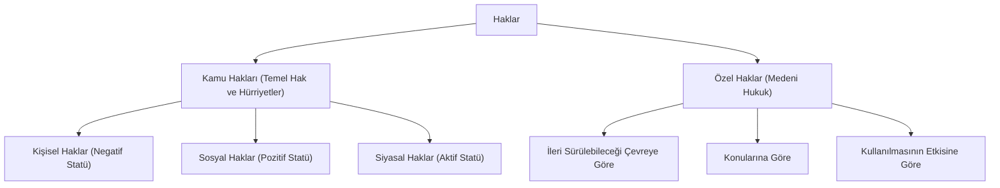

# Hak Kavramı, Hohfeldian Haklar Analizi ve Hak Türleri

> *"Hak, hukuk düzeni tarafından kişilere tanınmış ve korunan irade kudreti ve menfaattir."*  
> — **Bernhard Windscheid & Rudolf von Jhering**

---

## 1. Giriş: Hak Kavramının Felsefi ve Hukuki Temeli

Hak kavramı modern hukukun en merkezi yapı taşıdır. Hukuk felsefesinde hak anlayışını açıklayan iki temel geleneksel teori bulunur:
1. **İrade Teorisi (*Windscheid*):** Hak, hukuk düzeninin bireyin iradesine tanıdığı egemenlik alanıdır.
2. **Menfaat Teorisi (*Jhering*):** Hak, hukuken korunan ve teminat altına alınan insani menfaattir.
3. **Karma Teori (*Jellinek*):** Hukuken korunan menfaati elde etmek için bireye tanınan irade kudretidir.

---

## 2. Wesley Newcomb Hohfeld'in Analitik Haklar Tablosu

Amerikalı hukuk kuramcısı Wesley Newcomb Hohfeld (1879–1918), "hak" kelimesinin tekdüze bir kavram olmadığını, dört temel hukuki ilişki çiftinden oluştuğunu kanıtlamıştır:

```mermaid
flowchart TD
    subgraph Hohfeldian Karşılıklılık İlişkileri (Correlatives)
        A1["Talep / Hak (Right / Claim)"] <--> A2["Ödev / Yükümlülük (Duty)"]
        B1["Özgürlük / Ayrıcalık (Privilege / Liberty)"] <--> B2["Hak Yokluğu (No-Right)"]
        C1["Yetki / İktidar (Power)"] <--> C2["Tabiiyet / Bağlılık (Liability)"]
        D1["Bağışıklık / Muafiyet (Immunity)"] <--> D2["Yetkisizlik (Disability)"]
    end
```

### Hohfeldian Kavramların Açıklaması:
1. **Talep Hakkı (*Claim-Right*) ↔ Ödev (*Duty*):** A'nın B'den bir şey talep etme hakkı varsa, B'nin bunu yerine getirme ödevi vardır (Örn: Alacaklının borçludan edimi talep hakkı).
2. **Özgürlük (*Liberty/Privilege*) ↔ Hak Yokluğu (*No-Right*):** A'nın bir şeyi yapma özgürlüğü varsa, diğerlerinin A'yı engellemeye hakkı yoktur (Örn: İfade özgürlüğü).
3. **Yetki (*Power*) ↔ Tabiiyet (*Liability*):** A hukuki durumu tek taraflı değiştirme yetkisine sahipse, B bu değişikliğe tabidir (Örn: Sözleşmeyi feshetme veya vasiyetname yapma).
4. **Bağışıklık (*Immunity*) ↔ Yetkisizlik (*Disability*):** A'nın hukuki durumu B tarafından tek taraflı değiştirilemiyorsa A bağışıklığa sahiptir (Örn: Milletvekili dokunulmazlığı veya temel anayasal haklar).

---

## 3. Pozitif Hukukta Hakların Tasnifi



### A. İleri Sürülebileceği Çevreye Göre:
* **Mutlak Haklar (*Jura in Re / Erga Omnes*):** Herkese karşı ileri sürülebilen haklardır (Mülkiyet hakkı, kişilik hakları, fikri mülkiyet hakları). Herkesin bu hakka saygı gösterme pasif ödevi vardır.
* **Nisbi Haklar (*Inter Partes*):** Yalnızca belirli kişi veya kişilere karşı ileri sürülebilen haklardır (Sözleşmeden doğan alacak hakları).

### B. Kullanılmasının Hukuki Sonucuna Göre (Yenilik Doğuran Haklar - *İnşai Haklar*):
1. **Kurucu Yenilik Doğuran Haklar:** Tek taraflı irade beyanıyla yeni bir hukuki ilişki kuran haklar (Örn: Alım, önalım, gerialım hakkı).
2. **Değiştirici Yenilik Doğuran Haklar:** Mevcut bir hukuki ilişkiyi değiştiren haklar (Örn: Ayıplı malda indirim talep etme hakkı).
3. **Bozucu Yenilik Doğuran Haklar:** Mevcut hukuki ilişkiyi tamamen sona erdiren haklar (Örn: Fesih, iptal, istifa, takas).

---

## 📌 Sonuç

Hak kavramı; bireyin insan onuruna yaraşır özerkliğini koruyan, keyfi iktidar müdahalelerine karşı anayasal sınır çizen ve adaletin somutlaştığı en yüksek hukuki değerdir.
