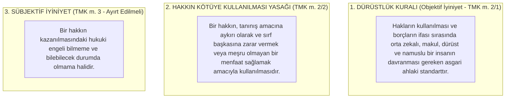

# Dürüstlük Kuralı ve Hakkın Kötüye Kullanılması Yasağı

> *"Herkes, haklarını kullanırken ve borçlarını yerine getirirken dürüstlük kurallarına uymak zorundadır. Bir hakkın açıkça kötüye kullanılmasını hukuk düzeni korumaz."*  
> — **Türk Medeni Kanunu (TMK) Madde 2**

---

## 1. Giriş: Özel Hukukun Ahlaki Supabı

Özel hukuk düzeni bireylere geniş haklar, yetkiler ve sözleşme özgürlüğü tanır. Ancak bireylerin biçimsel olarak kanunun lafzına dayanarak başkalarına zarar verme veya haksız menfaat sağlama girişimlerini engellemek için **Dürüstlük Kuralı (*Treu und Glauben / Bona Fides*)** ve **Hakkın Kötüye Kullanılması Yasağı** getirilmiştir.

Bu kurallar, hukukun harfi harfine uygulanmasının yaratacağı adaletsizliği engelleyen medeni hukukun en üst ahlaki denetim mekanizmasıdır.

---

## 2. İki Temel İlkenin Ayrımı

---

## 3. Hakkın Kötüye Kullanılmasının Unsurları

Bir eylemin hakkın kötüye kullanılması sayılabilmesi için şu şartlar aranır:

1. **Geçerli Bir Hakkın Varlığı:** Kişinin hukuk düzenince tanınmış biçimsel bir hakkı bulunmalıdır (Hakkı olmayan kişinin eylemi zaten doğrudan hukuka aykırıdır).
2. **Hakkın Amacına Aykırı Kullanılması:** Hakkın sosyal ve iktisadi varlık sebebine aykırı bir gaye güdülmesi.
3. **Zarar veya Zarar Tehlikesi:** Karşı tarafın zarar görmesi veya ağır bir zarar tehlikesine maruz kalması.
4. **Açık / Bariz Aykırılık:** Kötüye kullanımın makul her gözlemci tarafından açıkça anlaşılabilir olması.

### Klasik Roma ve İsviçre Hukukundan Örnekler:
* **Şikan Yasağı (*Schikanevebot*):** Bir arsa sahibinin, komşusunun manzarasını veya güneşini kapatmak için kendi arazisine hiçbir faydası olmayan 10 metrelik dev bir duvar örmesi.
* **Çelişkili Davranma Yasağı (*Venire Contra Factum Proprium*):** Kendi önceki tutarlı davranışıyla karşı tarafta haklı bir güven uyandırdıktan sonra, sonradan bu güveni sarsacak zıt bir hukuki yola başvurulması.
* **Hakkın Zamanaşımına Uğratılması:** Karşı tarafı hile veya oyalamayla zamanaşımı süresi dolana kadar bekletip, ardından zamanaşımı def'i ileri sürülmesi.

---

## 4. Hukuki Sonuçlar

* **Hukuk Düzeni Korumaz:** Hâkim, hakkın kötüye kullanıldığını re'sen (kendiliğinden) gözetmek zorundadır.
* Kötüye kullanılan hakka dayanılarak açılan dava reddedilir; yapılan işlem geçersiz sayılır veya doğan zarar tazmin ettirilir.

---

## 📌 Sonuç

Dürüstlük kuralı ve hakkın kötüye kullanılması yasağı; hukukun mekanik bir kural yığınına dönüşmesini engelleyerek **hukuk ile adalet ve ahlak arasındaki köprüyü kuran** evrensel bir ilkedir.
