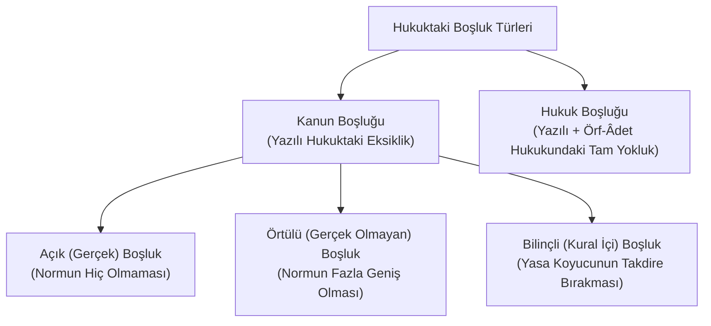
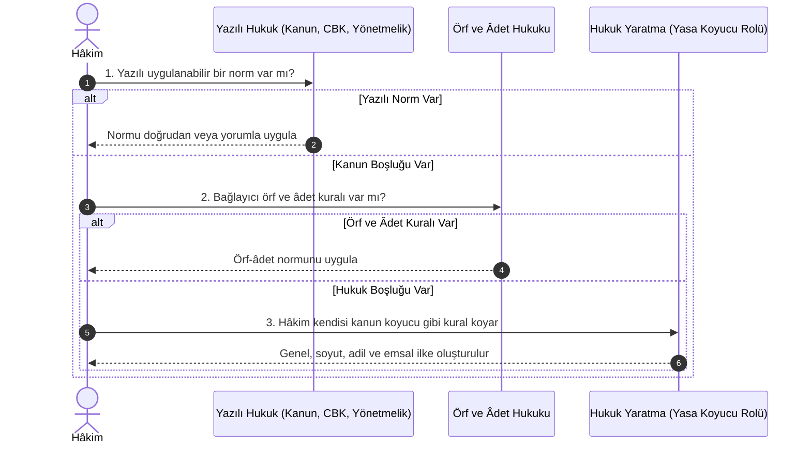

# Hukuk Boşluğu ve Hâkimin Hukuk Yaratması (*Rechtsfindung*)

> *"Kanunda uygulanabilir bir hüküm yoksa, hâkim, örf ve âdet hukukuna göre; bu da yoksa kendisi kanun koyucu olsaydı nasıl bir kural koyacak idiyse ona göre karar verir."*  
> — **Türk Medeni Kanunu Madde 1 / İsviçre Medeni Kanunu (ZGB) Art. 1 (Eugen Huber)**

---

## 1. Hukukta Boşluk Kavramı ve Türleri

Hiçbir yasa koyucu, insan hayatının ve toplumsal ilişkilerin sonsuz çeşitliliğini ve gelecekte doğacak gelişmeleri önceden eksiksiz olarak öngöremez. Bu nedenle hukuk sisteminde kaçınılmaz olarak boşluklar (*lacunae*) meydana gelir.

---

## 2. Boşluk Türlerinin Ayrımı

| Boşluk Türü | Tanım | Çözüm Yolu |
| :--- | :--- | :--- |
| **Kural İçi Boşluk (*Bilinçli Boşluk*)** | Kanun koyucunun bilerek ve isteyerek somut olayın özelliklerine göre doldurulmak üzere genel/soyut kavramlar (hakkaniyet, dürüstlük, haklı sebep, kusur) bırakmasıdır. | **Takdir Yetkisi Kullanımı** (TMK m. 4). Hâkim adalete ve hakkaniyete göre takdir eder. |
| **Açık (Gerçek) Kanun Boşluğu** | Kanunda belirli bir hukuki meseleye uygulanması gereken hiçbir kuralın bulunmaması durumudur. | **Kıyas (*Analoji*)** veya Örf-Âdet Hukuku uygulanır. |
| **Örtülü (Gerçek Olmayan) Boşluk** | Kanunda bir kural vardır ancak bu kural lafzı itibarıyla adaletsiz sonuçlar doğuracak kadar geniştir ve kurala bir istisna getirilmesi unutulmuştur. | **Teleolojik İndirgeme (*Teleologische Reduktion*)** ile normun uygulama alanı sınırlandırılır. |
| **Hukuk Boşluğu** | Ne yazılı hukukta (kanun, CBK, yönetmelik) ne de yazısız hukukta (örf ve âdet) uygulanabilecek hiçbir kuralın bulunmaması halidir. | **Hâkimin Hukuk Yaratması** (TMK m. 1/2). |

---

## 3. Hâkimin Boşluk Doldurma Sırası (Metodolojik Hiyerarşi)

Hâkim bir uyuşmazlığı karara bağlarken keyfi davranamaz; şu sıralamayı titizlikle takip etmek zorundadır:

---

## 4. Hâkimin Hukuk Yaratmasının Sınırları ve İlkeleri

Hâkim hukuk yaratırken mutlak bir serbestiye sahip değildir:

1. **Kanun Koyucu Gibi Davranma:** Hâkim bireysel değil, o durumda gelecekteki benzer olaylara da uygulanabilecek **genel ve soyut bir norm** tasavvur eder.
2. **Doktrin ve İçtihattan Yararlanma (TMK m. 1/3):** Hâkim karar verirken bilimsel görüşlerden (*doktrin*) ve yargı kararlarından (*içtihat*) zorunlu olarak faydalanır.
3. **Anayasal Değerlere ve Hukukun Genel İlkelerine Bağlılık:** Oluşturulan kural; dürüstlük kuralı, insan hakları, ölçülülük ve eşitlik prensiplerine aykırı olamaz.
4. **Gerekçelendirme Yükümlülüğü:** Hâkim yarattığı kuralın gerekçesini ve mantıksal dayanaklarını kararında açıkça göstermek zorundadır.

---

## 📌 Sonuç

Hukuk boşluğunun hâkim tarafından doldurulması, hukukun donuk ve durağan bir kurallar yığını olmaktan çıkıp hayatın dinamizmine uyum sağlayan canlı bir adalet mekanizmasına dönüşmesini sağlayan en önemli supaptır.
