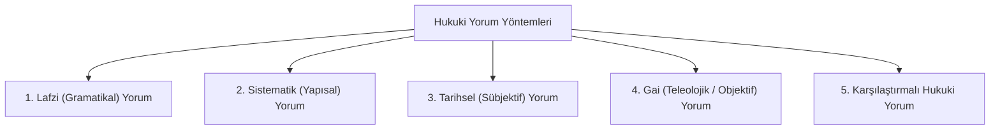
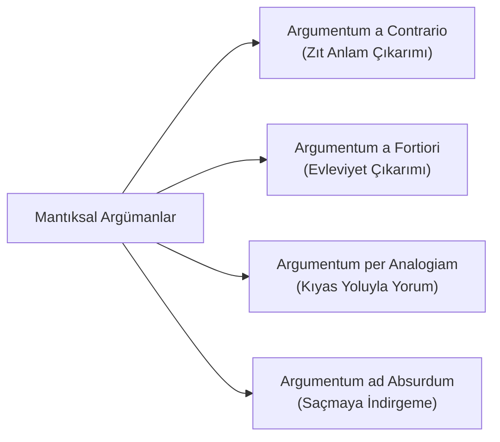

# Hukukta Yorum Yöntemleri ve Mantıksal Çıkarım Kuralları (*Hermeneutik*)

> *"Kanunun lafzı ve ruhu bir kuşun iki kanadı gibidir; yalnız biriyle uçulamaz."*  
> — **Rudolf von Jhering**

---

## 1. Giriş: Hukuki Yorumun Doğası

Hukuki yorum (*interpretatio*), yürürlükteki soyut ve genel hukuk kurallarının somut olaylara uygulanabilmesi için anlam, kapsam ve gayelerinin tespit edilmesidir. Hukuk normu salt harflerden ibaret olmayıp ardında normatif bir irade ve sosyal bir amaç barındırır.

Yorum faaliyeti iki temel evreden oluşur:
1. **Normun Anlamlandırılması:** Metnin ne söylediğinin ve yasa koyucunun amacının belirlenmesi.
2. **Normun Somut Olayla Eşleştirilmesi (*Subsumtion*):** Olayın soyut normun unsurlarını karşılayıp karşılamadığının tespiti.

---

## 2. Klasik ve Çağdaş Yorum Yöntemleri

### 1. Lafzi (Gramatikal / Sözel) Yorum
* **Tanım:** Kanun metninin söz dizimi, kelime anlamları, noktalama işaretleri ve dil kuralları dikkate alınarak yapılan yorumdur.
* **İlke:** *"In claris non fit interpretatio"* (Açık ve net olan hükümde ayrıca yoruma gerek yoktur).
* **Sınır:** Kelimelerin salt sözlük anlamı yasanın amacını tahrif ediyorsa lafzi yorumla sınırlı kalınamaz.

### 2. Sistematik Yorum
* **Tanım:** Bir kanun maddesinin tek başına değil; bulunduğu fıkra, madde başlığı, kanunun genel yapısı ve normlar hiyerarşisi içindeki konumuyla birlikte ele alınmasıdır.
* **Yaklaşım:** Hukuk düzeni çelişkisiz bir bütünlük olarak kabul edilir (*corpus juris*).

### 3. Tarihsel (Sübjektif) Yorum
* **Tanım:** Kuralı koyan kanun koyucunun normu ihdas ettiği andaki sübjektif iradesini (*mens legislatoris*) esas alan yorumdur.
* **Kaynaklar:** Meclis tutanakları, komisyon raporları, kanun gerekçeleri ve hazırlık çalışmaları (*travaux préparatoires*).

### 4. Gai (Teleolojik / Amaçsal) Yorum
* **Tanım:** Normun günün koşullarına, toplumun değişen adalet ve ihtiyaç dengesine göre taşıdığı objektif koruma amacını (*ratio legis*) esas alan çağdaş yorum metodudur.
* **Savunucuları:** Serbest Hukuk Okulu (*Freirechtsbewegung*) ve Menfaatler İçtihadı (*Interessenjurisprudenz* - Philipp Heck).

---

## 3. Hukuki Mantık ve Çıkarım Kuralları (*Argumenta*)

Hukuk uygulayıcıları metnin yorumlanmasında ve norm çatışmalarının çözülmesinde biçimsel mantık ve argümantasyon araçlarını kullanır:

| Mantıksal Araç | Açıklama | Somut Örnek |
| :--- | :--- | :--- |
| **Argumentum a Contrario** *(Zıt Anlam)* | Kuralın olumlu belirttiği durumun dışında kalan tüm hallerin zıddına tabi tutulması. | *"Parka köpek sokulamaz"* kuralından, köpeğin dışındaki evcil hayvanların kural kapsamında yasaklanmadığı sonucuna varılması. |
| **Argumentum a Fortiori** *(Evleviyet)* | Küçük veya hafif olan için geçerli hükmün, öncelikle ve daha kuvvetle büyük veya ağır olan için geçerli olması. | *"Balkonda sigara içmek yasaktır"* kuralından, balkonda ateş yakmanın evleviyetle yasak olması. |
| **a Maiore ad Minus** *(Çoğun İçinde Az)* | Çoğa hakkı veya yetkisi olanın, aza da evleviyetle hakkı olması. | Bir taşınmazı satma yetkisi olan vekilin, onu kiraya da verebilmesi. |
| **a Minore ad Maius** *(Azın Yasaklığı Çoğu Kapsar)* | Azı yasak olanın, çoğunun da yasak olması. | Hafif yaralama suç ise, ağır yaralamanın evleviyetle suç olması. |
| **Argumentum ad Absurdum** | Bir yorum seçeneğinin kabulü saçma, mantıksız veya hukukun temel gayesiyle bağdaşmayan bir sonuca götürüyorsa o yorumun reddedilmesi. | Bir kanun hükmünün devleti tamamen işlemez kılacak şekilde katı yorumlanmasının reddi. |

---

## 4. Kıyas (*Analogia*) ve Yorum Ayrımı

* **Kıyas (*Analogia Legis / Analogia Juris*):** Kanunda açıkça düzenlenmemiş bir duruma, benzer bir duruma ilişkin normun kuralının uygulanmasıdır (Boşluk doldurma aracıdır).
* **Genişletici Yorum:** Mevcut bir kuralın lafzının, yasanın gerçek amacını tam karşılayacak biçimde geniş anlamlandırılmasıdır (Kural içi bir faaliyettir).
* **Ceza Hukukunda Kıyas Yasağı:** Ceza hukukunda suç ve ceza ihdasında kıyas kesin olarak yasaktır (*Nullum crimen sine lege*).

---

## 📌 Sonuç

Hukuki yorum, metnin lafzına duyulan saygı ile adaletin somutlaştırılması arasındaki hassas dengedir. Çağdaş hukukta hâkim; lafzı başlangıç noktası alarak sistematik ve teleolojik yorumla normun ruhunu (*ratio legis*) tespit etmekle mükelleftir.
