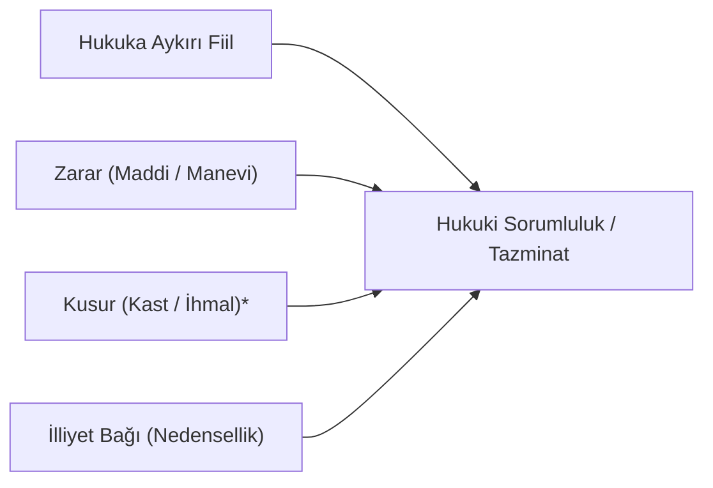
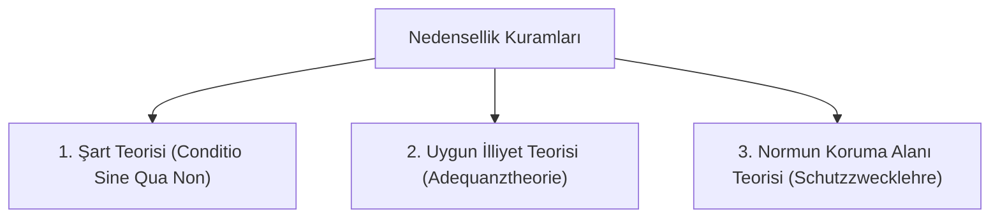
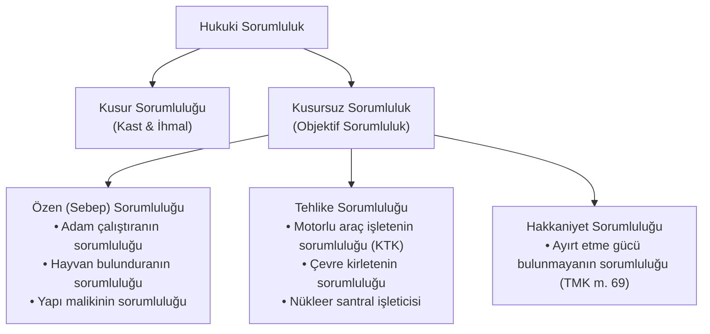

# Hukukta Nedensellik (*İlliyet Bağı*) ve Sorumluluk Kuramları

> *"Kusur olmaksızın sorumluluk istisnadır; ancak tehlike ve menfaat yaratan, onun rizikosuna da katlanır."*  
> — **Cuius est commodum, eius est periculum**

---

## 1. Giriş: Hukuki Sorumluluğun Kurucu Unsurları

Hukuki sorumluluk, bir kişinin başkasına verdiği zararı tazmin etme veya katlanma yükümlülüğüdür. Modern sorumluluk hukukunun temelini dört ana unsur oluşturur:

*\* Kusursuz sorumluluk hallerinde kusur unsuru aranmaz.*

---

## 2. Nedensellik (*İlliyet Bağı*) Teorileri

Nedensellik, hukuka aykırı fiil ile meydana gelen zarar arasındaki sebep-sonuç ilişkisidir. Hukuk felsefesi ve doktrininde illiyeti açıklayan üç ana teori geliştirilmiştir:

### 1. Şart Teorisi (*Conditio Sine Qua Non*)
* **Yaklaşım:** Zararın meydana gelmesinde rol oynayan tüm şartları eşit değerde kabul eder.
* **Test:** *"Fiil aradan çıkarıldığında zarar yine de doğacak mıydı?"* Doğmayacaktı ise fiil sebeptir.
* **Eleştiri:** Sorumluluk zincirini sonsuza kadar genişletebilir (Örn: Hırsızın doğmasını sağlayan ebeveynin de sorumlu tutulması riski).

### 2. Uygun İlliyet Bağı Teorisi (*Hâkim Görüş*)
* **Yaklaşım:** Bir fiil, yalnızca hayatın olağan akışına, genel hayat tecrübelerine ve olayların normal gelişimine göre o türden bir zararı doğurmaya **elverişli ve uygun** ise sebep sayılır.
* **Ölçüt:** Objektif öngörülebilirlik.

### 3. Normun Koruma Alanı Teorisi (*Schutzzweck der Norm*)
* **Yaklaşım:** Zararın doğmasına yol açan ihlalin, ihlal edilen normun korumayı amaçladığı menfaat ve tehlike kapsamında olup olmadığına bakılır.

---

## 3. İlliyet Bağını Kesen Sebepler

Şu üç durum meydana geldiğinde fiil ile zarar arasındaki nedensellik bağı kopar ve fail sorumluluktan kurtulur:

1. **Mücbir Sebep (*Vis Major*):** Dışarıdan gelen, kaçınılması ve karşı konulması mutlak imkânsız olan doğa veya insan kaynaklı olağanüstü olaylar (Deprem, tsunami, savaş).
2. **Zarar Görenin Ağır Kusuru:** Zararın doğmasında veya artmasında mağdurun kendi ağır kusurlu davranışının asıl belirleyici olması.
3. **Üçüncü Kişinin Ağır Kusuru:** Üçüncü bir şahsın araya giren öngörülemez ve ağır kusurlu fiilinin zararı bizzat meydana getirmesi.

---

## 4. Sorumluluk Türleri Matrisi

---

## 📌 Sonuç

Modern hukukta sorumluluk anlayışı, yalnızca "suçlu ve kusurlu olanı cezalandırma" ekseninden çıkarak, toplumda risk yaratan faaliyetlerin ve mağdurun uğradığı zararın hakkaniyete uygun şekilde telafi edilmesi (*zararın paylaştırılması ve dengelenmesi*) prensibine evrilmiştir.
