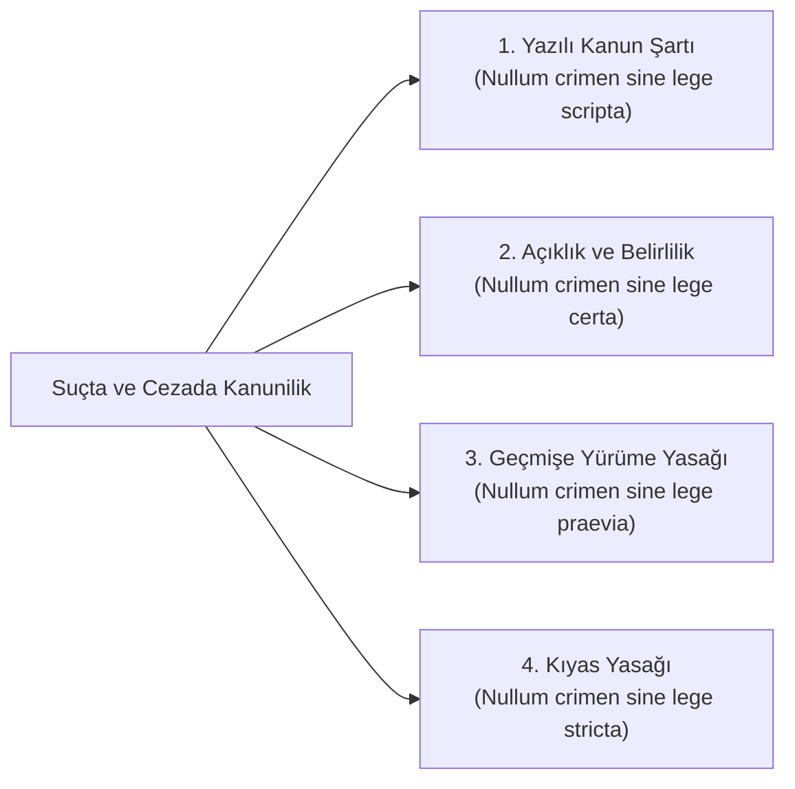

# Masumiyet Karinesi ve Suç-Cezada Kanunilik

> *"Suçluluğu hükmen sabit oluncaya kadar, kimse suçlu sayılamaz."*  
> — **T.C. Anayasası m. 38/4 & AİHS m. 6/2**

---

## 1. Giriş: Ceza Hukukunun Kurucu Güvenceleri

Ceza adaleti sistemi, devletin fiziksel zor kullanma ve hürriyeti bağlama yetkisinin en sert tezahür ettiği alandır.

Bu nedenle bireyin devlet aygıtı karşısında ezilmesini engellemek amacıyla asırlar süren mücadeleler sonucunda iki sarsılmaz sütun inşa edilmiştir:
1. **Suç ve Cezada Kanunilik İlkesi** (*Nullum crimen, nulla poena sine lege*).
2. **Masumiyet Karinesi** (*Presumption of Innocence*).

---

## 2. Suçta ve Cezada Kanunilik İlkesi (*Nullum Crimen Sine Lege*)



### Alt İlkeler:
* **Kanunsuz Suç ve Ceza Olmaz:** İdare genelgeyle, yönetmelikle veya kararla yeni bir suç veya ceza ihdas edemez; suç ve cezalar yalnızca yasama organının kabul ettiği açık bir kanunla konulabilir.
* **Kıyas Yasağı (*Analogy Prohibition*):** Kanunun suç saymadığı bir fiil, kanunda yazılı başka bir suça benziyor gerekçesiyle cezalandırılamaz.
* **Aleyhe Kanunun Geçmişe Yürümezliği:** Bir eylem yapıldığı anda kanunda suç değilse, sonradan çıkan bir kanunla suç sayılarak geçmişe dönük cezalandırılamaz.

---

## 3. Lehe Kanunun Geriye Yürümesi İlkesi (*Lex Mitior*)

Kanunilik ilkesinin ve ceza adaletinin en insancıl istisnası **Lehe Olan Kanunun Uygulanması** kuralıdır:

* Eğer suçun işlenmesinden sonra yürürlüğe giren yeni kanun, failin lehine hükümler getirmişse (örneğin eylemi suç olmaktan çıkarmışsa veya ceza miktarını indirmişse), dava kesinleşmiş olsa dahi **failin lehine olan yeni kanun geçmişe dönük olarak uygulanır**.
* *Gerekçe:* Toplumun ve kanun koyucunun artık suç saymadığı veya cezasını hafiflettiği bir fiil nedeniyle bir insanın eski kanun uyarınca hapiste tutulması adalet duygusunu rencide eder.

---

## 4. Masumiyet Karinesi ve İspat Yükü

Masumiyet Karinesi (*Presumption of Innocence*); hakkında bir ceza ithamı bulunan her bireyin, bağımsız bir mahkeme tarafından kesinleşmiş bir mahkûmiyet hükmü verilinceye kadar suçsuz kabul edilmesini emreder:

```text
┌─────────────────────────────────────────────────────────────┐
│                 MASUMİYET KARİNESİNİN SONUÇLARI             │
│                                                             │
│  1. İSPAT YÜKÜ İDDİA MAKAMINDIR:                            │
│     Sanık suçsuz olduğunu ispatlamak zorunda değildir;      │
│     suçu her türlü şüpheden uzak kesin delillerle ispat     │
│     etme yükümlülüğü devlete (savcılığa) aittir.            │
│                                                             │
│  2. ŞÜPHEDEN SANIK YARARLANIR (In Dubio Pro Reo):           │
│     Ceza yargılamasında en ufak bir makul şüphe kalmışsa,   │
│     bu durum sanık aleyhine değil lehine yorumlanır ve      │
│     beraat kararı verilir.                                  │
│                                                             │
│  3. DAMGALANMAMA HAKKI:                                     │
│     Kamu görevlileri ve medya, kesin hüküm çıkmadan önce    │
│     şüpheliyi suçlu ilan eden beyanlarda bulunamaz.         │
│                                                             │
│  4. SUSMA HAKKI VE KENDİ ALEYHİNE BEYANDA BULUNMAMA:        │
│     Hiç kimse kendisini veya yakınlarını suçlayıcı beyanda  │
│     bulunmaya veya delil göstermeye zorlanamaz (Nemo        │
│     tenetur se ipsum accusare).                             │
└─────────────────────────────────────────────────────────────┘
```

---

## 📌 Sonuç

Masumiyet karinesi ve kanunilik güvencesi; William Blackstone'un ünlü deyişinde ifadesini bulur:  
> *"On suçlunun cezasız kalması, bir masumun haksız yere acı çekmesinden evladır."*
