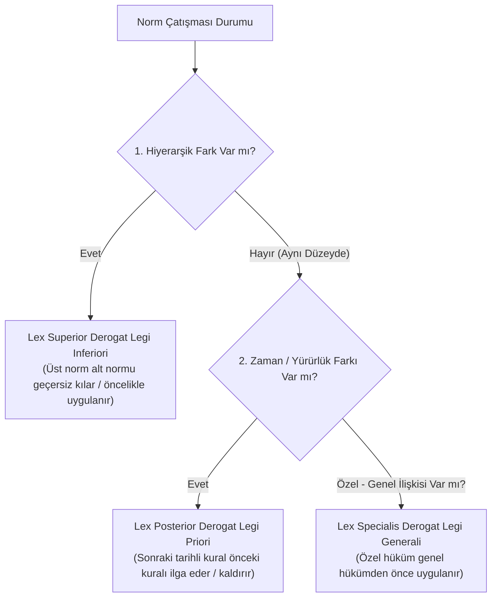

# Normlar Hiyerarşisi (*Stufenbaulehre*) ve Norm Çatışması Kuralları

> *"Hukuk düzeni eşit düzeydeki kuralların bir yığını değil, birbirine kademeli olarak bağlanan normlar piramididir."*  
> — **Hans Kelsen & Adolf Merkl**

---

## 1. Giriş: Kademeli Normlar Düzeni

Normlar Hiyerarşisi, bir hukuk düzenindeki kuralların rastgele değil, belirli bir üstünlük ve yetki sıralamasına göre dizildiği yapısal modeldir.

Bu piramitte:
* **Alt norm**, meşruiyetini ve geçerliliğini bir **üst normdan** alır.
* Hiçbir alt norm, üst normun hükmüne aykırı olamaz veya onun kapsamını kanunsuz olarak daraltıp genişletemez.

---

## 2. Türk Hukukunda Normlar Hiyerarşisi Piramidi

```text
                           ▲
                          / \
                         /   \
                        /  1  \       1. ANAYASA (Madde 11 - En Üstün Norm)
                       /-------\
                      /    2    \      2. TEMEL HAKLARA İLİŞKİN ULUSLARARASI SÖZLEŞMELER (m. 90/5)
                     /-----------\
                    /      3      \     3. KANUNLAR & CBK (Olağanüstü Hâl CBK'ları)
                   /---------------\
                  /        4        \    4. CUMHURBAŞKANLIĞI KARARNAMELERİ (Olağan Dönem CBK)
                 /-------------------\
                /          5          \   5. YÖNETMELİKLER & TÜZÜKLER
               /-----------------------\
              /            6            \  6. GENELGELER, YÖNERGELER, TEBLİĞLER (İsimsiz Düzenleyici İşlemler)
             /---------------------------\
            /              7              \ 7. BİREYSEL İŞLEMLER (Mahkeme Hükümleri, İdari Kararlar, Sözleşmeler)
           /-------------------------------\
```

---

## 3. Temel Haklara İlişkin Milletlerarası Andlaşmaların Özelliği (Anayasa m. 90/5)

2004 yılında Anayasa'nın 90. maddesine eklenen fıkra uyarınca:
* Usulüne göre yürürlüğe konulmuş temel hak ve özgürlüklere ilişkin milletlerarası andlaşmalar (AİHS, BM Medeni ve Siyasi Haklar Sözleşmesi vb.) ile ulusal kanunların aynı konuda farklı hükümler içermesi nedeniyle çıkabilecek uyuşmazlıklarda **Milletlerarası Andlaşma Hükümleri Esas Alınır**.
* Bu kural, insan hakları sözleşmelerine kanunların üzerinde bir öncelik tanımıştır.

---

## 4. Norm Çatışmalarını Çözme Kuralları (*Antinomi Kuralları*)

Farklı veya aynı seviyedeki iki kural birbiriyle çeliştiğinde hâkim şu üç evrensel ilkeyi sırasıyla uygular:



### Kuralların Latince Özeti:
1. **Lex Superior Derogat Legi Inferiori:** Üst norm alt normu hükümsüz kılar.
2. **Lex Posterior Derogat Legi Priori:** Sonraki kanun önceki kanunu yürürlükten kaldırır.
3. **Lex Specialis Derogat Legi Generali:** Özel kanun genel kanundan önce uygulanır.
4. **Lex Posterior Generalis Non Derogat Legi Priori Speciali:** Sonraki genel kanun, önceki özel kanunu (açıkça belirtilmedikçe) ortadan kaldırmaz.

---

## 📌 Sonuç

Normlar hiyerarşisi; hukuk düzeninde birbiriyle çelişen keyfi kuralların oluşmasını engelleyen, yargısal belirliliği ve anayasal nizamı koruyan en temel mantıksal omurgadır.
