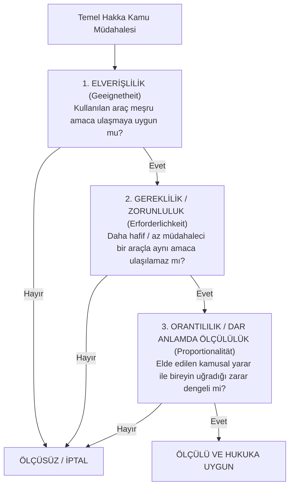

# Ölçülülük İlkesi ve Hukuki Belirlilik Doktrini

> *"Bir kelebeği öldürmek için balyoz kullanılmaz."*  
> — **Alman Federal İdare Mahkemesi Kararı**

---

## 1. Giriş: Ölçülülük İlkesi (*Verhältnismäßigkeitsprinzip*)

Ölçülülük ilkesi; kamu gücünü kullanan makamların (yasama, yürütme, idare ve yargı) bireylerin hak ve özgürlüklerini kısıtlarken veya onlara bir külfet yüklerken, **ulaşılmak istenen amaç ile başvurulan araç arasında adil ve makul bir denge** kurmasını zorunlu kılan evrensel hukuk ilkesidir.

Alman kamu hukukunda doğan bu ilke, günümüzde Avrupa İnsan Hakları Mahkemesi (AİHM), Avrupa Birliği Adalet Divanı (ABAD) ve Türkiye Anayasa Mahkemesi'nin en temel denetim standardıdır.

---

## 2. Ölçülülük Denetiminin Üç Kademeli Testi

Bir müdahalenin ölçülü sayılabilmesi için birbirini izleyen şu üç alt unsuru kümülatif (birlikte) taşıması zorunludur:



### 1. Elverişlilik (*Geeignetheit / Suitability*)
* Başvurulan tedbir, ulaşılmak istenen kamusal amacı gerçekleştirmeye fiilen ve mantıken elverişli olmalıdır. Amaca hizmet etmeyen veya amaca tamamen alakasız bir sınırlama baştan ölçüsüzdür.

### 2. Gereklilik (*Erforderlichkeit / Necessity*)
* Amaca ulaşmak için seçilen araç zorunlu olmalıdır. Eğer aynı amaca bireyin temel hakkını daha az sınırlayan veya ona daha az zarar veren başka bir alternatif tedbirle ulaşılabiliyorsa, ağır tedbire başvurulamaz (*en hafif araç kuralı*).

### 3. Orantılılık / Dar Anlamda Ölçülülük (*Proportionalität / Proportionality stricto sensu*)
* Kullanılan araç ile elde edilen fayda arasında tartımsal bir denge olmalıdır. Müdahaleyle kamuya sağlanan yarar, bireye yüklenen aşırı külfet ve zarardan bariz biçimde az olmamalıdır.

---

## 3. Hukuki Belirlilik Doktrini (*Bestimmtheitsgebot*)

Hukuki belirlilik, kanunların ve idari işlemlerin dilinin açık, net, anlaşılır ve öngörülebilir olmasını gerektirir:

```text
┌─────────────────────────────────────────────────────────────┐
│                 BELİRLİLİK İLKESİNİN ŞARTLARI               │
│                                                             │
│  1. ÖNGÖRÜLEBİLİRLİK:                                       │
│     Yurttaş hangi fiilin hangi cezayı veya hukuki sonucu   │
│     doğuracağını kuralı okuduğunda öngörebilmelidir.        │
│                                                             │
│  2. KEYFİYETİ ÖNLEME:                                       │
│     Kanun metni idareye veya hâkime sınırsız ve keyfi bir  │
│     yorum alanı bırakacak kadar muğlak ve geniş olamaz.     │
│                                                             │
│  3. ALENİYET VE ERİŞİLEBİLİRLİK:                            │
│     Kurallar gizli tutulamaz; resmî gazetede usulünce ilan  │
│     edilip herkesin erişimine açık kılınmalıdır.            │
└─────────────────────────────────────────────────────────────┘
```

---

## 📌 Sonuç

Ölçülülük ve belirlilik; devletin meşru kamu yararı iddialarını dahi sınırlayarak, devlet iktidarının birey üzerindeki gücünü asgari ve rasyonel düzeyde tutan en güçlü anayasal terazidir.
