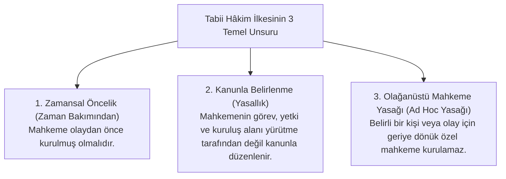

# Tabii Hâkim (Kanuni Hâkim) İlkesi

> *"Hiç kimse, kanunen tabi olduğu mahkemeden başka bir merci önüne çıkarılamaz. Bir kimseyi kanunen tabi olduğu mahkemeden başka bir merci önüne çıkarma sonucunu doğuran yargı yetkisine sahip olağanüstü merciler kurulamaz."*  
> — **T.C. Anayasası, Madde 37**

---

## 1. Giriş: Tabii Hâkim Güvencesi Nedir?

Tabii Hâkim (*Juge Naturel / Gesetzlicher Richter*) ya da Kanuni Hâkim güvencesi; bir uyuşmazlığa veya suça bakacak olan mahkemenin, hâkimin ve yargılama usulünün, **uyuşmazlığın veya suçun doğmasından ÖNCE** kanunla genel ve soyut olarak belirlenmiş olmasını zorunlu kılan anayasal bir güvencedir.

Bu ilke, adil yargılanma hakkının (*AİHS m. 6/1 - "Yasayla kurulmuş, bağımsız ve tarafsız bir mahkeme"*) en vazgeçilmez unsurudur.

---

## 2. İlkenin Üç Temel Boyutu

---

## 3. Olağanüstü Mahkeme (*Ad Hoc Mahkeme*) Yasağı

Tarih boyunca otoriter ve totaliter rejimler, siyasi muhalifleri tasfiye etmek için olay gerçekleştikten sonra o olaya ve kişiye özel olağanüstü mahkemeler (*İstiklal Mahkemeleri, Yassıada Yüksek Adalet Divanı, Nazi Volksgerichtshof / Halk Mahkemesi*) kurmuşlardır.

* **Neden Yasaktır?**  
  Olaydan sonra kurulan bir mahkeme; kurulma amacıyla, üyelerinin özel olarak seçilmesiyle ve intikam saikiyle baştan tarafgirdir.
* Bu tür mahkemelerin varlığı tabii hâkim ilkesini doğrudan ve telafisiz biçimde yok eder.

---

## 4. İhtisas Mahkemeleri ve Tabii Hâkim Ayrımı

Uygulamada sıklıkla karıştırılan bir husus, sonradan kurulan mahkemeler ile tabii hâkim ilişkisidir:

* **İhtisaslaşma (Hukuka Uygun):** Bilişim suçları, fikri mülkiyet, çocuk mahkemeleri veya tüketici mahkemeleri gibi genel kategoriler için yeni mahkemeler kurulması ve yürürlükten sonraki olaylara bakması tabii hâkime aykırı değildir.
* **Kişiye Özel Kurulma (Hukuka Aykırı):** Belli bir soruşturmayı yürütmek veya belli bir sanığı yargılamak üzere özel yetkili bir heyet veya mahkeme teşkil edilmesi tabii hâkim güvencesini ihlal eder.

---

## 📌 Sonuç

Tabii hâkim ilkesi; iktidarların "yargıcı seçme" veya "sanığa göre mahkeme tayin etme" keyfiyetini ortadan kaldırarak yurttaşın yargısal güvenliğini temin eden aşılmaz bir kalkandır.
