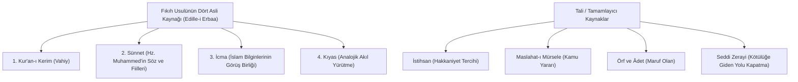

# Dini ve Geleneksel Hukuk Sistemleri

> *"Gelenek, yaşayanların ölüler üzerinde değil; ölülerin yaşayanlar üzerindeki ahlaki ve hukuki sözleşmesidir."*  
> — **Edmund Burke**

---

## 1. Giriş: Dini ve Kültürel Hukuk Sistemlerinin Mahiyeti

Dini ve geleneksel hukuk sistemleri, meşruiyetini doğrudan vahiyden, kutsal metinlerden veya kuşaktan kuşağa aktarılan toplumsal örf ve adetlerden alan normatif düzenlerdir. Bu sistemlerde din, ahlak ve hukuk iç içe geçmiştir.

---

## 2. İslam Hukuku (*Fıkıh ve Şeriat Geleneği*)

İslam hukuku (Fıkıh), ilahi vahiy ve peygamberi sünneti akıl yürütme metotlarıyla somut olgulara uygulayan geniş bir içtihad kütüphanesidir.

### Temel Kavramlar ve Mecelle Kaideleri:
* **Makasidü'ş-Şeria (Hukukun Beş Temel Koruma Amacı):** Canın korunması (*Nefs*), aklın korunması (*Akl*), neslin korunması (*Nesl*), malın korunması (*Mal*) ve din/vicdanın korunması (*Din*).
* **Mecelle-i Ahkâm-ı Adliye İlkeleri (1876):**
  * *"Zarar ve mukabele-i bizzarar yoktur."* (Zarar vermek de zararla karşılık vermek de yasaktır - m. 19).
  * *"Zarar-ı ammi def' için zarar-ı has ihtiyar olunur."* (Kamu zararını önlemek için özel zarara katlanılır - m. 26).
  * *"Ezmanın tağayyürü ile ahkâmın tağayyürü inkâr olunamaz."* (Zamanın değişmesiyle hükümlerin ve içtihatların değişmesi inkâr edilemez - m. 39).

---

## 3. Yahudi Hukuku (*Halaha Geleneği*)

* **Kaynaklar:** Yazılı Tevrat (*Tora*) ve sözlü geleneklerin derlemesi olan Talmud (*Mişna* ve *Gemara*).
* **Nitelik:** Rabbinik otoritelerin yüzyıllar süren tartışma, şerh ve fetvalarıyla gelişen, toplumsal ve dini yaşamı düzenleyen kazuistik bir hukuk geleneğidir.

---

## 4. Doğu Asya ve Geleneksel Hukuk Anlayışları

| Gelenek / Sistem | Temel Felsefe | Hukuka ve Uyuşmazlık Çözümüne Bakış |
| :--- | :--- | :--- |
| **Konfüçyüsçü Hukuk (Çin / Doğu Asya)** | **Li (Ahlak / Erdem) vs Fa (Kanun / Ceza):** Düzen kanun zoruyla değil, ahlaki eğitim ve erdemle sağlanmalıdır. | Mahkemeye gitmek toplumsal ahengin (*Harmoni*) bozulması sayılır; uzlaşma ve arabuluculuk esastır. |
| **Hindu Hukuku (Dharma Geleneği)** | **Dharma:** Evrensel kozmik düzen, bireyin kastına ve yaşam evresine göre yerine getirmesi gereken kutsal ödevler bütünüdür. | Hukuk bireysel haklardan ziyade ahlaki ve kozmik sorumluluklar üzerine inşa edilmiştir. |
| **Afrika Geleneksel Hukuku (*Ubuntu*)** | **Ubuntu:** *"Ben, biz olduğumuz için benim."* | Restoratif (onarıcı) adalet; cezalandırmaktan ziyade topluluk bağlarını onarma ve barışı tesis etme odaklıdır. |

---

## 📌 Sonuç

Dini ve geleneksel hukuk gelenekleri; insanlığın adalet, toplumsal uyum ve ahlaki meşruiyet arayışında geliştirdiği zengin felsefi ve usuli tecrübeleri barındırır.
