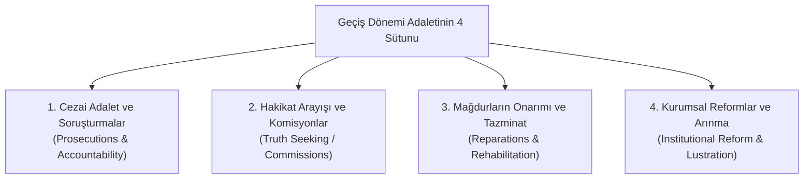

# Geçiş Dönemi Adaleti (*Transitional Justice*) ve Tarihsel Yüzleşme

> *"Geçmişi hatırlamayanlar, onu bir kez daha yaşamak zorunda kalırlar."*  
> — **George Santayana**

---

## 1. Giriş: Geçiş Dönemi Adaleti Nedir?

Geçiş Dönemi Adaleti (*Transitional Justice*), otoriter rejimlerden, askeri diktatörlüklerden veya kitlesel insan hakları ihlallerinin yaşandığı iç çatışmalardan demokratik ve barışçıl bir hukuk düzenine geçen toplumların; geçmişteki ağır haksızlıklarla, cezasızlıkla (*impunity*) ve travmalarla yüzleşmek amacıyla başvurduğu hukuki, adli ve kurumsal mekanizmalar bütünüdür.

---

## 2. Geçiş Dönemi Adaletinin Dört Temel Sütunu

Birleşmiş Milletler ve uluslararası hukuk doktrini tarafından kabul edilen dört vazgeçilmez sütun:

### 1. Cezai Kovuşturmalar (*Ceza Yargılaması*)
* Ağır insan hakları ihlallerini, insanlığa karşı suçları ve işkenceyi gerçekleştiren sorumluların adil bir biçimde yargılanarak cezalandırılmasıdır.
* **Tarihsel Emsaller:** Nürnberg ve Tokyo Mahkemeleri (1945-1946), Eski Yugoslavya Uluslararası Ceza Mahkemesi (ICTY), Ruanda Uluslararası Ceza Mahkemesi (ICTR) ve Uluslararası Ceza Mahkemesi (UCM / ICC - Roma Statüsü).

### 2. Hakikat ve Uzlaşma Komisyonları (*Truth Commissions*)
* Resmi belgelerin açılması, gizli arşivlerin incelenmesi, faillerin itirafları ve mağdurların kamuoyu önünde dinlenmesi yoluyla tarihsel hakikatin resmi olarak belgelenmesi.
* **Örnek:** Güney Afrika Hakikat ve Uzlaşma Komisyonu (Desmond Tutu başkanlığında, Apartheid rejiminin suçlarını ortaya çıkarmıştır).

### 3. Mağdurların Onarımı (*Reparations*)
* Mağdurlara ve ailelerine maddi/manevi tazminat ödenmesi, el konulan mülklerin iadesi, kamusal anıtlar ve hafıza mekânları inşa edilmesi (*Memorialization*), devletin resmi özür dilemesi.

### 4. Kurumsal Reform ve Arınma (*Lustration / Vetting*)
* İnsan hakları ihlallerine karışmış yargıç, polis ve bürokratların kamu görevlerinden el çektirilmesi; istihbarat ve güvenlik kurumlarının demokratik denetime açılması.

---

## 3. Adalet ile Barış Arasındaki Gerilim

Geçiş süreçlerinde sıklıkla ortaya çıkan felsefi ikilem:

| Yaklaşım | Temel Sav | Karşı Karşıya Olduğu Risk |
| :--- | :--- | :--- |
| **Retributif (Cezalandırıcı) Adalet** | Her suçlu istisnasız cezalandırılmalıdır; taviz verilemez. | Barış anlaşmalarının bozulması ve eski rejimin silahlı direnişe devam etme riski. |
| **Restoratif (Onarıcı) Adalet** | Toplumsal barış, uzlaşma ve bir arada yaşama için af ve itiraf mekanizmaları işletilmelidir. | Mağdurların adalet duygusunun zedelenmesi ve cezasızlık (*impunity*) kültürü yaratma riski. |

---

## 📌 Sonuç

Geçiş dönemi adaleti; intikam hissi yerine hukukun üstünlüğünü ikame eden, geçmişin yaralarını sararak gelecekte benzer suçların tekrarlanmasını önleyen (*Non-Recurrence*) anayasal bir barış inşası sürecidir.
