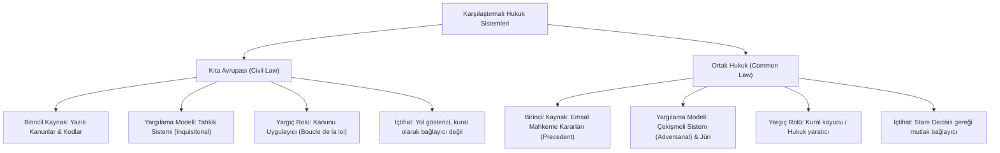

# Kıta Avrupası (*Civil Law*) ve Ortak Hukuk (*Common Law*) Karşılaştırması

> *"Kıta Avrupası hukuku Roma'nın sistemli aklına, Common Law ise İngiliz yargıcının pratik tecrübesine dayanır."*  
> — **Oliver Wendell Holmes Jr.**

---

## 1. Giriş: Dünyadaki İki Büyük Hukuk Geleneği

Dünya üzerindeki çağdaş hukuk düzenlerinin ezici çoğunluğu iki ana kökten türemiştir:
1. **Kıta Avrupası Hukuk Çevresi (*Civil Law / Roma-Germen Geleneği*):** Roma Hukuku'nun (*Corpus Iuris Civilis*) derlenmesi ve 19. yüzyıl kodifikasyon hareketlerine (Fransız *Code Civil*, Alman *BGB*, İsviçre *ZGB*) dayanan yazılı ve sistematik gelenek.
2. **Ortak Hukuk Çevresi (*Common Law / Anglo-Amerikan Geleneği*):** İngiltere'de 1066 Norman Fethi sonrasında krallık yargıçlarının somut uyuşmazlıklarda verdikleri kararlardan türeyen, içtihat odaklı (*Case Law*) gelenek.

---

## 2. Karşılaştırmalı Yapısal Matris

| Karşılaştırma Ölçütü | Kıta Avrupası (*Civil Law*) | Ortak Hukuk (*Common Law*) |
| :--- | :--- | :--- |
| **Temel Tarihsel Köken** | Roma Hukuku (*Justinianus*), Kilise Hukuku, Aydınlanma Çağı Kodifikasyonları. | İngiliz örf-âdeti, Kraliyet Mahkemeleri (*King's Bench*), *Equity* (Hakkaniyet) Mahkemeleri. |
| **Asli Hukuk Kaynağı** | Yazılı Mevzuat (Anayasa, Kodlar, Kanunlar, Yönetmelikler). | Yargısal İçtihatlar (*Precedents* / Mahkeme Emsal Kararları). |
| **İçtihatların Bağlayıcılığı** | İstisnalar (İçtihadı Birleştirme) hariç bağlayıcı değil; ikna edicidir (*persuasive*). | **Stare Decisis** ilkesi uyarınca üst mahkeme kararları alt mahkemeleri mutlak bağlar. |
| **Yargılama Usulü** | **Tahkik Sistemi (*Inquisitorial*):** Hâkim aktif olarak delil toplar, gerçeği araştırır. | **Çekişmeli Sistem (*Adversarial*):** Taraflar delil sunar; hâkim tarafsız hakemdir, jüri karar verir. |
| **Hukukun Yapısı** | Kamu Hukuku / Özel Hukuk ayrımı çok keskin ve katıdır. | *Common Law* ve *Equity* ayrımı esastır; Kamu-Özel ayrımı daha akışkandır. |
| **Akıl Yürütme Tarzı** | **Tümdengelim (*Deductive*):** Genel ve soyut kuraldan somut olaya inilir. | **Tümevarım (*Inductive*):** Somut olaylar ve emsallerden genel kurala ulaşılır. |

---

## 3. Temel Anglo-Amerikan Kavramları

1. **Stare Decisis (*Et Non Quieta Movere*):** *"Önceki karara sadık kal ve yerleşmiş olanı bozma."* Mahkemelerin geçmişteki emsal kararlara uyması zorunluluğudur.
2. **Ratio Decidendi:** Bir mahkeme kararının bağlayıcı olan asıl hukuki gerekçesi ve temel kuralıdır.
3. **Obiter Dictum:** Kararda hâkimin konu dışı olarak sarf ettiği, bağlayıcı olmayan yan görüşleridir.
4. **Distinguishing (Ayırt Etme Tekniği):** Hâkimin önündeki olayın, önceki emsal karardaki maddi vakıalardan farklı olduğunu göstererek o emsale uymama yöntemidir.

---

## 4. Çağdaş Yakınsama (*Convergence*) Eğilimi

21. yüzyılda bu iki gelenek birbirinden tamamen kopuk değildir; giderek birbirine yaklaşmaktadır:
* Kıta Avrupası ülkelerinde yüksek mahkemelerin (Yargıtay, Danıştay, Anayasa Mahkemesi) içtihatları fiilen ve hukuken büyük bir bağlayıcılık ve rehberlik kazanmıştır.
* *Common Law* ülkelerinde (özellikle ABD ve İngiltere) yasama organları artan oranda yazılı kanun (*Statute Law*) ve düzenleyici kurallar çıkarmaktadır.

---

## 📌 Sonuç

Her iki sistem de adalet ve hukuki güvenlik amacına farklı metodolojilerle ulaşmayı hedefler: Kıta Avrupası sistemli soyut kurallarla öngörülebilirlik sağlarken; Common Law somut hayatın akışına anında uyum sağlayan esnek ve pratik bir adalet sunar.
