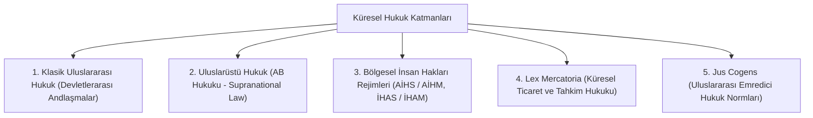
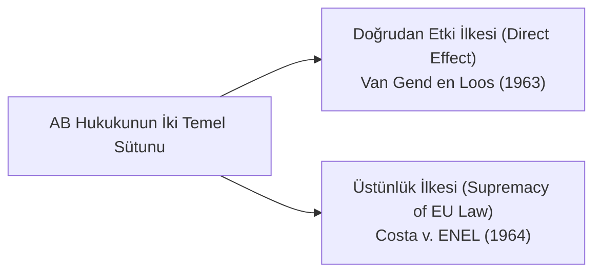

# Uluslarüstü (*Supranasyonal*) ve Küresel Hukuk Düzenleri

> *"Uluslararası hukuk artık yalnızca devletlerin egemenlik ilişkilerini düzenleyen bir sözleşmeler ağı değil; insan onurunu ve küresel kamu yararını gözeten anayasal bir düzene evrilmektedir."*

---

## 1. Giriş: Egemenlik Sonrası Hukuk Düzeni

Klasik Westphalia (1648) düzeni, devletlerin mutlak egemenliği ve iç işlerine müdahale yasağı üzerine kuruluydu. 20. yüzyılın ikinci yarısından itibaren küreselleşme, uluslararası insan hakları sözleşmeleri ve uluslarüstü entegrasyonlar bu mutlak egemenlik paradigmasını dönüştürmüştür.

---

## 2. Uluslarüstü (*Supranasyonel*) Hukuk: Avrupa Birliği Modeli

Avrupa Birliği hukuku, klasik uluslararası örgütlerden farklı olarak üye devletlerin egemenlik devrettiği özgün bir (*sui generis*) hukuk düzenidir:

1. **Doğrudan Etki (*Direct Effect* - *Van Gend en Loos Kararı, 1963*):** AB hukuku normları, ulusal iç hukuka aktarılmaya gerek kalmaksızın doğrudan bireylere hak ve borç yükleyebilir ve ulusal mahkemelerde ileri sürülebilir.
2. **Üstünlük İlkesi (*Supremacy* - *Costa v. ENEL Kararı, 1964*):** AB hukuku ile üye devletlerin ulusal hukuku (anayasa dahil) çatıştığında AB hukuku öncelikle uygulanır.

---

## 3. *Jus Cogens* ve *Erga Omnes* Yükümlülükler

Uluslararası hukukta devletlerin anlaşarak dahi aksini kararlaştıramayacağı en üst düzey emredici normlara **Jus Cogens** denir (1969 Viyana Andlaşmalar Hukuku Sözleşmesi m. 53):

* **Jus Cogens Kapsamındaki Yasaklar:**
  * Soykırım (*Genocide*) yasağı
  * İşkence ve insanlık dışı muamele yasağı
  * Kölelik ve köle ticareti yasağı
  * Saldırı suçu ve hukuka aykırı kuvvet kullanma yasağı
  * Ayrımcılık ve apartheid yasağı
* **Erga Omnes Yükümlülükler:** Bir devletin belirli bir devlete değil, uluslararası toplumun bütününe karşı borçlu olduğu temel insan hakları ve çevre güvenceleridir.

---

## 4. *Lex Mercatoria*: Küresel Ticaret Hukuku ve Uluslararası Tahkim

Devlet sınırlarını aşan uluslararası ticaret ve finans ilişkilerinde, devletlerin yerel kanunlarının yetersiz kalması sonucu ortaya çıkan küresel tüccar hukukudur:
* **Özellikleri:** UNCITRAL model kanunları, ICC (Milletlerarası Ticaret Odası) kuralları, INCOTERMS ve uluslararası tahkim mekanizmaları (ICSID, ICC, LCIA).
* **New York Sözleşmesi (1958):** Yabancı hakem kararlarının 160'tan fazla ülkede kolayca tanınmasını ve tenfiz edilmesini sağlayarak küresel ticaretin güvencesi olmuştur.

---

## 📌 Sonuç

Küresel hukuk düzeni; ulusal sınırların ötesinde insan haklarının, serbest ticaretin ve çevre adaletinin korunmasını sağlayan çok katmanlı ve çoğulcu bir normlar ağı olarak genişlemeye devam etmektedir.
