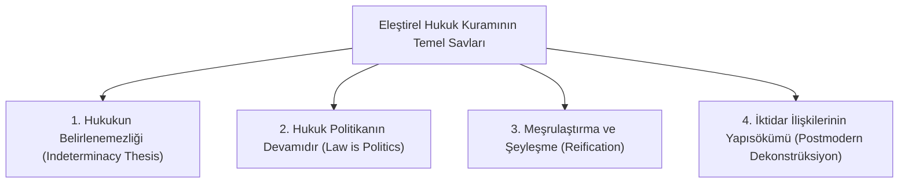

# Eleştirel Hukuk Çalışmaları (*CLS*) ve Postmodern Hukuk Teorisi

> *"Hukuk politikadır; yargısal kararlar tarafsız ve nötr bir mantığın değil, örtük ideolojik ve hiyerarşik tercihlerin ürünüdür."*  
> — **Duncan Kennedy & Roberto Unger (Critical Legal Studies Movement)**

---

## 1. Giriş: Eleştirel Hukuk Çalışmaları (*CLS - Critical Legal Studies*)

1970'lerin sonlarında Harvard Hukuk Fakültesi merkezli ortaya çıkan Eleştirel Hukuk Hareketi (CLS), liberal hukukun "tarafsızlık", "objektiflik" ve "biçimsel eşitlik" iddialarını köklü bir yapı sökümüne (*deconstruction*) tabi tutmuştur.

---

## 2. CLS'in Temel Doktrinleri

### 1. Hukukun Belirlenemezliği Tezi (*Indeterminacy*)
* Liberal pozitivizm, hukuki uyuşmazlıklarda tarafsız bir kuralın tek ve doğru bir çözüme ulaştıracağını iddia eder (*Dworkin'in tek doğru cevap tezi*).
* CLS ise her hukuki normun zıddıyla bir arada var olduğunu (*antinomi ve karşıtlıklar*) ve hâkimin bilinçli ya da bilinçsiz ideolojik tercihlerine göre karar verip sonradan buna kılıf uydurduğunu savunur.

### 2. Şeyleşme (*Reification*) ve Meşrulaştırma Fonksiyonu
* Hukuki kavramlar (sözleşme serbestisi, mülkiyet hakkı, şirket tüzel kişiliği) sanki doğanın değişmez kurallarıymış gibi sunulur. Oysa bunlar tarihsel olarak egemen sınıfların çıkarlarını korumak için inşa edilmiş kurgulardır.

---

## 3. Postmodernizm ve Michel Foucault: İktidar / Söylem Analizi

* **Disipliner İktidar ve Gözetim (*Panoptikon*):** Hukuk, iktidarın sadece tepeden inme bir baskı aygıtı değil, söylemler ve pratikler yoluyla bireylerin bedenlerine ve zihinlerine nüfuz eden bir disiplin mekanizmasıdır.
* **Jacques Derrida ve Yapısöküm (*Deconstruction*):** Hukuk adaletin kendisi değildir; adalet hesaplanamaz, yapıbozuma uğratılamaz olandır. Hukuk ise sürekli eleştirilmeye ve dönüştürülmeye muhtaçtır.

---

## 📌 Sonuç

Eleştirel hukuk ve postmodern kuramlar; hukukçuları statükonun edilgen uygulayıcıları olmaktan çıkarıp, hukukun arkasındaki güç ilişkilerini, adaletsizlikleri ve ayrımcılıkları ifşa eden dönüştürücü birer özneye dönüştürmeyi amaçlar.
