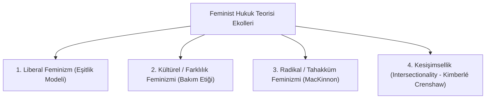

# Feminist Hukuk Teorisi ve Toplumsal Cinsiyet Adaleti

> *"Hukukun tarafsız ve cinsiyetsiz olduğu iddiası, aslında erkeğin bakış açısını evrensel standart olarak dayatmanın en etkili yoludur."*  
> — **Catharine A. MacKinnon**

---

## 1. Giriş: Hukukun Toplumsal Cinsiyet Analizi

Feminist hukuk teorisi, geleneksel hukuk normlarının, mahkeme pratiklerinin ve kurumsal yapıların tarihsel olarak erkek egemen (*ataerkil*) bir dünya görüşüyle inşa edildiğini; "tarafsız ve rasyonel insan" standardının çoğunlukla mülk sahibi erkeği temsil ettiğini ortaya koyar.

---

## 2. Dört Temel Feminist Hukuk Dalgası

| Feminist Hukuk Akımı | Temel Görüş ve Metodoloji | Hukuki Talepler ve Sonuçlar |
| :--- | :--- | :--- |
| **Liberal Feminist Teori** | Kadın ve erkeğin eşit rasyonaliteye sahip olduğu; hukukun biçimsel olarak cinsiyet körü (*gender-blind*) olması gerektiği. | Seçme ve seçilme hakkı, eşit işe eşit ücret, medeni haklarda biçimsel eşitlik. |
| **Farklılık / Kültürel Feminizm (Carol Gilligan)** | Kadınların ahlaki ve hukuki algısının "hak ve ödevler" yerine "ilişkiler, şefkat ve bakım etiği" (*ethics of care*) üzerine kurulduğu. | Doğum izinleri, esnek çalışma saatleri, aile hukuku reformları ve onarıcı adalet. |
| **Radikal / Tahakküm Feminizmi (Catharine MacKinnon)** | Mesele "farklılık" değil, erkeğin kadın üzerindeki "tahakkümüdür" (*dominance model*). Hukuk bu tahakkümün meşrulaştırıcı aracıdır. | Cinsel tacizin hukuki suç/haksız fiil sayılması, tecavüz yasalarının rıza odaklı reformu, pornografi ve fuhuş eleştirisi. |
| **Kesişimsellik (*Intersectionality* - Kimberlé Crenshaw)** | Ayrımcılık tek boyutlu değildir; ırk, cinsiyet, sınıf ve cinsel yönelim gibi kimlikler birbirini katlayarak benzersiz baskı biçimleri yaratır. | Çoklu ayrımcılıkla mücadele, ceza ve iş hukukunda kesişimsel koruma standartları. |

---

## 3. Somut Pozitif Hukuk Reformları

Feminist hukuk mücadelesi modern hukuk düzenlerinde hayati dönüşümlere yol açmıştır:
1. **Ev İçi Emeğin Değerlendirilmesi:** Evlilik birliği içinde edinilen mallara katılma rejimi (TMK m. 202 vd.).
2. **Cinsel Dokunulmazlığa Karşı Suçlar:** Mağdurun direnme zorunluluğunun kaldırılarak "özgür irade ve rıza" standardının getirilmesi.
3. **İstanbul Sözleşmesi ve 6284 Sayılı Kanun:** Kadına yönelik şiddetin önlenmesi, acil tedbir kararları ve kurumsal koruma mekanizmaları.

---

## 📌 Sonuç

Feminist hukuk teorisi, adaletin yalnızca biçimsel eşitlik ile sağlanamayacağını, tarihsel güç dengesizliklerini ve toplumsal eşitsizlikleri fiilen ortadan kaldıran bir maddi eşitlik anlayışının zorunlu olduğunu kanıtlamıştır.
