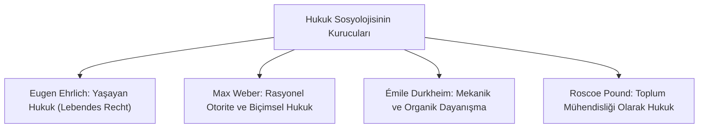

# Hukuk Sosyolojisinin Temelleri: Yaşayan Hukuk ve Toplumsal Yapı

> *"Hukukun ağırlık merkezi mevzuatta, doktrinde veya yargı kararlarında değil; bizzat toplumun kendisindedir."*  
> — **Eugen Ehrlich**

---

## 1. Giriş: Hukukun Sosyolojik Boyutu

Hukuk sosyolojisi, hukuku salt biçimsel kurallar ve soyut normlar bütünü olarak değil; toplumsal dinamiklerle sürekli etkileşim halinde olan, toplumu dönüştüren ve toplumdan türeyen yaşayan bir olgu olarak inceler.

---

## 2. Klasik Sosyolojik Hukuk Kuramları

### 1. Eugen Ehrlich: Yaşayan Hukuk (*Lebendes Recht*)
* **Tez:** Devletin kanunlaştırdığı pozitif hukuk (*Rechtssatz*) ile halkın günlük hayatında fiilen uyguladığı kurallar (*Lebendes Recht*) birbirinden farklıdır.
* **Sonuç:** Bir kanun toplumsal kabule ve yaşayan hukuka uygun değilse, yalnızca kâğıt üzerinde kalmaya mahkûmdur (*Dead Law*).

### 2. Max Weber: Hukuki Rasyonelleşme ve Bürokratik Otorite
* **Otorite Tipleri:** Geleneksel, Karizmatik ve **Yasal-Rasyonel Otorite**.
* **Hukuk Tipleri:**
  * *Biçimsel Mantıksal Rasyonel Hukuk:* Modern kapitalizmin ve hukuk devletinin omurgasını oluşturan, genelleştirilebilir kurallara dayalı sistem.
  * *Kadi Adaleti (Substantive Irrational):* Somut olayın duygusal ve ahlaki takdirine dayalı yargılama.

### 3. Émile Durkheim: Toplumsal Dayanışma ve Hukuk Türleri
* **Mekanik Dayanışma (Geleneksel Toplumlar):** Kolektif bilinç güçlüdür; ihlaller topluluğu yaralar ve **Cezalandırıcı (*Represif*) Hukuk** egemendir.
* **Organik Dayanışma (Modern İş Bölümü Toplumları):** Bireysellik ve uzmanlaşma gelişmiştir; bozulan dengeyi eski haline getiren **Telafi Edici / Onarıcı (*Restitutif*) Hukuk** egemendir.

### 4. Roscoe Pound: Toplum Mühendisliği (*Social Engineering*)
* Hukukun temel görevi, toplumdaki çatışan bireysel, kamusal ve sosyal menfaatleri asgari sürtünme ve israfla uzlaştırmak ve dengelemektir.

---

## 📌 Sonuç

Hukuk sosyolojisi; yasa koyucuların ve hâkimlerin kör bir pozitivizme saplanmasını engelleyerek, hukukun yaşayan sosyal gerçeklikle bağını diri tutmasını sağlar.
