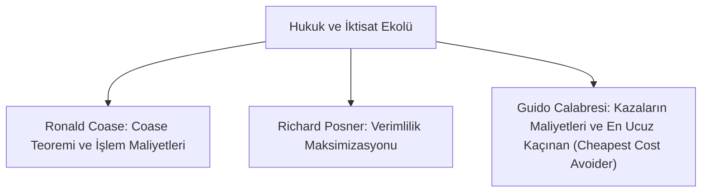

# Hukuk ve İktisat Ekolü (*Law and Economics / Chicago Okulu*)

> *"Hukuk kuralları salt ahlaki ideallerle değil, kaynakların en verimli ve etkin dağılımını sağlayacak ekonomik rasyonaliteyle değerlendirilmelidir."*  
> — **Richard Posner**

---

## 1. Giriş: Hukukun İktisadi Analizi

1960'larda Chicago Üniversitesi Hukuk Fakültesi'nde filizlenen Hukuk ve İktisat Ekolü (*Economic Analysis of Law*), mikroiktisadın araçlarını (fayda maksimizasyonu, maliyet-fayda analizi, işlem maliyetleri ve piyasa dengesi) hukuk kurallarının ve yargı kararlarının değerlendirilmesinde kullanır.

---

## 2. Temel Kuramlar ve Öncüler

### 1. Coase Teoremi (*Ronald Coase - 1960*)
* **Teorem:** Sıfır işlem maliyeti (*zero transaction costs*) ve net tanımlanmış mülkiyet hakları varlığında, taraflar pazarlık yaparak yasal hakların kime verildiğine bakılmaksızın kaynakları en etkin ve verimli şekilde tahsis eder.
* **Hukukun Rolü:** Gerçek hayatta işlem maliyetleri sıfır olmadığı için, kanun koyucu ve mahkemeler hakları, **taraflar pazarlık yapabilseydi varacakları en etkin sonuca** göre tahsis etmelidir.

### 2. Richard Posner ve Verimlilik Kriterleri
* **Pareto Verimliliği:** Hiç kimsenin refahını azaltmadan en az bir kişinin durumunu iyileştiren durumdur.
* **Kaldor-Hicks Verimliliği (*Hukukta Esas Alınan*):** Kazananların elde ettiği toplam fayda, kaybedenlerin uğradığı zarardan daha büyükse ve teorik olarak onları tazmin edebiliyorsa bu kural ekonomik olarak verimlidir.

### 3. Guido Calabresi ve Haksız Fiil Hukuku
* Haksız fiil sorumluluğunun amacı salt intikam veya ahlaki ceza değil, **toplam kaza maliyetlerini en aza indirmektir**.
* Zarar, o zarardan en düşük maliyetle kaçınabilecek olan tarafa (*Cheapest Cost Avoider*) yüklenmelidir.

---

## 3. Ceza Hukukunun İktisadi Analizi (*Gary Becker*)

Nobel ödüllü Gary Becker, suç işleme kararının rasyonel bir maliyet-fayda hesabına dayandığını öne sürmüştür:
$$\text{Beklenen Suç Getirisi} > (\text{Yakalanma Olasılığı} \times \text{Cezanın Ağırlığı})$$
* Dolayısıyla suçu önlemenin en rasyonel yolu yalnızca cezaları artırmak değil; yakalanma olasılığını ve yargılamanın kesinliğini yükseltmektir.

---

## 📌 Sonuç

Hukuk ve İktisat Ekolü; yasa koyucuların mevzuat hazırlarken veya yargıçların tazminat takdir ederken toplum üzerindeki maliyet ve teşvik etkilerini rasyonel bir süzgeçten geçirmesini sağlar.
