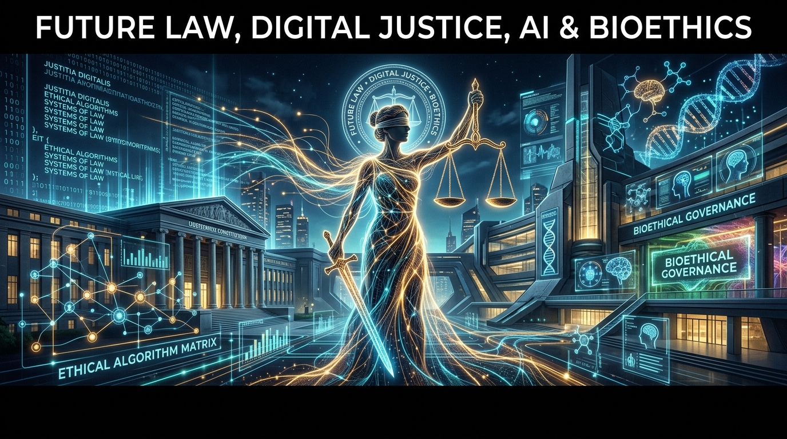

# 07. Dijital Çağ, Yapay Zekâ ve Hukukun Geleceği

<p align="center">
  
</p>

> *"Code is Law (Kod Kanundur). Siber uzamda mimariyi ve algoritmaları yazanlar, dijital çağın gerçek kanun koyucularıdır."*  
> — **Lawrence Lessig**, *Code and Other Laws of Cyberspace (1999)*

> *"Gözetim kapitalizmi, insan tecrübesini davranışsal veriye dönüştürerek irademizi ve haysiyetimizi metalaştırır. Hukuk bu istilaya karşı son kalkandır."*  
> — **Shoshana Zuboff**, *The Age of Surveillance Capitalism (2019)*

> *"Hiçbir yapay zekâ algoritması, insan yargıcın vicdani kanaatinin ve adalet duygusunun yerine ikame edilemez."*  
> — **Avrupa Konseyi (CEPEJ)**, *Yargı Sistemlerinde Yapay Zekâ Kullanımına İlişkin Etik Şart (2018)*

---

## 📌 Genel Bakış

Bu modül; yapay zekâ, otonom robotlar, büyük veri analitiği, algoritmik yargı sistemleri, gözetim toplumu, dijital mahremiyet ve blokzincir teknolojilerinin hukuk felsefesi, anayasal düzen ve özel hukuk üzerindeki etkilerini ve hukuki dönüşümü ele almaktadır.

---

## 📑 Modül İçeriği ve Dizin

```text
07-dijital-cag-yapay-zeka-ve-hukukun-gelecegi/
├── README.md
├── yapay-zeka-ve-hukuki-kisilik-sorunu.md
├── algoritmik-adalet-ve-yargisal-otomasyon.md
├── dijital-haklar-veri-egemenligi-ve-mahremiyet.md
└── akilli-sozlesmeler-ve-merkeziyetsiz-hukuk.md
```

---

## 🧭 Konu Başlıkları ve Özetler

1. **[Yapay Zekâ, Otonom Sistemler ve Hukuki Kişilik Sorunu](yapay-zeka-ve-hukuki-kisilik-sorunu.md):** Elektronik kişilik tartışması, üretici ve tehlike sorumluluğu, AB Yapay Zekâ Yasası (*EU AI Act* risk piramidi).
2. **[Algoritmik Adalet, Yargısal Otomasyon ve Tahminleyici Yargı](algoritmik-adalet-ve-yargisal-otomasyon.md):** COMPAS vakası, algoritmik önyargı ve ayrımcılık, kara kutu problemi, gerekçelendirme hakkı ve CEPEJ etik şartı.
3. **[Dijital Haklar, Veri Egemenliği ve Mahremiyet Hukuku](dijital-haklar-veri-egemenligi-ve-mahremiyet.md):** GDPR ve KVKK ilkeleri, Unutulma Hakkı (*Costeja*), Schrems kararları, gözetim toplumu ve bilişsel haklar (*Neurorights*).
4. **[Akıllı Sözleşmeler, Blokzincir ve Merkeziyetsiz Hukuk](akilli-sozlesmeler-ve-merkeziyetsiz-hukuk.md):** "Code is Law" analizi, irade sakatlıkları ve emprevizyon, DAO'ların tüzel kişiliği ve merkeziyetsiz tahkim protokolleri.
