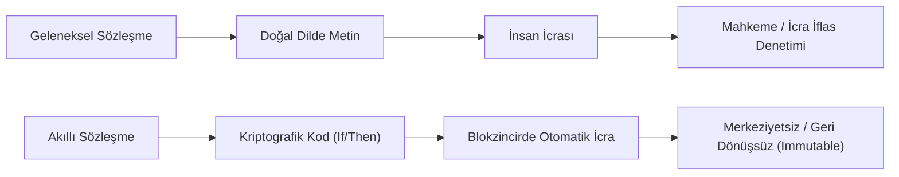

# Akıllı Sözleşmeler (*Smart Contracts*), Blokzincir ve Merkeziyetsiz Hukuk

> *"Kod yasadır (Code is Law); ancak kodun meşruiyeti insan adaletine ve hukukun genel ilkelerine sadakatinde yatar."*  
> — **Lawrence Lessig**

---

## 1. Giriş: "Code is Law" Paradigması

Akıllı sözleşmeler (*Smart Contracts*), ilk kez 1994 yılında Nick Szabo tarafından tanımlanan ve blokzincir (Blockchain) üzerinde çalışan, önceden belirlenmiş şartlar gerçekleştiğinde kendi kendini otomatik olarak icra eden (*self-executing*) bilgisayar protokolleridir.

---

## 2. Akıllı Sözleşmelerin Hukuki Niteliği ve Borçlar Hukuku

| Sözleşme Unsuru | Akıllı Sözleşmelerdeki Karşılığı ve Sorunlar |
| :--- | :--- |
| **İrade Beyanı ve Uyuşma** | Kriptografik imza (özel anahtar / private key) ile işlem onaylama. İrade sakatlığı (hata, hile, korkutma) halinde işlemin geri alınamaması (*immutability*). |
| **İfa ve Temerrüt** | Şart gerçekleştiğinde kripto varlık veya veri otomatik transfer edilir; borçlu temerrüdü veya ifa imkânsızlığı mekanizması kod seviyesinde bloke olur. |
| **Aşırı İfa Güçlüğü (*Gabin / Emprevizyon*)** | Kod katıdır; beklenmeyen olağanüstü durumları (mücbir sebep, enflasyon) insan yargıç gibi hakkaniyetle yorumlayamaz. |

---

## 3. Merkeziyetsiz Otonom Kuruluşlar (*DAO*) ve Tüzel Kişilik

* **DAO (Decentralized Autonomous Organization):** Hiyerarşik yönetim kurulu veya tek bir merkez olmaksızın, token sahiplerinin akıllı sözleşmeler aracılığıyla oylama yaparak yönettiği merkeziyetsiz dijital yapılardır.
* **Hukuki Sorun:** DAO'ların çoğu ülkede resmi tüzel kişiliği bulunmadığından doktrinde ve Anglo-Amerikan hukukunda **"Adi Ortaklık" (*General Partnership*)** olarak nitelendirilmekte ve tüm üyelerin sınırsız şahsi sorumluluğu riski doğmaktadır (Örn: *CFTC v. Ooki DAO Davası*).

---

## 4. Yetki ve Yargı Yeri Uyuşmazlıkları (*Lex Cryptographia*)

Blokzincir düğümleri (*nodes*) dünyanın dört bir yanına dağılmış durumdadır:
* Bir uyuşmazlık çıktığında hangi ülkenin mahkemesinin yetkili olacağı (*lex fori*) ve hangi hukukun uygulanacağı (*lex causae*) geleneksel kanunlar ihtilafı kurallarını zorlamaktadır.
* Çözüm olarak blokzincir tabanlı merkeziyetsiz tahkim protokolleri (Örn: *Kleros*, *Aragon Court*) ortaya çıkmıştır.

---

## 📌 Sonuç

Akıllı sözleşmeler işlem maliyetlerini düşürür ve aracıları ortadan kaldırır; fakat hakkaniyet, ahlak ve dürüstlük kuralı gibi soyut adalet ilkeleri kodlara tamamen indirgenemez. Bu nedenle "Code is Law" değil, **"Law governs Code"** prensibi esastır.
