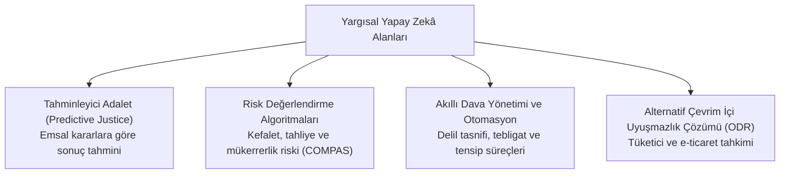
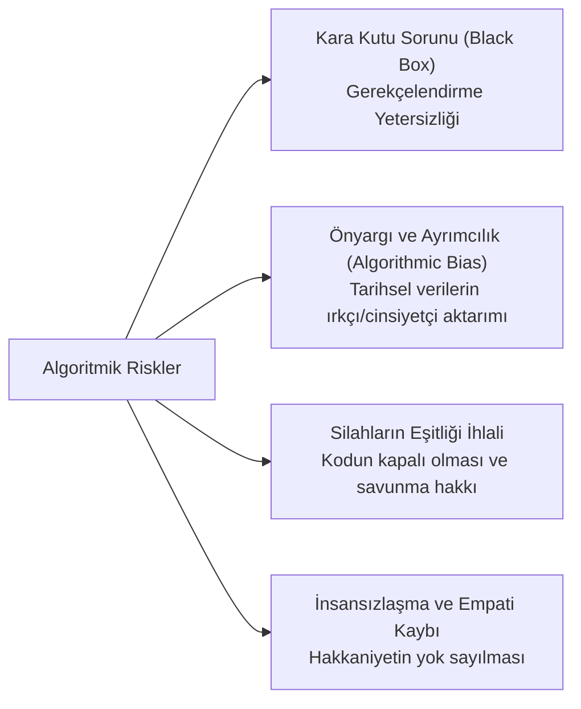

# Algoritmik Adalet, Yargısal Otomasyon ve Tahminleyici Yargı (*Predictive Justice*)

> *"Hâkimin vicdanı ve insani muhakemesi, hiçbir zaman bir istatistiksel olasılık algoritmasına devredilemez."*

---

## 1. Giriş: Adaletin Dijitalleşmesi

Yapay zekâ, büyük veri (*big data*) ve doğal dil işleme (NLP) teknolojilerinin yargı sistemlerine entegrasyonu; mahkeme kararlarının tahmin edilmesi, ceza tayini, kefalet/tahliye değerlendirmeleri ve dava dosyalarının özetlenmesi gibi alanlarda köklü dönüşümler yaratmaktadır.

---

## 2. Temel Kavramlar ve Uygulama Alanları

---

## 3. Algoritmik Adaletin Riskleri ve Anayasal Sorunlar

### 1. COMPAS Vakası ve Algoritmik Ayrımcılık (*State v. Loomis, 2016*)
* ABD'de sanıkların yeniden suç işleme olasılığını hesaplayan COMPAS algoritmasının, siyahi sanıkları beyaz sanıklara kıyasla iki kat daha yüksek oranda haksız yere "yüksek riskli" sınıflandırdığı ortaya çıkmıştır (*ProPublica Araştırması*).
* Mahkeme, algoritma çıktılarının tek başına mahkûmiyet veya ceza artırımına dayanak yapılamayacağını, mutlaka insan yargıç denetiminden geçmesi gerektiğini vurgulamıştır.

### 2. Gerekçeli Karar Hakkı ve Açıklanabilirlik (*Explainable AI - XAI*)
* Anayasa m. 141/3 uyarınca tüm mahkeme kararları gerekçeli olmak zorundadır. Algoritmanın nasıl karar verdiğini açıklayamadığı (*Black-box*) bir sistemde adil yargılanma ve itiraz hakkı işlemez hale gelir.

---

## 4. Avrupa Etik Şartı ve Yargayda YZ İlkeleri (CEPEJ - 2018)

Avrupa Konseyi Yargının Etkinliği Komisyonu (CEPEJ) beş temel etik ilke belirlemiştir:
1. **Temel Haklara Saygı:** Sistemlerin temel insan haklarına uygun tasarlanması.
2. **Ayrımcılık Yasağı:** Bireyler ve gruplar arasında ayrımcılığı önleme.
3. **Kalite ve Güvenlik:** Güvenilir kaynak ve verilerin işlenmesi.
4. **Şeffaflık, Tarafsızlık ve Adillik:** Algoritmik yöntemlerin denetlenebilir ve anlaşılır olması.
5. **Kullanıcı Kontrolü ("İnsan Odaklılık"):** Nihai kararın her zaman bağımsız bir insan yargıç tarafından verilmesi.

---

## 📌 Sonuç

Algoritmalar yargıda rutin ve idari iş yükünü hafifleten güçlü birer **yardımcı araç** olabilir; ancak adaletin vicdani, ahlaki ve insani özü asla silikona ve makine kodlarına terk edilemez.
