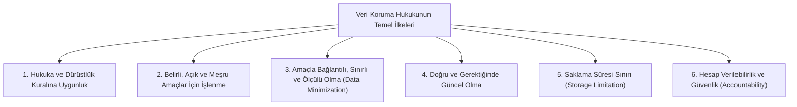
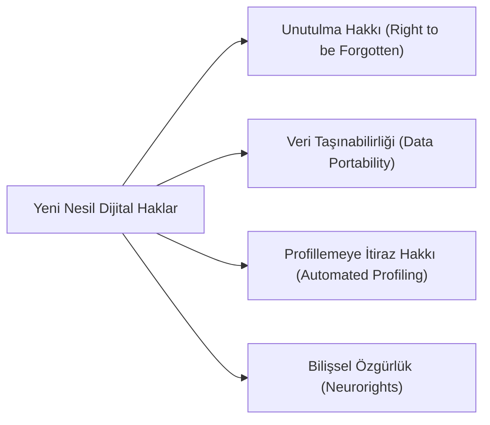

# Dijital Haklar, Veri Egemenliği ve Mahremiyet Hukuku

> *"Mahremiyet, kişinin kendisi hakkındaki bilgilerin başkaları tarafından ne zaman, nasıl ve ne ölçüde paylaşılabileceğini belirleme hakkıdır."*  
> — **Alan Westin**

---

## 1. Giriş: Gözetim Kapitalizmi ve Dijital Kişilik

Dijital çağda bireyin çevrim içi ayak izleri, biyometrik verileri, davranışsal eğilimleri ve kişisel tercihleri en değerli ekonomik meta haline gelmiştir. Bu durum, anayasal "özel hayatın gizliliği" hakkını köklü bir biçimde dönüştürerek **"kişisel verilerin korunması"** ve **"bilişimsel kendi geleceğini belirleme hakkı"** (*informationelle Selbstbestimmung*) kavramlarını doğurmuştur.

---

## 2. Küresel Standartlar: GDPR ve KVKK Karşılaştırmalı İlkeleri

---

## 3. Dijital Çağın Yeni Hakları

### 1. Unutulma Hakkı (*Costeja Kararı - AB Adalet Divanı, 2014*)
* Bireylerin, geçmişte kamuya mal olmuş ancak güncelliğini, doğruluğunu veya kamu yararı niteliğini yitirmiş kişisel bilgilerinin arama motorlarından ve internet kayıtlarından silinmesini veya indekslenmemesini talep etme hakkıdır.

### 2. Dijital Egemenlik ve Sınır Ötesi Veri Akışı (*Schrems I & II Kararları*)
* Max Schrems'in açtığı davalarda AB Adalet Divanı, ABD istihbarat kurumlarının verilere orantısız erişimi nedeniyle *Safe Harbor* ve *Privacy Shield* veri transfer anlaşmalarını iptal etmiştir.

### 3. Bilişsel Haklar (*Neurorights*)
* Beyin-bilgisayar arayüzleri (BCI) ve nöroteknolojilerin gelişmesiyle bireyin zihinsel mahremiyetini ve bilişsel özerkliğini koruma amaçlı yeni kuşak anayasal haklar (Örn: Şili Anayasası'ndaki öncü düzenleme).

---

## 📌 Sonuç

Dijital haklar ve veri egemenliği; bireyin sadece fiziksel bedenini değil, dijital dünyadaki gölgesini ve onurunu da teknoloji tekellerine ve otoriter gözetim devletine karşı koruyan en kritik modern anayasal siperdir.
