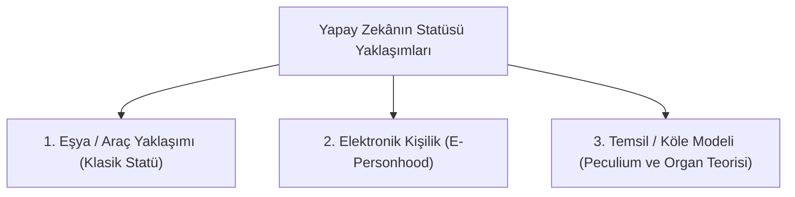
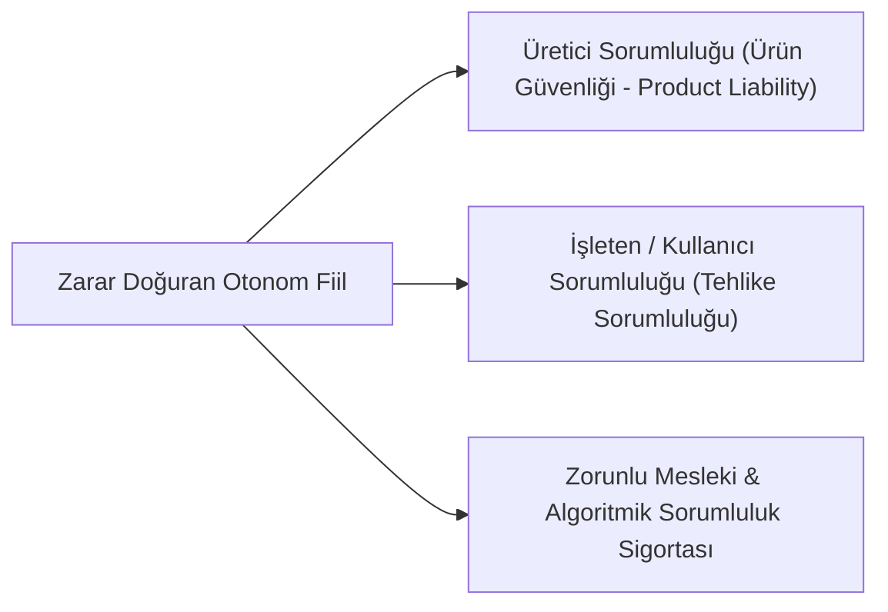

# Yapay Zekâ, Otonom Sistemler ve Hukuki Kişilik Sorunu

> *"Kişilik kavramı biyolojik bir zorunluluk değil, hukuk düzeninin belirli varlıklara hak ve borç yüklemek için yarattığı normatif bir kurgudur."*

---

## 1. Giriş: Otonom Teknolojilerin Hukuka Meydan Okuyuşu

Yapay zekâ (YZ / AI), derin öğrenme (*deep learning*) ve otonom robotik sistemlerin insan gözetimi olmaksızın kendi kendine karar alabilme ve eylemde bulunabilme kapasitesi, geleneksel kişi, irade, kusur ve haksız fiil kavramlarını kökten sarsmaktadır.

---

## 2. Yapay Zekânın Hukuki Statüsü Tartışması

Doktrinde yapay zekânın hukuki statüsüne dair üç ana yaklaşım savunulmaktadır:

| Model / Statü | Temel Görüş | Eleştiri ve Sınırlar |
| :--- | :--- | :--- |
| **Eşya / Araç Modeli** | YZ ne kadar gelişmiş olursa olsun bir yazılım/eşyadır. Zararlardan üretici, geliştirici veya kullanıcı kusursuz/ürün sorumluluğu kapsamında sorumludur. | Otonom sistem "öngörülemeyen" (black-box) bir karar verdiğinde üreticiye kusur veya illiyet isnat etmek zorlaşır. |
| **Elektronik Kişilik (*Electronic Personality*)** | Tıpkı ticaret şirketlerine tüzel kişilik tanındığı gibi, otonom sistemlere de zorunlu sigorta ve malvarlığı fonuyla sınırlı "elektronik kişilik" verilmesi (Avrupa Parlamentosu 2017 Raporu). | İnsan onuru kavramını sulandırma riski ve sorumluluktan kaçma aracı olarak suistimal edilme tehlikesi. |
| **Özel Malvarlığı / Temsil Modeli (*Peculium*)** | Roma Hukuku'ndaki kölelerin malvarlığı (*peculium*) gibi; sisteme tahsis edilen bir teminat fonu üzerinden zararların karşılanması. | Pratik ve uygulanabilir bir ara çözüm olarak değerlendirilir. |

---

## 3. Yapay Zekânın Neden Olduğu Zararlardan Hukuki Sorumluluk

1. **Kusur Sorumluluğunun Yetersizliği:** YZ'nin kendi kendine öğrendiği ve kara kutu (*black box*) kararlar aldığı durumlarda insan failin kast veya ihmalini kanıtlamak imkânsız hale gelir.
2. **Kusursuz / Tehlike Sorumluluğu İlkesi:** YZ destekli yüksek riskli sistemleri piyasaya süren ve bundan ticari kazanç sağlayan aktörler, nedensellik karinesiyle doğrudan sorumlu tutulmalıdır.
3. **AB Yapay Zekâ Sorumluluk Yönergesi (*AI Liability Directive*):** Mağdurlar lehine ispat yükünü hafifleten ve bilgi alma hakkı getiren düzenleme.

---

## 4. Avrupa Birliği Yapay Zekâ Yasası (*EU AI Act - 2024*)

AB AI Act, yapay zekâ sistemlerini **risk temelli piramit** ile kategorize etmiştir:

1. **Kabul Edilemez Risk (*Yasaklananlar*):** Bilişsel manipülasyon, sosyal puanlama (*social scoring*), kamusal alanda gerçek zamanlı biyometrik uzaktan tanıma.
2. **Yüksek Risk (*Katı Düzenlemeye Tabi*):** Kritik altyapılar, adli karar destek sistemleri, kolluk kuvveti algoritmaları, işe alım araçları (Şeffaflık, insan gözetimi ve siber güvenlik zorunluluğu).
3. **Sınırlı ve Asgari Risk:** Chatbotlar, üretken yapay zekâ (Şeffaflık ve içerik etiketleme zorunluluğu).

---

## 📌 Sonuç

Hukukun yapay zekâ karşısındaki görevi, inovasyonu boğmadan insan onurunu, temel anayasal hakları ve mağdurun tazminat hakkını teminat altına alacak esnek ve sağlam bir normatif çerçeve inşa etmektir.
