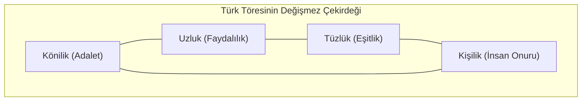
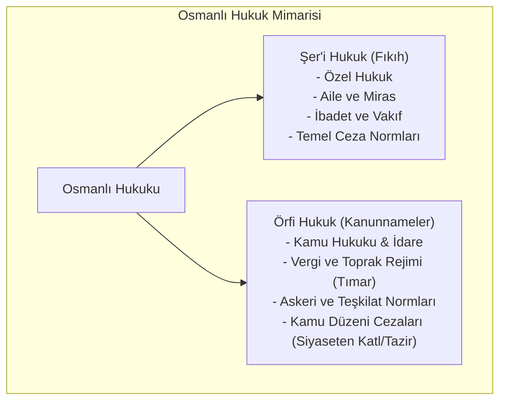

# Eski Türk Töresi ve İslam Hukuku Sentezi: Adalet Çemberi ve Örfi Kanunlar

> *"Memleket tutmak için çok asker ve ordu lazımdır; askeri beslemek için de çok mal ve mülk lazımdır; bu malı elde etmek için halkın zengin olması gerekir; halkın zengin olması için ise doğru ve adil kanunlar lazımdır."*  
> — **Yusuf Has Hacib**, *Kutadgu Bilig (1069), Beyit: 2057-2059*

---

## 🏛️ 1. Bozkır Töresi ve Türk Devlet Felsefesinde Hukuk

İslamiyet öncesi Türk devletlerinde (Hun, Göktürk, Uygur) hukuk düzeni **Töre** adı verilen kurallar manzumesine dayanmaktaydı. Töre; değişmeyen evrensel adalet ilkeleri ile zamana ve ihtiyaca göre şekillenen dinamik kuralların bileşimidir.

### Törenin Dört Değişmez Temel İlkesi (*Kutadgu Bilig Temelleri*)
1. **Könilik (Adalet ve Doğruluk):** Hukukun her ferde eşit ve tarafsız uygulanması.
2. **Uzluk (Faydalılık ve İyilik):** Hukuki düzenlemelerin toplumun refah ve salahiyetini hedeflemesi.
3. **Tüzlük (Eşitlik):** Bey ile sıradan vatandaşın töre karşısında aynı yargısal muameleye tabi olması.
4. **Kişilik (İnsanlık ve İnsan Onuru):** İnsanın varlığına ve yaşam hakkına saygı duyulması.

> **Önemli Not:** Eski Türk anlayışında Kağan dahi törenin üstünde değildir. Kağanın meşruiyeti (Kut), töreye ve adalete uygun hükmettiği sürece geçerlidir. Adaletten sapan kağan, "kut"unu kaybetmiş sayılır ve tahttan indirilirdi.

---

## 🔄 2. Dâire-i Adliye (Adalet Çemberi) Doktrini

Doğu ve Türk-İslam siyaset teorisinin omurgasını oluşturan **Adalet Döngüsü** (*Dâire-i Adliye*); siyasal otorite, ordu, ekonomi, mülk ve adalet arasındaki ontolojik bağı gösterir. Kınalızâde Ali Efendi (*Ahlâk-ı Alâî*), İbn Haldun (*Mukaddime*) ve Yusuf Has Hacib bu döngüyü devletin varoluş şartı olarak kabul eder.

### Döngünün 8 Temel İlkesi:
1. **Adldir mûcib-i salâh-ı cihân:** Cihanın huzur ve kurtuluşu ancak adalete bağlıdır.
2. **Cihân bir bâğdır dîvârı devlet:** Dünya bir bağdır, onun koruyucu duvarı devlettir.
3. **Devletin nâzımı şeriattır:** Devleti çekip çeviren, nizam veren hukuktur.
4. **Şeriate hâris olamaz illâ mülk:** Hukuku ancak güçlü bir mülk (devlet gücü) muhafaza edebilir.
5. **Mülkü zapt eyleyemez illâ leşker:** Devleti ancak disiplinli bir ordu ayakta tutabilir.
6. **Leşkeri cem' edemez illâ mâl:** Orduyu ancak hazine ve maddi refah toplayabilir.
7. **Mâlı tahsîl eyleyen râiyyettir:** Malı ve serveti üreten tebaa / halktır.
8. **Râiyyeti kul eder pâdişâha adl:** Halkı devlete sadık kılan ve bağlayan tek kuvvet ise **adalettir**.

---

## ⚖️ 3. Örfi Hukuk ile Şer'i Hukukun Birlikteliği (İkili Hukuk Düzeni)

Osmanlı İmparatorluğu'nda hukuk düzeni, salt dini kurallardan (Şeriat) ibaret olmayıp; padişahın yasama yetkisine dayanan **Örfi Hukuk** ile organik bir sentez oluşturmuştur.

### Tarihsel Kanunnameler:
* **Fatih Kanunnamesi (*Kânûn-nâme-i Âl-i Osmân*):** Devlet teşkilatı, vergi düzeni ve taht intikalini tanzim eden ilk kapsamlı Osmanlı laik/örfi kamu hukuku metnidir.
* **Kanuni Sultan Süleyman Kanunnameleri:** Nişancı Celâlzâde Mustafa Çelebi ve Şeyhülislam Ebussuud Efendi işbirliğiyle şeriat ile örfi hukukun harmonizasyonu sağlanmıştır.

---

## 👨‍⚖️ 4. Kadılık Kurumu ve Yargı Erkinin Özgüllüğü

Osmanlı hukuk sisteminde yargı erki **Kadılar** vasıtasıyla yürütülmüştür:
* **Çift Başlı Yetki:** Kadı hem bir hâkim (yargı organı) hem de mülki amir/noter/belediye başkanı gibi idari bir görevlidir.
* **Şer'i Mahkeme Sicilleri (*Kadı Sicilleri*):** Davaların, evlenme akitlerinin, vakfiyelerin ve fermanların kaydedildiği, bugünün tapu, sicil ve zabıt kayıtlarına kaynaklık eden paha biçilemez hukuki vesikalardır.
* **Divan-ı Hümayun ve Kazasker:** Kadı kararlarına karşı itiraz ve şikayetler en üst merci olan Divan'da (*Mezalim Mahkemesi niteliğinde*) Kazasker tarafından incelenirdi.

---

## 📋 Değerlendirme ve Günümüz Hukukuna Yansımaları

Eski Türk devlet geleneğindeki töre meşruiyeti ve Osmanlı'daki Adalet Çemberi felsefesi; devletin varoluş sebebini **bireyin ve toplumun adalet içinde yaşatılmasına** bağlamıştır. Şeyh Edebali'nin *"İnsanı yaşat ki devlet yaşasın"* sözü, çağdaş anayasa hukukundaki "insan onurunun korunması" ve "sosyal hukuk devleti" ilkesinin tarihsel kökünü teşkil eder.
