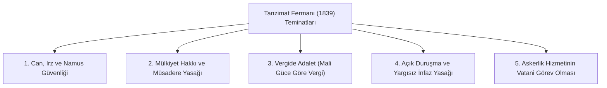
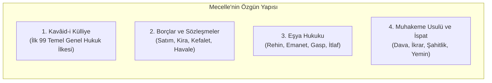

# Tanzimat Dönemi, Kanun-i Esâsî ve Mecelle-i Ahkâm-ı Adliye

> *"Ezmine-i muhtelifede ahkâmın tebeddülü inkâr olunamaz."*  
> *(Zamanın değişmesiyle hükümlerin de değişeceği inkâr olunamaz.)*  
> — **Mecelle-i Ahkâm-ı Adliye**, *Madde 39*

---

## 📜 1. Tanzimat Fermanı (Gülhane Hatt-ı Hümayunu, 1839)

3 Kasım 1839'da Hariciye Nazırı Mustafa Reşid Paşa tarafından ilan edilen Tanzimat Fermanı; Osmanlı Devleti'nin anayasacılık yolunda attığı ilk büyük adımdır. Padişah, kendi yetkilerini bizzat sınırlandırmış ve hukukun üstünlüğü ilkesine bağlı kalacağını taahhüt etmiştir.

### Hukuki Niteliği:
* Tanzimat Fermanı şekli anlamda bir anayasa değil; temel hak ve hürriyetleri tanıyan ve hükümdarın mutlak erkini kısıtlayan bir **Hakkaniyet ve Özgürlükler Şartı** (*Magna Carta benzeri ferman*) niteliğindedir.
* Müsadere (devletin vatandaşın malına keyfi el koyması) kesin olarak yasaklanmış, özel mülkiyet anayasal güvenceye kavuşturulmuştur.

---

## ⚖️ 2. Islahat Fermanı (1856) ve Tebaa Eşitliği İlkesi

Kırım Savaşı sonrası ilan edilen Islahat Fermanı; din, mezhep ve ırk farkı gözetmeksizin tüm Osmanlı tebaasının kanun önünde eşitliğini (*İttihâd-ı Anâsır*) ilan etmiştir:
* Gayrimüslimlere devlet memurluklarına girme, askeri okullara kaydolma hakkı tanındı.
* Aşağılayıcı tabirlerin kullanımı yasaklandı.
* Cizye vergisi kaldırılarak yerine bedel-i askeri sistemi getirildi.
* Karma ticaret ve ceza mahkemeleri (*Nizamiye Mahkemeleri*) kuruldu.

---

## 🏛️ 3. Kanun-i Esâsî (1876): İlk Yazılı Türk-Osmanlı Anayasası

Mithat Paşa başkanlığındaki komisyon tarafından Belçika (1831) ve Prusya (1850) anayasalarından esinlenerek hazırlanan 1876 Kanun-i Esâsîsi ile I. Meşrutiyet ilan edilmiştir.

### Temel Kurumsal Yapı:
* **Meclis-i Umûmî:** İki meclisli parlamento yapısı:
  1. **Heyet-i Âyân (Senato):** Üyeleri padişah tarafından kaydıhayat (ömür boyu) şartıyla atanan meclis.
  2. **Heyet-i Mebusân (Milletvekilleri Meclisi):** Halk tarafından seçilen meclis.
* **Yargı Bağımsızlığı:** Mahkemelerin her türlü müdahaleden azade olduğu, hâkimlerin azledilemeyeceği güvenceye bağlanmıştır (Madde 86).
* **Divan-ı Âli (Yüce Divan):** Yüce Divan kurumu oluşturularak bakanların ve yüksek bürokratların yargılanması düzenlenmiştir.
* **1909 Değişiklikleri:** II. Meşrutiyet sonrası yapılan değişikliklerle padişahın Meclisi fesih yetkisi sınırlandırılmış, hükümet meclise karşı sorumlu kılınmış ve gerçek anlamda parlamenter sisteme geçilmiştir.

---

## 📖 4. Mecelle-i Ahkâm-ı Adliye (1869–1876)

Ahmet Cevdet Paşa riyasetindeki ilim heyeti tarafından kaleme alınan Mecelle; Hanefi fıkhına dayalı, ancak modern Batı kanunlaştırma tekniği ve maddeleme usulüyle yazılmış 16 kitap ve 1851 maddeden oluşan abidevi bir kodifikasyondur.

### Mecelle'nin Ölümsüz Hukuk Kaideleri (*Kavâid-i Külliye'den Seçmeler*):
| Madde No | Osmanlıca Metin | Günümüz Türkçesi ve Karşılığı | Modern Hukuk İlkesi |
| :--- | :--- | :--- | :--- |
| **Md. 8** | *Berâet-i zimmet asıldır.* | Borçsuzluk ve suçsuzluk asıldır. | **Masumiyet Karinesi** |
| **Md. 4** | *Şek ile yakîn zâil olmaz.* | Kesin olarak bilinen şey, şüphe ile ortadan kalkmaz. | **Şüpheden Sanık Yararlanır** |
| **Md. 17** | *Zarar ve ziyan izâle olunur.* | Verilen zarar ve haksızlık giderilmelidir. | **Haksız Fiil Tazminatı** |
| **Md. 20** | *Zarar bi-kaderi'l-imkân def' olunur.* | Zarar, mümkün mertebe önceden engellenmelidir. | **Önleme / İhtiyat İlkesi** |
| **Md. 26** | *Zarar-ı âmmı def' için zarar-ı hâs ihtiyar olunur.* | Kamu zararını önlemek için özel zarara katlanılır. | **Kamu Yararı Üstünlüğü** |
| **Md. 36** | *Âdet muhakkemdir.* | Örf ve teamül, hüküm kurmada hakemdir. | **Örf ve Adet Hukuku Kaynağı** |
| **Md. 39** | *Ezmine-i muhtelifede ahkâmın tebeddülü inkâr olunamaz.* | Zaman değiştikçe hukuki hükümler de değişir. | **Hukukun Dinamikliği / Sosyal Değişim** |
| **Md. 76** | *Beyyine müddeî için ve yemin münkir üzerinedir.* | İspat yükü iddia edene aittir; inkar eden ise yemin eder. | **İspat Külfeti (*Onus Probandi*)** |

---

## 🎯 Tarihsel Önemi

Ahmet Cevdet Paşa'nın eseri Mecelle; Fransız Medeni Kanunu'nu (*Code Civil*) doğrudan tercüme etmek isteyen Batıcı kanada karşı, kendi yerli-milli hukuk kaynaklarından evrensel sistematikle bir medeni kanun üretilebileceğini ispat etmiştir. Mecelle, Osmanlı sonrasında dahi Ürdün, Suriye, Irak, Filistin ve Kuveyt gibi ülkelerde uzun yıllar uygulanmıştır.
