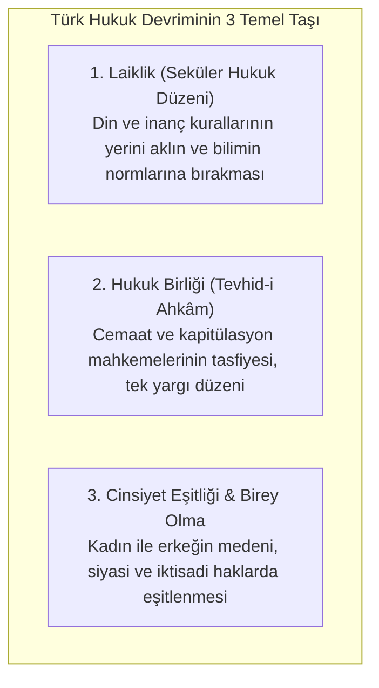
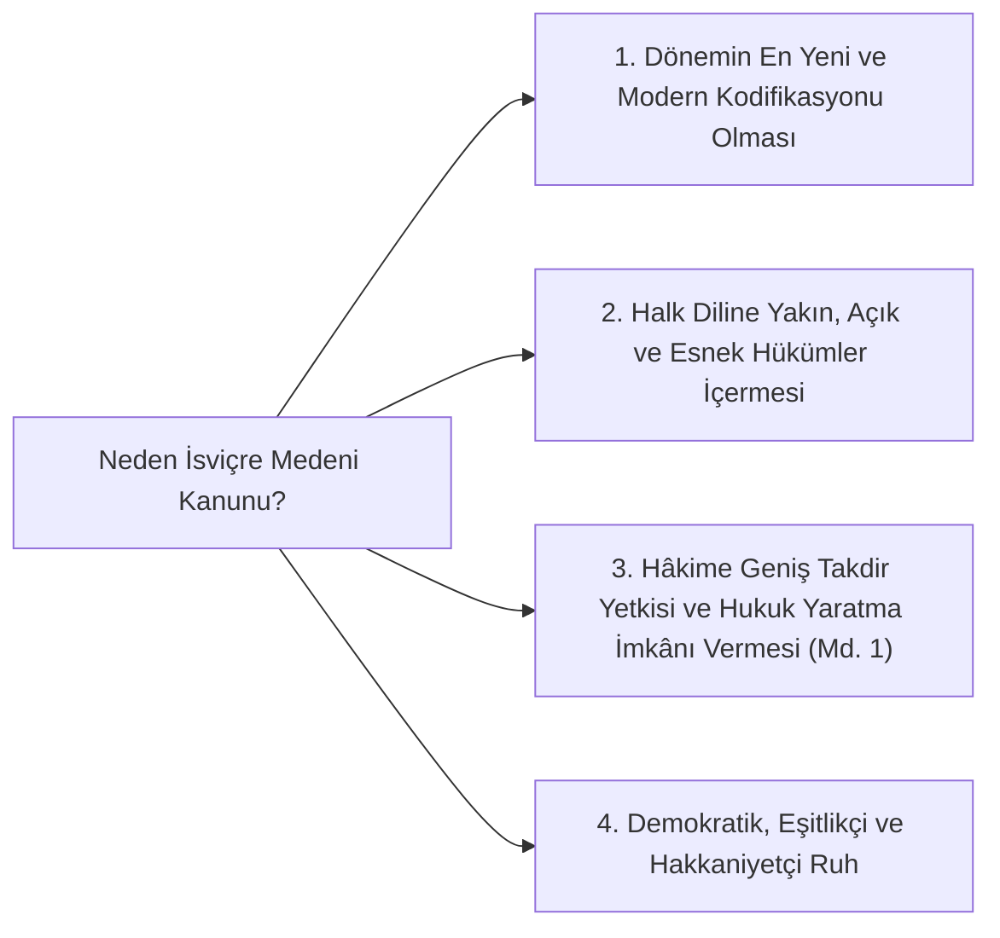

# Cumhuriyet Hukuk Devrimi, Laikleşme ve Modern Kodifikasyonlar

> *"Milletin hayatında yeni bir devir açılırken, eski kanunların hükümleriyle yürümek imkânsızdır. İhtilalin kanunu, mevcut kanunların üstündedir."*  
> — **Mahmut Esat Bozkurt**, *Adalet Bakanı (1926 Türk Medeni Kanunu Gerekçesi)*

---

## 🏛️ 1. Hukuk Devriminin Felsefi ve Sosyolojik Temelleri

Türkiye Cumhuriyeti'nin kuruluşuyla birlikte gerçekleştirilen Hukuk Devrimi; salt kanun maddelerinin değiştirilmesinden ibaret olmayıp, toplumun tebaadan **eşit haklara sahip yurttaşlara (*citoyen*)** dönüştürülmesini hedefleyen rasyonel ve hümanist bir zihniyet dönüşümüdür.

---

## 📜 2. 1921 Teşkilât-ı Esasîye ve 1924 Anayasası

* **1921 Teşkilât-ı Esasîye Kanunu:** Milli Mücadele şartlarında kabul edilen, "Hâkimiyet bilâkayduşart milletindir" ilkesini ilk kez getiren, Meclis Hükümeti sistemini ve kuvvetler birliğini benimseyen kısa ve çerçeve anayasadır.
* **1924 Teşkilât-ı Esasîye Kanunu:** Cumhuriyet rejiminin ilk kapsamlı anayasasıdır. Meclis üstünlüğüne dayalı karma bir hükümet sistemi kurgulamış, yargıyı bağımsız mahkemelere bırakmıştır. 1928'de "Devletin dini İslam'dır" ibaresi çıkarılmış, 1937'de ise 6 Atatürk ilkesi (Laiklik dahil) anayasa metnine dahil edilmiştir.

---

## ⚖️ 3. 1926 Türk Kanunu Medenisi ve İsviçre Medeni Kanunu'nun İktibası

Cumhuriyet kanun koyucusu; Eugen Huber tarafından hazırlanan 1907 tarihli **İsviçre Medeni Kanunu'nu (*Zivilgesetzbuch - ZGB*)** ve Borçlar Kanunu'nu (*Obligationenrecht - OR*) model alarak iktibas etmiştir.

### Medeni Kanunun Getirdiği Radikal Değişimler:
1. **Tek Eşlilik ve Resmi Nikâh:** Çok eşlilik (*poligami*) kesin olarak yasaklanmış, resmi nikâh zorunlu kılınmıştır.
2. **Kadın-Erkek Eşitliği:** Mirasta, boşanmada, şahitlikte ve velayette kadınlar erkeklerle eşit haklara kavuşmuştur.
3. **Şahsi Hal Sicilleri:** Modern nüfus ve sicil sistemi tesis edilmiştir.
4. **Hâkimin Hukuk Yaratması (Madde 1):** Kanunda ve örf-adet hukukunda hüküm bulunmayan hallerde hâkime "kanun koyucu olsaydı nasıl bir kural koyacak idiyse ona göre hüküm verme" yetkisi tanınmıştır.

---

## 📚 4. Dönemin Diğer Temel İktibasları

Cumhuriyet döneminde modern dünya standartlarında bir hukuk sistemi inşa etmek adına dönemin en yetkin hukuk sistemlerinden iktibaslar yapılmıştır:

| Kanun | Kaynak Ülke / Kodifikasyon | İktibas Yılı | Temel Gerekçe ve Nitelik |
| :--- | :--- | :--- | :--- |
| **Türk Kanunu Medenisi** | İsviçre Medeni Kanunu (*ZGB*) | 1926 | Kişi, aile, miras ve eşya hukukunda seküler ve eşitlikçi düzen. |
| **Borçlar Kanunu** | İsviçre Borçlar Kanunu (*OR*) | 1926 | Sözleşme serbestisi, kusur sorumluluğu ve dürüstlük kuralı. |
| **Türk Ceza Kanunu** | İtalya Zanardelli Ceza Kanunu (1889) | 1926 | Kusur ilkesi, kanunilik ve ceza adaleti. |
| **Ticaret Kanunu** | Almanya & İsviçre Ticaret Hukuku | 1926 / 1956 | Modern şirketler hukuku, kıymetli evrak ve deniz ticareti. |
| **Hukuk Muhakemeleri Usulü** | İsviçre Neuchâtel Kantonu Usul Kanunu | 1927 | Yazılı yargılama, tasarruf ilkesi ve adil yargılanma. |
| **Ceza Muhakemeleri Usulü** | Almanya Ceza Muhakemesi (*StPO*) | 1929 | Savcılık kurumu, delil serbestisi ve sanık hakları. |
| **İcra ve İflas Kanunu** | İsviçre İcra İflas Kanunu (*SchKG*) | 1932 | Alacaklı-borçlu dengesi ve cebri icra güvencesi. |

---

## 🎯 Sonuç: Mahmut Esat Bozkurt Doktrini

Dönemin Adalet Bakanı Mahmut Esat Bozkurt, Türk Hukuk Devrimi'ni şu sözlerle formüle etmiştir:  
*"Türk inkılabının kararı, Batı medeniyetini bütünüyle benimsemektir. Yeni Türk hukukunun temeli; dogma ve teokratik esaslar değil, aklın ve pozitif ilmin rehberliğidir."*

Cumhuriyet hukuk reformları; Türkiye'yi İslam coğrafyasında kadın-erkek eşitliğini, laik mahkeme düzenini ve birey odaklı medeni hakları eksiksiz tanıyan ilk ve öncü hukuk nizamı haline getirmiştir.
