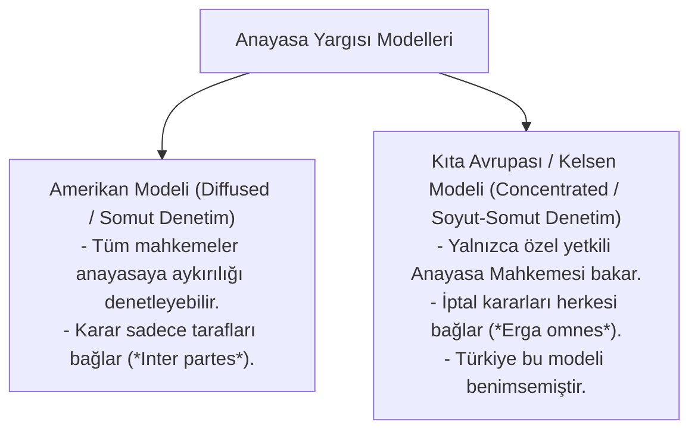
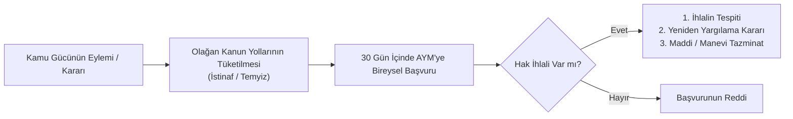

# Türk Anayasa Yargısı, AYM ve Bireysel Başvuru Rejimi

> *"Anayasa hükümleri; yasama, yürütme ve yargı organlarını, idare makamlarını ve diğer kuruluş ve kişileri bağlayan temel hukuk kurallarıdır."*  
> — **Türkiye Cumhuriyeti Anayasası**, *Madde 11 (Anayasanın Bağlayıcılığı ve Üstünlüğü)*

---

## 🏛️ 1. Türk Anayasa Yargısının Doğuşu: 1961 Anayasası

1924 Anayasası döneminde Meclis çoğunluğunun sınırsız tasarrufta bulunabilmesi ve çoğunlukçu demokrasi anlayışının yol açtığı siyasal krizler, kanunların Anayasa'ya uygunluğunun yargısal denetimini zorunlu kılmıştır.

1961 Anayasası ile Türk hukuk tarihinde ilk defa **Anayasa Mahkemesi (AYM)** kurulmuştur (Hans Kelsen modeline dayanan Avusturya-Kıta Avrupası modeli).

---

## ⚖️ 2. Norm Denetimi Usulleri (İptal Davası ve İtiraz Yolu)

Türkiye'de kanunların, Cumhurbaşkanlığı kararnamelerinin ve TBMM İçtüzüğünün Anayasaya uygunluğu iki yolla denetlenir:

### A. Soyut Norm Denetimi (İptal Davası)
* Belirli organların (Cumhurbaşkanı veya TBMM üye tamsayısının en az beşte biri) doğrudan doğruya AYM'de açtığı davadır.
* Yürürlüğe girmesinden itibaren 60 gün içinde açılması gerekir.

### B. Somut Norm Denetimi (İtiraz / Def'i Yolu)
* Görülmekte olan bir davada mahkemenin, uygulayacağı kanun hükmünü Anayasaya aykırı görmesi veya tarafların aykırılık iddiasını ciddi bulması halinde dosyayı AYM'ye göndermesidir.
* AYM 5 ay içinde karar vermezse mahkeme yürürlükteki kanuna göre davayı çözer; ancak karar kesinleşinceye kadar AYM kararı gelirse mahkeme bu karara uymak zorundadır.

---

## 🛡️ 3. 2010 Anayasa Değişikliği ve Bireysel Başvuru Devrimi

12 Eylül 2010 referandumuyla Türk anayasa hukukuna giren ve 23 Eylül 2012'den itibaren uygulanmaya başlanan **Bireysel Başvuru (*Anayasa Şikayeti / Verfassungsbeschwerde*)**, Türk yargı tarihinin en büyük hak arama reformudur.

### Bireysel Başvurunun Kabul Edilebilirlik Şartları:
1. **Hak Kapsamı:** İhlale uğradığı iddia edilen hakkın, hem **Anayasa'da** hem de **AİHS (ve ek protokollerinde)** ortaklaşa korunan temel haklardan biri olması gerekir.
2. **Olağan Yolların Tüketilmesi:** İdari ve adli başvuru mercileri (ilk derece, istinaf, Yargıtay/Danıştay) tamamen tüketilmiş olmalıdır.
3. **Süre:** Nihai kararın öğrenilmesinden veya tebliğinden itibaren **30 gün** içinde başvuru yapılmalıdır.
4. **Kişisel Menfaat:** Başvurucunun doğrudan doğruya mağdur (*victim status*) olması gerekir; soyut kamu yararı için actio popularis başvurusu yapılamaz.

---

## 📈 4. Anayasa Mahkemesi'nin "Hak Eksenli" İçtihat Dönüşümü

AYM, özellikle 2012 sonrası içtihatlarında lafzi ve devlet merkezli yorum yerine, bireyin hürriyetini ve insan onurunu önceleyen **"Hak Eksenli Denetim"** paradigmasını benimsemiştir:

* **İfade ve Basın Özgürlüğü:** İnternet sitelerinin toptan engellenmesi, gazetecilerin tutuklanması ve eleştiri sınırlarının genişletilmesinde AİHM standartlarını aşan özgürlükçü kararlar.
* **Adil Yargılanma Güvencesi:** Uzayan yargılamalarda makul süre aşımı ihlalleri, tanık dinletme hakkı ve delillere erişim eşitliği.
* **Mülkiyet Hakkı:** Kamulaştırmasız el atmalar, imar kısıtlamaları ve orantısız idari para cezalarının iptali.
* **Toplantı ve Gösteri Yürüyüşü:** Önceden izin alma şartı aranmaksızın barışçıl gösteri yapma hakkının korunması.

---

## 🎯 Sonuç

Türk anayasa yargısı; 1876 Kanun-i Esâsî'den günümüze uzanan meşrutiyet, cumhuriyet ve demokrasi deneyimlerinin nihai ürünüdür. AYM kararları; yasama ve yürütmenin tasarruflarını temel insan hakları zemininde frenleyerek hukuk devletinin nihai güvencesini oluşturur.
